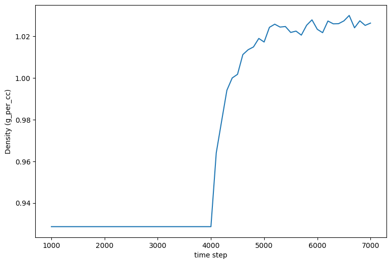

Examples
========

Example 1: BPTI
---------------

An example YAML configuration file to build the 6PTI system described in the 
in the `psfgen user manual <https://www.ks.uiuc.edu/Research/vmd/plugins/psfgen/ug.pdf>`_ is below:

.. code-block:: yaml

  title: BPTI
  tasks:
    - psfgen:
        source:
          id: 6pti
    - md:
        ensemble: minimize
    - solvate:
    - md:
        ensemble: minimize
    - md:
        ensemble: NVT
    - md:
        ensemble: NPT
        nsteps: 200
    - md:
        ensemble: NPT
        nsteps: 400
    - md:
        ensemble: NPT
        nsteps: 800
    - md:
        ensemble: NPT
        nsteps: 1600
    - mdplot:
        savedata: solvated.csv
        traces:
          - density
        units:
          density: g_per_cc
        basename: solvated        
    - terminate:
        basename: my_6pti
        package:
          ensemble: NPT
          basename: prod_6pti

This build can be performed (preferably in a clean directory) using this command:

.. code-block:: console

   $ pestifer run-example 1

Or, alternatively, pasting that content into a local file ``myconfig.yaml``:

.. code-block:: console

   $ pestifer run myconfig.yaml

The first thing ``pestifer`` does with ``run-example`` is to copy the YAML config file for that example into the local directory.  In this case, the file copied is named ``bpti.yaml``, and contains what you see above.

This file is YAML format; you can think of it as a python ``dict`` with nesting.  ``pestifer`` uses the general-purpose package ``ycleptic`` (`pypi <https://pypi.org/project/pestifer/>`_) to manage its input configurations.  Under ``ycleptic``, the user provides a YAML format file that contains a set of "directives", where a directive is a ``dict`` with a single key and a value of any type, including directives. Here, there are two topmost directives: ``title`` and ``tasks``.  The value of ``title`` is the string ``BPTI`` and the value of ``tasks`` is a *list*.  Each element in the list of tasks is itself a directive describing a task, and ``pestifer`` executes tasks in the order they appear in the ``tasks`` list.

For the ``psfgen`` task, we see the directive ``source``.  Its value appears to be yet another subdirective, ``id``, but the value of source is a ``dict`` with several keys, and we specify *only* ``id``, and the others are set to default values.  We can see these other keys and their default values using ``pestifer config-help``: 

.. code-block:: console

  $ pestifer config-help tasks psfgen source --no-banner
  Help on user-provided configuration file format
  tasks->
  psfgen->
  source:
      Specifies the source of the initial coordinate file
      type: dict
      Help available for id, biological_assembly, file_format, cif_residue_map_file, psf, altcoords, exclude, sequence

This tells us that, in addition to ``id``, we have the ability to set seven other keys.  Again, using ``pestifer config-help`` we can learn about these:

.. code-block:: console

  $ pestifer config-help tasks psfgen source id --no-banner
  Help on user-provided configuration file format
  tasks->
  psfgen->
  source->
  id:
      The 4-character PDB ID of the source or the basename of a local
        coordinate file (PDB or mmCIF format); pestifer will download
        from the RCSB if a file is not found
      type: str
      A value is required.
  $ pestifer config-help tasks psfgen source biological_assembly --no-banner
  Help on user-provided configuration file format
  tasks->
  psfgen->
  source->
  biological_assembly:
      integer index of the biological assembly to construct; default is 0,
        signifying that the asymmetric unit is to be used
      type: int
      default: 0
  $ pestifer config-help tasks psfgen source file_format --no-banner
  Help on user-provided configuration file format
  tasks->
  psfgen->
  source->
  file_format:
      either PDB or mmCIF; some entries do not have a PDB-format file.  The
        main advantage of PDB is that it uses the author-designations
        for chains by default.  mmCIF is the new "default" format of the
        PDB.
      type: str
      default: PDB
      allowed values: PDB, mmCIF

And so on.  Let's return to the example.  Immediately after the ``psfgen`` task we declare an ``md`` task, and the subdirective ``ensemble`` is set to ``minimize``.  There are no other subdirectives explicitly listed.  This task will use ``namd2`` to run an energy minimization.  As we did for the ``source`` subdirective of the ``psfgen`` task, let's have a look at the possible subdirectives for an ``md`` task:

.. code-block:: console

  $ pestifer config-help tasks md --no-banner
  Help on user-provided configuration file format
  tasks->
  md:
      Parameters controlling a NAMD run
      type: dict
      Help available for ensemble, minimize, nsteps, dcdfreq, xstfreq, temperature, pressure, other_parameters, constraints

By now, you know how to use ``config-help`` to figure out what these subdirectives mean. 
So let's return again to the example.  After this ``md`` task is the ``solvate`` task.  Notice that it has no subdirectives; only default values are used for any subdirectives. (Currently (v. 1.3.2) the only subdirective is ``pad``.) Then comes another minimization via an ``md`` task, then an NVT equilibration, and then a series of progressively longer NPT equilibrations in yet more ``md`` tasks.  These "chained-together" NPT runs avoid the common issue that, after solvation, the density of the initial water box is a bit too low, so under pressure control the volume shrinks.  It can shrink so quickly that NAMD's internal data structures for distributing the computational load among processing units becomes invalid, which causes NAMD to die.  The easiest way to reset those internal data structures is just to restart NAMD from the result of the previous run.

The ``mdplot`` task generates a plot of system density (in g/cc) vs time step for the series of MD simulations that occur after solvation.  This is a quick way to check that enough NPT equilibration has been performed.  For this example, the plot looks like this:

    Density vs. timestep for the BPTI system post-solvation.

Finally, we see a ``terminate`` task, whose main role is to generate some informative output and to provide a set of NAMD input files (PSF, PDB, xsc, coor, and vel) that all have a common base file name.  The ``package`` subdirective creates a tarball of all required input files to execute a NAMD run, ready for transfer to the HPC resource of your choice.

This run generates a lot of other files.  One such file, ``bpti-complete.yaml`` is the fully explicit configuration file implied by the given configuration file and any default values.  It can be instructive to peruse this file to see the totality of what you can specify for ``pestifer``; it is possible to have very close control over the ``psfgen`` script generation by, for example, adding ``pdbalias`` directives.

The outputs of this build are the PSF/PDB/COOR/VEL/XSC files needed to (re)start namd2; by default, these are ``my_6pti.pdb``, etc.

.. code-block:: console

   $ ls my_6pti*
   my_6pti.coor  my_6pti.pdb  my_6pti.psf  my_6pti.vel  my_6pti.xsc

Where, you may wonder, are the CHARMM parameter files?  ``pestifer`` includes the full CHARMM force field download from the MacKerrel lab, so they are somewhere under your python package installation tree.  You can see their full pathnames in any NAMD config file ``pestifer`` generates along the way.  However, using the ``package`` subdirective in the ``terminate`` task copies the necessary CHARMM parameter files to the local directory for you and puts them into the production tarball along with the NAMD configuration file and the PSF/PDB/COOR/VEL/XSC files.

.. code-block:: console

  $ tar ztf prod_6pti.tgz
  prod_6pti.namd
  par_all36m_prot.prm
  par_all36_carb.prm
  par_all36_lipid.prm
  par_all36_carb.prm
  par_all36_na.prm
  par_all36_cgenff.prm
  toppar_all36_carb_glycopeptide.str
  toppar_all36_prot_modify_res.str
  toppar_water_ions.str
  toppar_all36_moreions.str
  02-00-solvate.psf
  08-00-md-NPT.pdb
  08-00-md-NPT.coor
  08-00-md-NPT.xsc
  08-00-md-NPT.vel

``prod_6pti.namd`` is the NAMD2 configuration file, and it created with some default values.  Carefully consider its contents before you run!

Example 2: BPTI with Phosphate Ion Deleted
------------------------------------------
This is the same as Example 1, except we delete the phosphate ion.

.. code-block:: yaml

  title: BPTI with phosphate ion excluded
  tasks:
    - psfgen:
        source:
          id: 6pti
          exclude:
            resnames:
              - PO4
    - md:
        ensemble: minimize
    - solvate:
    - md:
        ensemble: minimize
    - md:
        ensemble: NVT
    - md:
        ensemble: NPT
        nsteps: 200
    - md:
        ensemble: NPT
        nsteps: 400
    - md:
        ensemble: NPT
        nsteps: 800
    - md:
        ensemble: NPT
        nsteps: 1600
    - terminate:
        basename: my_6pti
        package:
          ensemble: NPT
          basename: prod_6pti

Note the ``exclude`` subdirective under ``source``.  You remember how you can learn about it?  Using ``config-help``: 

.. code-block:: console

  $ pestifer config-help tasks psfgen source exclude --no-banner
  Help on user-provided configuration file format
  tasks->
  psfgen->
  source->
  exclude:
      Specifies any residues or atoms present in the PDB source to exclude
        from the system
      type: dict
      Help available for chains, resnames

Each of ``chains`` and ``resnames`` are lists, and in the configuration file above, we have a single-element list for ``resnames`` that indicates the resname ``PO4``, which is how the phosphate ion is labelled in the original PDB file.

Example 3: BPTI with One Reduced Disulfide and Some Point Mutations
-------------------------------------------------------------------
Building on Example 2, here we show how to introduce point mutations and how to undo disulfides.  Both of these actions are specified in the ``psfgen`` task under the ``mods`` subdirective:

.. code-block:: yaml

  title: BPTI, no phosphate, some random mutations plus deletion of one disulfide
  tasks:
    - psfgen:
        source:
          id: 6pti
          exclude:
            resnames:
              - PO4
        mods:
          mutations: # showcasing the two shortcode formats
            - A:T11A # threonine to alanine at position 11
            - A:PRO,13,ALA # proline to alanine at position 13
            - A:K15R
            - A:MET,52,LEU
          ssbondsdelete:
            - A_5-A_55
    - md:
        ensemble: minimize
    - solvate:
    - md:
        ensemble: minimize
    - md:
        ensemble: NVT
    - md:
        ensemble: NPT
        nsteps: 200
    - md:
        ensemble: NPT
        nsteps: 400
    - md:
        ensemble: NPT
        nsteps: 800
    - md:
        ensemble: NPT
        nsteps: 1600
    - terminate:
        basename: my_6pti
        package:
          ensemble: NPT
          basename: prod_6pti

First, note the ``mutations`` list.  Each element specifies one particular point mutation using a *shortcode*.  There are two allowable shortcodes for a point mutation:

1. ``CHAIN``:``OLRCRESIDOLRC``
2. ``CHAIN``:``TLRC,RESID,TLRC``

``CHAIN`` is the chain ID, ``OLRC`` is a one-letter residue code, and ``RESID`` is the residue sequence number; ``TLRC`` is a three-letter residue code.  Note that both formats are showcased here.

Second, note the ``ssbondsdelete`` list.  Again, a shortcode is used to identify a disulfide to reduce; I think you can see that we are reducing the disulfide between residues 5 and 55.

.. list-table::

    * - .. figure:: pics/yes_disu.png

           BPTI with the 5-55 disulfide intact, showing 
           sidechains for residues T11, P13, K15, and M52.

      - .. figure:: pics/no_disu.png

           BPTI with the 5-55 disulfide reduced, and 
           point mutations T11A, P13A, K15R, and M52L.

Example 4: BPTI with an Extra Disulfide Added
---------------------------------------------
Using the ``mods`` subdirective, one can introduce new disulfides into an existing structure.  This example introduces a disulfide linking residues 11 and 34.

.. code-block::  yaml

  title: BPTI, no phosphate, introducing a disulfide via mutations
  tasks:
    - psfgen:
        source:
          id: 6pti
          exclude:
            resnames:
              - PO4 # we don't need no stinkin phosphates
        mods:
          mutations: # get me two cysteines, stat!
            - A:T11C
            - A:V34C
          ssbonds:
            - A_11-A_34  # now ligation!
    - md:
        ensemble: minimize
    - solvate:
    - md:
        ensemble: minimize
    - md:
        ensemble: NVT
    - md:
        ensemble: NPT
        nsteps: 200
    - md:
        ensemble: NPT
        nsteps: 400
    - md:
        ensemble: NPT
        nsteps: 800
    - md:
        ensemble: NPT
        nsteps: 1600
    - terminate:
        basename: my_6pti
        package:
          ensemble: NPT
          basename: prod_6pti

Note that this required first mutating the residues at positions 11 and 34 to cysteines, and *then* introducing the disulfide mod.

Example 5:  C3-symmetric HIV-1 Env Glycoprotein
-----------------------------------------------
Pestifer understands how to build a system using any chosen biomolecular assembly available in the structure file.  In the case of the HIV-1 Env glycoprotein trimer in PDB entry 4zmj, the asymmetric unit is a single protomer, and the relevant biological assembly is a C3-symmetric homotrimer, which is labeled as biological assembly 1 in the PDB entry.  Pestifer will also by default undo any engineered mutations (there are three in 4zmj) and add any unresolved or zero-occupancy residues.  A build of the 4zmj trimer illustrates these capabilities.

.. code-block:: yaml

  title: HIV-1 Env Trimer 4zmj
  tasks:
    - psfgen:
        source:
          id: 4zmj
          biological_assembly: 1
          sequence:
            loops:
              declash:
                maxcycles: 20
        mods:
          crotations:
            - psi,B,546,568,-180.0
            - phi,B,547,568,-60.0
    - md:
        ensemble: minimize
    - ligate:
        steer:
          nsteps: 4200
    - md:
        ensemble: minimize
    - md:
        ensemble: NVT
        nsteps: 2400
    - solvate:
    - md:
        ensemble: minimize
    - md:
        ensemble: NVT
    - md:
        ensemble: NPT
        nsteps: 200
    - md:
        ensemble: NPT
        nsteps: 400
    - md:
        ensemble: NPT
        nsteps: 800
    - md:
        ensemble: NPT
        nsteps: 1600
    - terminate:
        basename: my_4zmj
        package:
          ensemble: NPT
          basename: prod_4zmj

There are several new aspects in this example relative to the first four.  First, in the ``psfgen`` task, the ``source`` directive has a ``biological_assembly`` specification and a ``sequence`` subdirective.  

Clearly we are indicating biological assembly 1, which you can verify through the RCSB web interface or by reading the PDB file header is the trimer.  

There is also a ``ligate`` task.  Together, the ``loops`` subdirective of the ``sequence`` directive in the ``source``, and the ``ligate`` task, constitute the method of inserting missing residues (residues designated by MISSING records in the PDB or zero-occupancy in the mmCIF).  Building in missing protein loops that are *internal* to any given chain is done in the following way:

1. Via ``residue`` commands inside ``segment`` stanzas of the ``psfgen`` script, each missing residue is indicated.  Additionally, a sacrificial glycine residue is added at the C-terminus of any run of missing residues.  After all ``segments`` are defined, sacrificial glycines are deleted and NTER/CTER patches are explicitly added.  When ``psfgen`` is run, the ``guesscoords`` command results in this missing residues being built in according to their default internal coordinates; this means they grow in as straight chains where every phi and psi angle is 180 degrees.
2. Each such loop is put through a ``declashing`` procedure in which phi and psi angles are adjusteds so that the loop residues do not clash with any other residues.  Sometimes, additional manual adjustment of some dihedrals is necessary; that is the case here.
3. After a minimization, pestifer then runs a ``ligation`` task which has two parts.  First, a steered MD is run that shrinks the distance between the terminal glycine of each loop and the location on the resolved protein to which it should be attached.  Second, another ``psfgen`` run is performed to "heal" the gap between the C-terminus of the loop and its attachment point with a peptide bond.

Declashing is done using a Monte-Carlo approach where trial rotations are suggested and only performed if they result in a reduction in the number of steric clashes.

The 4zmj entry contains partially resolved glycans.  By default, pestifer will include all resolved glycans.  These can be excluded using an ``excludes`` list that specifies ``resnames`` like ``NAG``, ``MAN``, etc.

The snapshots below illustrate the process by which the loops are grown in.  In these snapshots, only backbone protein atoms are shown with bonds drawn as lines.  The model-built parts are drawn with thick bonds, and the six chains are colored uniquely.

.. list-table::

    * - .. figure:: pics/4zmj_step0.png

           Structure after first ``psfgen``.

      - .. figure:: pics/4zmj_step1.png

           Structure after declashing loops.

    * - .. figure:: pics/4zmj_step2-1.png

           Early in the steering.

      - .. figure:: pics/4zmj_step2-2.png

           Midway through the steering.

    * - .. figure:: pics/4zmj_step2-3.png

           At the end of the steering.

      - .. figure:: pics/4zmj_step3.png

           After healing.

           

