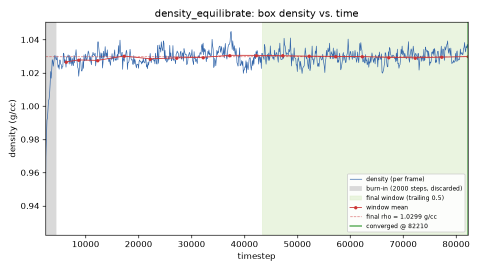
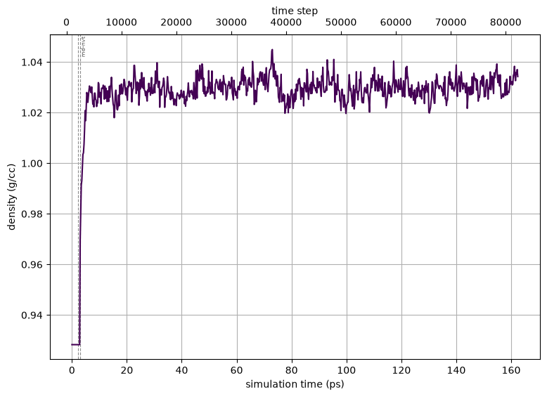

.. _example bpti1:

Example 1: Bovine Pancreatic Trypsin Inhibitor (BPTI)
-----------------------------------------------------

The Input Configuration
=======================

The ``psfgen`` `user manual <https://www.ks.uiuc.edu/Research/vmd/plugins/psfgen/ug.pdf>`_ is a necessary resource for learning how to use ``psfgen`` to generate PDB and PSF input files for NAMD.  A simple example in that manual is a solvation of bovine pancreatic trypsin inhibitor (BPTI) starting from its PDB coordinates (`PDB ID 6pti <https://www.rcsb.org/structure/6PTI>`_).  ``pestifer`` can reproduce this solvation via the input YAML-format configuration shown below:

.. literalinclude:: ../../../../pestifer/resources/examples/01/inputs/bpti1.yaml
    :language: yaml

.. task-table:: ../../../../pestifer/resources/examples/01/inputs/bpti1.yaml

You can check the :ref:`config_ref` for a complete reference to Pestifer config files.

This build can be performed (preferably in a clean directory) using this command:

.. code-block:: bash

   $ pestifer build-example 1

The first thing ``pestifer`` does with ``build-example`` is to copy the YAML config file for that example into the local directory.  In this case, the file copied is named ``bpti1.yaml``, and contains what you see above.  Or, alternatively, pasting that content into a local file ``myconfig.yaml``:

.. code-block:: bash

   $ pestifer build myconfig.yaml

Alternatively, you could also use ``fetch-example`` to get the config file and then run it:

.. code-block:: bash

  $ ls
  $ pestifer fetch-example 1
  $ ls
  bpti1.yaml
  $ pestifer build bpti1

(If there is no extension on the argument of build, pestifer assumes one of ``.yaml``, ``.yml``, or ``.ym``.)

``bpti1.yaml`` is a YAML-format text file, and the keywords (of course) have particular meanings.  This is also an example of a "minimal" configuration file; ``pestifer`` has many more controls that can be set in a configuration file than are shown here.  Here, this configuration file contains two topmost directives: ``title`` and :ref:`config_ref tasks`.  The value of ``title`` is the string ``Bovine Pancreatic Trypsin Inhibitor (BPTI)`` and the value of ``tasks`` is a *list*.  Each element in the list of tasks is itself a directive describing a task, and ``pestifer`` in general executes tasks in the order they appear in the ``tasks`` list.

Digression: Interactive Help 
============================

``pestifer`` uses the general-purpose package ``ycleptic`` (`pypi <https://pypi.org/project/ycleptic/>`_) to manage its input configurations.  A package developer using ``ycleptic`` specifies a "pattern" file describing the configuration file syntax they would like their package to have.  ``ycleptic`` provides two useful features:

1. Automatic generaton of a hierarchical arrangement of RST files for documentation of all configuration parameters; in these pages, this is rooted at :ref:`config_ref`.
2. Automatic acquisition of a command-line interactive help feature that allows package users to explore the configuration file format specified by the package developers.  

Let's use this second feature to explore the ``fetch`` task.  (You can visit the :ref:`config_ref tasks` page to view the same info in the online documentation.) 

.. code-block:: bash

  $ pestifer --no-banner config-help tasks

    tasks:
        Specifies the tasks to be performed serially in a pestifer run

    base|tasks
        fetch ->
        continuation ->
        psfgen ->
        ligate ->
        pdb2pqr ->
        mdplot ->
        cleave ->
        solvate ->
        desolvate ->
        ring_check ->
        make_membrane_system ->
        md ->
        manipulate ->
        terminate ->
        validate ->
        .. up
        ! quit
    pestifer-help:  fetch

    fetch:
        Fetch task; its only job is to fetch any external data file (e.g.,
        PDB).

    base|tasks->fetch
        source
        sourceID
        source_format
        .. up
        ! quit
    pestifer-help: source

    source:
        Source for the initial coordinate file; one of 'pdb' (for the RCSB
        PDB), 'alphafold' (for the AlphaFold DB), or 'local' (for a
        local file)
        default: pdb

    All subattributes at the same level as 'source':

    base|tasks->fetch
        source
        sourceID
        source_format
        .. up
        ! quit
    pestifer-help: sourceID

    sourceID:
        ID of the source file; if source is 'local', a file 'sourceID.pdb' or
        'sourceID.cif' must exist in the working directory

    All subattributes at the same level as 'sourceID':

    base|tasks->fetch
        source
        sourceID
        source_format
        .. up
        ! quit
    pestifer-help: source_format

    source_format:
        Format of the source file; this should be 'pdb' or 'cif'
        default: pdb
        allowed values: pdb, cif

    All subattributes at the same level as 'source_format':

    base|tasks->fetch
        source
        sourceID
        source_format
        .. up
        ! quit
    pestifer-help: !
  $

In the config file for this example, we specify on the the ``sourceID`` as 6pti; the other source attributes take their default values.  This causes ``pestifer`` to fetch the file ``6pti.pdb`` from the RCSB PDB (if ``6pti.pdb`` does not already exist in the current working directory).

We can return to ``config-help`` to explore the ``psfgen`` task, which is the next task in the list.  We can do this by:

.. code-block::bash

  $ pestifer config-help tasks psfgen

    psfgen:
        Parameters controlling a specific psfgen run on an input molecule

    base|tasks->psfgen
        source ->
        mods ->
        .. up
        ! quit 
    pesifer-help: source

    source:
        Specifies the processing and interpretation of the initial source
        coordinate file

    base|tasks->psfgen->source
        biological_assembly
        transform_reserves
        remap_chainIDs
        reserialize
        model
        cif_residue_map_file
        include
        exclude
        sequence ->
        .. up
        ! quit
    pestifer-help: biological_assembly

    biological_assembly:
        integer index of the biological assembly to construct; default is 0,
        signifying that the asymmetric unit is to be used
        default: 0

    All subattributes at the same level as 'biological_assembly':

    base|tasks->psfgen->source
        biological_assembly
        transform_reserves
        remap_chainIDs
        reserialize
        model
        cif_residue_map_file
        include
        exclude
        sequence ->
        .. up
        ! quit

And so on.  Let's return to the example.  After the ``psfgen`` and ``validate`` tasks we declare an ``md`` task, and the subdirective ``ensemble`` is set to ``minimize``.  There are no other subdirectives explicitly listed.  This task will use ``namd3`` to run an energy minimization.  Let's have a look at the possible subdirectives for an ``md`` task.  We can do this by:

.. code-block:: bash

  $ pestifer console-help tasks md

    md:
        Parameters controlling a NAMD run

    base|tasks->md
        cpu-override
        vacuum
        ensemble
        minimize
        nsteps
        dcdfreq
        xstfreq
        temperature
        pressure
        addl_paramfiles
        other_parameters
        constraints ->
        .. up
        ! quit
    pestifer-help:

The Input Configuration (Continued)
===================================

So let's return to the example.  After the first ``md`` task is the ``solvate`` task.  Notice that it has no subdirectives; in this case default values are used for any subdirectives.  After this task has finished, we have a run-ready *nonequilibrated* system.  Equilibration here is three tasks: another minimization, a short NVT ``md`` task to bring the system to temperature, and then a single :ref:`density_equilibrate <subs_buildtasks_density_equilibrate>` task that settles the box density under NPT.

That last task replaces what used to be written by hand as a ladder of progressively longer NPT ``md`` tasks (``nsteps: 200``, then 400, then 800, and so on).  Why such runs have to be broken into pieces at all is worth knowing, because it is a property of NAMD rather than of the chemistry: after solvation the initial water box is slightly too sparse, so under pressure control the cell shrinks.  NAMD fixes its spatial decomposition at the *start* of each run, and if a cell dimension shrinks past the patch margin partway through, the run dies with *"periodic cell has become too small for the patch grid"*.  Restarting resets that decomposition, so the equilibration has to proceed in restarts.  ``density_equilibrate`` does that for you, and sizes each chunk from the shrink rate it has just measured rather than from a guessed schedule.

**Deciding when the system is equilibrated is the task's job, not yours.**  It runs until the box density is *measurably* stationary and then stops on its own.  The test is not "the curve looks flat": density fluctuates intrinsically under NPT and those fluctuations are correlated in time, so the task estimates the integrated autocorrelation time of the series, uses it to compute an honest standard error of the mean, and requires that error to be small compared with the drift tolerance before it will even test for drift.  Only then does it ask whether the trend across the averaging window is below tolerance, and it must answer yes several times in a row.  A small, noisy box therefore runs longer than a large quiet one without anyone tuning a step count.

The task writes its own convergence plot, which shows the reasoning rather than only the trace:

    Box density vs. timestep for the BPTI system, as reported by ``density_equilibrate``.  The grey band at the left is the burn-in discarded as the barostat transient; the green band is the trailing window the convergence test is evaluated over; the red points are per-chunk means of that window; and the marker at the right is the step at which the run decided it was finished.  The final density is stated on the plot.

The ``mdplot`` task then plots the same quantity across *all* the post-solvation dynamics -- the minimization and the NVT warm-up as well as the NPT stage -- which is the wider view rather than the convergence argument:

    Density vs. timestep for the BPTI system post-solvation, across every simulation stage.  The dashed vertical rules mark the boundaries between stages, so the jump as the barostat engages reads as a change of ensemble rather than as a physical event.

Between the two, nothing about the equilibration has to be assumed: the first figure shows the criterion that ended the run, and the second shows that criterion in the context of everything that came before it.

Finally, we see a ``terminate`` task, whose main role is to generate some informative output and to provide a set of NAMD input files (PSF, PDB, xsc, coor, and vel) that all have a common base file name.  The ``package`` subdirective creates a tarball named for its own ``basename`` (here ``prod_6pti.tar.gz``) containing all input files necessary to execute a NAMD run, ready for transfer to the HPC resource of your choice.  Inside the tarball the files sit under a single directory also named for the package ``basename`` (``prod_6pti/``); the state files keep the terminate ``basename`` (``my_6pti``) while the generated NAMD config uses the package ``basename``.  The ``namd`` attribute of the ``package`` subdirective lets you specify any NAMD configuration options for the production config file; here we simply request the default parameters for an NPT run.

The ``terminate`` task also archives the build's other working files into a second tarball, named from the terminate ``basename`` (here ``my_6pti-artifacts.tar.gz``); the ``artifacts`` attribute can override that name.  Plot images are deliberately *not* swept into it -- they stay in the ``mdplots/`` subdirectory of the run, where they are easy to look at without unpacking anything.

Listing the contents of the state tarball:

.. code-block:: bash

   $ tar ztf prod_6pti.tar.gz
    prod_6pti/my_6pti.psf
    prod_6pti/my_6pti.pdb
    prod_6pti/my_6pti.coor
    prod_6pti/my_6pti.xsc
    prod_6pti/my_6pti.vel
    prod_6pti/prod_6pti.namd
    prod_6pti/par_all36m_prot.prm
    prod_6pti/par_all36_lipid.prm
    prod_6pti/par_all36_carb.prm
    prod_6pti/par_all36_na.prm
    prod_6pti/par_all36_cgenff.prm
    prod_6pti/par_all36m_prot.prm
    prod_6pti/par_all36_lipid.prm
    prod_6pti/par_all36_carb.prm
    prod_6pti/par_all36_na.prm
    prod_6pti/par_all36_cgenff.prm
    prod_6pti/toppar_water_ions.str
    prod_6pti/toppar_all36_carb_glycopeptide.str
    prod_6pti/toppar_all36_prot_modify_res.str
    prod_6pti/toppar_water_ions.str
    prod_6pti/toppar_all36_carb_glycopeptide.str
    prod_6pti/toppar_all36_prot_modify_res.str
    prod_6pti/toppar_all36_moreions.str
    
You should note the presence of CHARMM force-field files in the current directory.  These are generated by ``pestifer`` during the build, and are essentially copies of the parent files with certain lines commented out to permit use by VMD and NAMD.  The parent files are not altered.

The archive tarball contains all intermediate files used in the build but which are not necessary for production MD runs.  These files can be useful for debugging or for understanding the build process.

.. _file name conventions:

Digression: On File Name Conventions
====================================

Intermediate files generated by pestifer during a build typically conform to a common naming convention:

.. code-block:: bash

   CC-MT-SSS_TASKNAME.ext

Here ``CC`` is the 2-digit identification of the run *controller* (``00`` for the first controller), ``MT`` is the 2-digit identification of the *main task* of that controller (``02`` is the *third* task), and ``SSS`` is the 3-digit identification of the *subtask* within that task (``000`` for the first).  ``TASKNAME`` is the name of the task as it appears in the yaml file, and ``ext`` is the file extension.  For example, ``00-04-000_solvate.psf`` is the PSF file generated by the ``solvate`` task -- the *fifth* task, index ``04`` -- in this example.

The subtask counter is what makes a task like ``density_equilibrate`` legible in a directory listing: because it restarts NAMD once per chunk, it produces a numbered series such as ``00-07-000_density_equilibrate-NPT.log`` through ``00-07-019_...``, all belonging to the one task at index ``07``.  A trailing label after the task name records the ensemble or the role of that particular run.

Some tasks may spawn *subcontrollers*, which typically acquire a controller ID derived from that of the parent controller.  In the current version of pestifer, this occurs when building a membrane bilayer, in which a series of MD simulations are launched by a subcontroller the the ``make_membrane_system`` task.

.. raw:: html

        

            
Example author: Cameron F. Abrams&nbsp;&nbsp;&nbsp;Contact: <a href="mailto:cfa22@drexel.edu">cfa22@drexel.edu</a>

        
