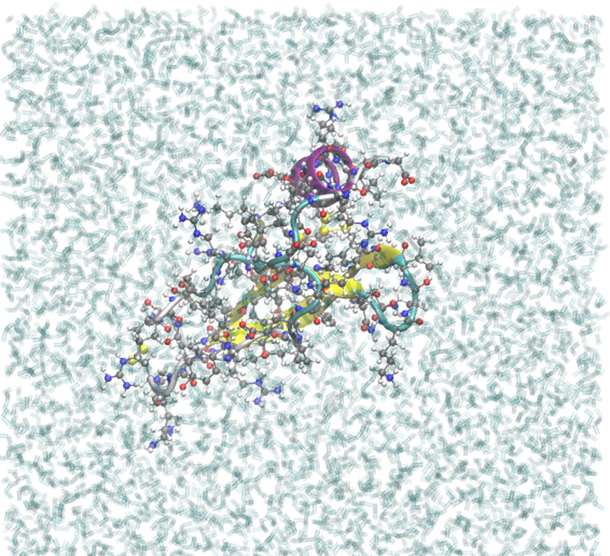

.. _example bpti3:

Example 3: BPTI with a Mutated-out Disulfide Bond
-------------------------------------------------

Building on Example 2, here we show how to introduce point mutations and how to undo disulfides.  Both of these actions are specified in the ``psfgen`` task under the ``mods`` subdirective:

.. literalinclude:: ../../../../pestifer/resources/examples/03/inputs/bpti3.yaml
    :language: yaml

.. task-table:: ../../../../pestifer/resources/examples/03/inputs/bpti3.yaml

    The Example 3 build, in the same style and viewpoint as :ref:`Example 1 <example bpti1>`.
    The mutations are in place and one of the three native disulfides has been reduced, so this
    system has **two** S-S bonds where the others have three; the freed cysteine sulfurs are the
    yellow atoms no longer paired.

First, note the ``mutations`` list.  Each element specifies one particular point mutation using a *shortcode*.  There are two allowable shortcodes for a point mutation:

1. ``CHAIN``:``OLRCRESIDOLRC``
2. ``CHAIN``:``TLRC,RESID,TLRC``

``CHAIN`` is the chain ID, ``OLRC`` is a one-letter residue code, and ``RESID`` is the residue sequence number; ``TLRC`` is a three-letter residue code.  Note that both formats are showcased here.

Second, note the ``ssbondsdelete`` list.  Again, a shortcode is used to identify a disulfide to reduce; I think you can see that we are reducing the disulfide between residues 5 and 55.

.. list-table::

    * - .. figure:: yes_disu.png

           BPTI with the 5-55 disulfide intact, showing 
           sidechains for residues T11, P13, K15, and M52.
           Red marks the two disulfide-forming cysteines, 
           5 and 55; orange marks the four mutation sites.

      - .. figure:: no_disu.png

           BPTI with the 5-55 disulfide reduced, and 
           point mutations T11A, P13A, K15R, and M52L.
           Same colors: the red cysteine sidechains are now 
           unbonded, and the orange sidechains are the mutants.

.. raw:: html

        

            
Example author: Cameron F. Abrams&nbsp;&nbsp;&nbsp;Contact: <a href="mailto:cfa22@drexel.edu">cfa22@drexel.edu</a>

        
