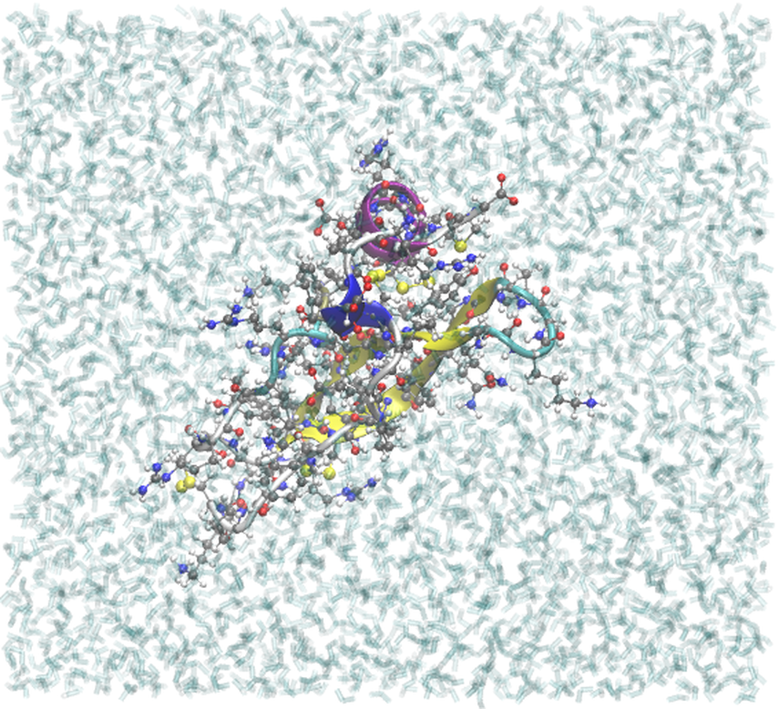

.. _example bpti4:

Example 4: BPTI with a Mutated-in Disulfide Bond
------------------------------------------------

Using the ``mods`` subdirective, one can introduce new disulfides into an existing structure.  This example introduces a disulfide linking residues 11 and 34.

.. literalinclude:: ../../../../pestifer/resources/examples/04/inputs/bpti4.yaml
    :language: yaml

.. task-table:: ../../../../pestifer/resources/examples/04/inputs/bpti4.yaml

    The Example 4 build, in the same style and viewpoint as :ref:`Example 1 <example bpti1>`.
    Residues 11 and 34 have been mutated to cysteine and cross-linked, so this system carries
    eight cysteines and **four** S-S bonds against the native three.

Note that this required first mutating the residues at positions 11 and 34 to cysteines, and *then* introducing the disulfide mod.

.. raw:: html

        

            
Example author: Cameron F. Abrams&nbsp;&nbsp;&nbsp;Contact: <a href="mailto:cfa22@drexel.edu">cfa22@drexel.edu</a>

        
