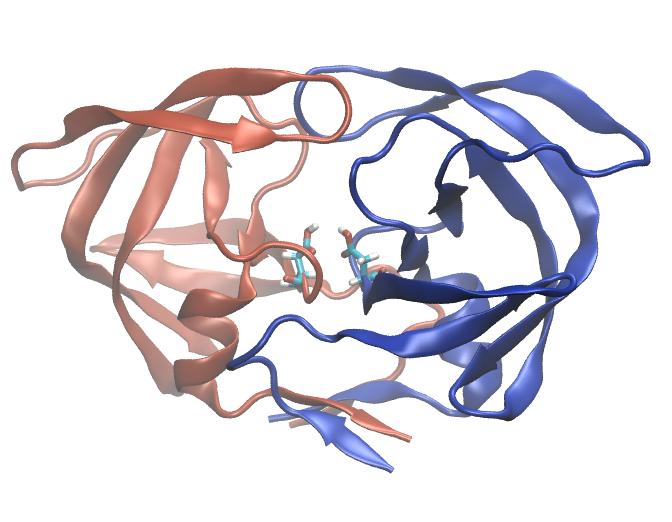

.. _example 5:

Example 5: HIV Protease with Patches to Protonate Aspartates
------------------------------------------------------------

Using the ``mods`` subdirective, one can introduce standard CHARMM36 residue patches.  This example protonates the aspartates in the HIV protease structure from `PDB ID 1f7a <https://www.rcsb.org/structure/1f7a>`_.

.. literalinclude:: ../../../pestifer/resources/examples/05-hiv-protease.yaml
    :language: yaml

Note that this required first mutating the residues at positions 25 from asparagine to asparate. This PDB entry was a catalytically inactive construct with an inhibitor mimic bound, so the catalytic aspartates were mutated to asparagines.

           HIV-1 protease with aspartates protonated.  The two chains are colored differently and ASP25 on each chain is shown in licorice.
