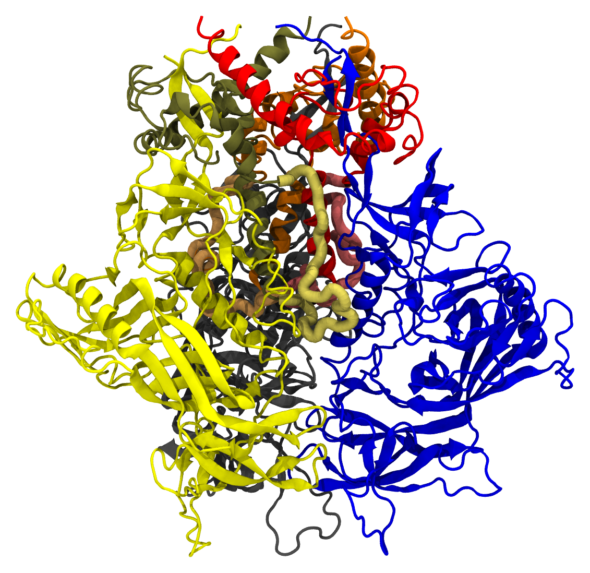
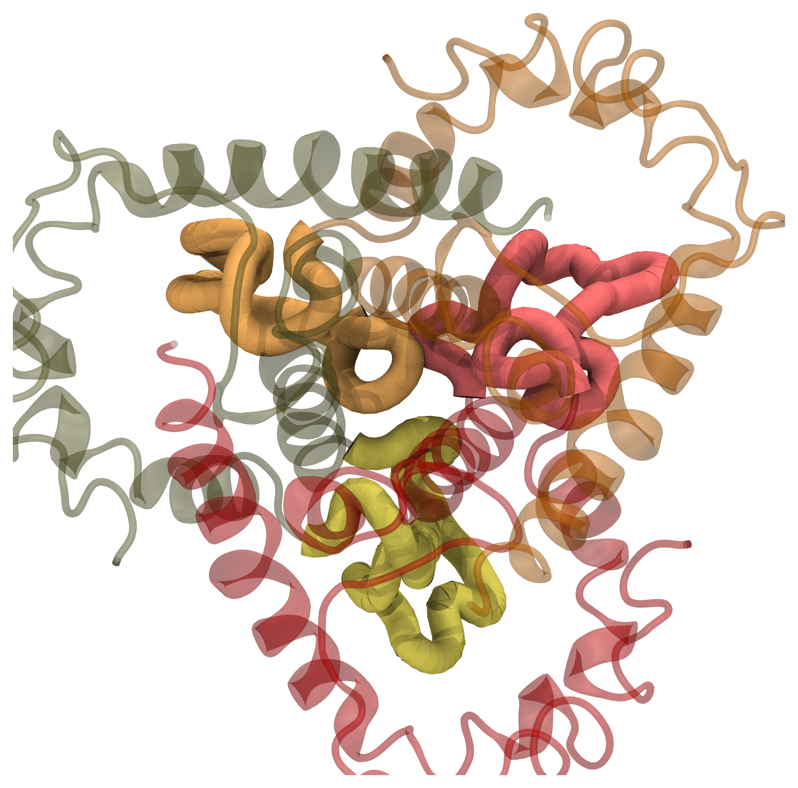

.. _example env 4zmj:

Example 7:  Closed, Unliganded HIV-1 BG505 Env SOSIP.664 Trimer
---------------------------------------------------------------

`PDB ID 4zmj <https://www.rcsb.org/structure/4zmj>`_ is a structure of the HIV-1 Env BG505 SOSIP-664 ectodomain trimer in a closed conformation, without any ligands bound.  It is one of the earliest X-ray crystal structures solved for this protein in trimeric form.

Pestifer understands how to build a system using any chosen biomolecular assembly available in the structure file.  In the case of `4zmj <https://www.rcsb.org/structure/4ZMJ>`_, the asymmetric unit is a single heterodimeric protomer composed of chains G (gp120) and B (gp41).
The relevant biological assembly is a C3-symmetric homotrimer of protomers, which is labeled biological assembly 1 in the PDB header.  Here we specify that the new chains generated by BIOMT transforms are H and J for chain G and C and D for chain B.  Pestifer will also by default undo any engineered mutations (there are three in 4zmj) and add any unresolved or zero-occupancy residues.  A build of the 4zmj trimer illustrates these capabilities.

.. literalinclude:: ../../../../pestifer/resources/examples/07/inputs/hiv-sosip-env-ectodomain1.yaml
    :language: yaml

.. task-table:: ../../../../pestifer/resources/examples/07/inputs/hiv-sosip-env-ectodomain1.yaml

There are several new aspects in this example relative to the first four.  First, in the ``psfgen`` task, the ``source`` directive has a ``biological_assembly`` specification with ``transform_reserves`` and ``sequence`` subdirectives.  

Clearly we are indicating biological assembly 1, which you can verify through the RCSB web interface or by reading the PDB file header is the trimer.  

There is also a ``ligate`` task.  Together, the ``loops`` subdirective of the ``sequence`` directive in the ``source``, and the ``ligate`` task, constitute the method of inserting missing residues (residues designated by MISSING records in the PDB or zero-occupancy in the mmCIF).  Building in missing protein loops that are *internal* to any given chain is done in the following way:

1. Via ``residue`` commands inside ``segment`` stanzas of the ``psfgen`` script, each missing residue is indicated.  When ``psfgen`` is run, the ``guesscoords`` command builds these residues from their default internal coordinates; this means they grow in as straight chains where every phi and psi angle is 180 degrees, with the far end nowhere near the residue it must eventually bond to.
2. The ``ligate`` task (``method: ccd``, the default) then closes each loop.  Every loop residue's backbone :math:`(\phi, \psi)` is re-seeded from the coil regions of the Ramachandran plot -- a realistic, compact backbone instead of a straight chain -- and the loop is closed onto its downstream anchor by cyclic coordinate descent, followed by an iterative declash refinement against the surrounding structure.  Each loop copy is closed **independently** against its actual neighbors (including copies already closed), so the three gp41 HR1N loops that converge at the trimer 3-fold interleave rather than clashing; symmetry of the modeled-in residues is not preserved, which is what makes that possible.  A final ``psfgen`` run heals each gap with a peptide bond.
3. Because the closure is purely geometric, a few soft (non-threaded) steric overlaps typically remain; the ``minimize`` and equilibration stages that follow relax them.  (In earlier versions this loop closure was instead done by steered MD, and the HR1N loops needed hand-tuned ``crotations`` to avoid clashes; neither is necessary now.)

The result is shown below: the closed, connected trimer after ``ccd`` loop closure and healing.

    The ccd-closed 4zmj Env trimer, drawn as a cartoon with the six chains coloured uniquely.  The three gp41 HR1N loops grown in and closed by ``ccd`` (residues 548–568 of chains B, C, and D) are drawn as thick tubes, each a brighter shade of its own protomer's colour.  They converge at the trimer 3-fold and **interleave** rather than clashing, because each copy is closed independently against its neighbours -- the symmetry of the modeled-in residues is not preserved.

    The same three HR1N loops, viewed straight down the trimer 3-fold axis with the surrounding gp41 core ghosted.  Because each copy is closed independently, the three loops (coral, orange, and gold for chains B, C, and D) take up *different* conformations and interleave around the axis.  A symmetry-preserving closure would instead place three identical copies at the same radius and collapse them into a clash at the centre.

The 4zmj entry contains partially resolved glycans.  By default, pestifer will include all resolved glycans.  These can be excluded using an ``excludes`` list that specifies ``resnames`` like ``NAG``, ``MAN``, etc.

The snapshots below illustrate the *legacy* steered-MD workflow (``method: steer``) by which the loops were previously grown in and dragged onto their anchors; they are retained here as a visual reference for how a model-built loop is closed onto resolved protein.  The default ``ccd`` closure described above reaches a comparable closed, connected structure geometrically rather than by steering.  In these snapshots, only backbone protein atoms are shown with bonds drawn as lines.  The model-built parts are drawn with thick bonds, and the six chains are colored uniquely.

.. list-table::

    * - .. figure:: 4zmj_step0.png

           Structure after first ``psfgen``.

      - .. figure:: 4zmj_step1.png

           Structure after declashing loops.

    * - .. figure:: 4zmj_step2-1.png

           Early in the steering.

      - .. figure:: 4zmj_step2-2.png

           Midway through the steering.

    * - .. figure:: 4zmj_step2-3.png

           At the end of the steering.

      - .. figure:: 4zmj_step3.png

           After healing.

           

.. raw:: html

    

        
Example author: Cameron F. Abrams &nbsp;&nbsp;&nbsp; Contact: <a href="mailto:cfa22@drexel.edu">cfa22@drexel.edu</a>

    
