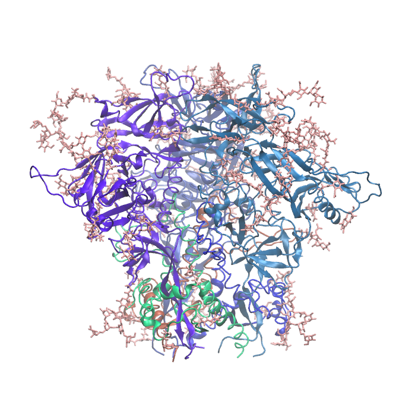

.. _example env 4tvp:

Closed, PGT122/35O22-Liganded HIV-1 BG505 Env SOSIP.664 Trimer (ligands removed)
--------------------------------------------------------------------------------

`PDB ID: 4tvp <https://www.rcsb.org/structure/4tvp>`_ is a structure of the HIV-1 Env ectodomain trimer in a closed conformation, with the PGT122 and 35O22 antibody Fabs bound.  This structure has fairly well-resolved glycans, likely because of the stabilization provided by the Fab ligands.  Here we prepare a system with just the ectodomain and glycans, omitting the ligands.

Like the other SOSIP examples here, the configuration reverts the engineered stabilizing changes back to the wild-type sequence: the ``SOS`` disulfide (A501C and T605C, which staples gp120 to gp41) and the ``IP`` substitution (I559P).  This is not automatic -- it happens because the ``mutations`` block asks for it, and a build without that block is of the stabilized construct rather than of wild-type Env.  The names above are the conventional HXB2 ones; each configuration addresses the residues in its own structure's numbering, so the indices in the ``mutations`` block below will not always match them.

Many structures in the RCSB are only available in mmCIF format, rather than the older, outdated PDB format; `4tvp <https://www.rcsb.org/structure/4TVP>`_ is one example.  Pestifer uses the native residue indices in the mmCIF file to build the system, not the "auth" indices.

.. literalinclude:: ../../../../pestifer/resources/examples/08/inputs/hiv-sosip-env-ectodomain2.yaml
    :language: yaml

.. task-table:: ../../../../pestifer/resources/examples/08/inputs/hiv-sosip-env-ectodomain2.yaml

    Structure of HIV-1 BG505 SOSIP.664 trimer (PDB ID 4tvp) with Fab ligands deleted from a complete Pestifer build.  Glycans are shown in pink stick representation.  The run-ready system has approx. 270,000 atoms in an equilibrated cell of roughly 144 x 141 x 131 Angstroms.

.. raw:: html

    

        
Example author: Cameron F. Abrams &nbsp;&nbsp;&nbsp; Contact: <a href="mailto:cfa22@drexel.edu">cfa22@drexel.edu</a>

    
