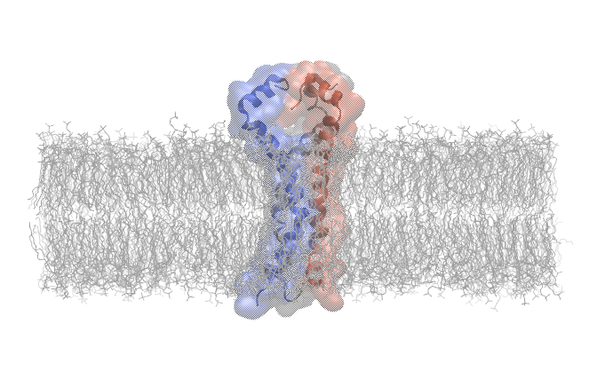
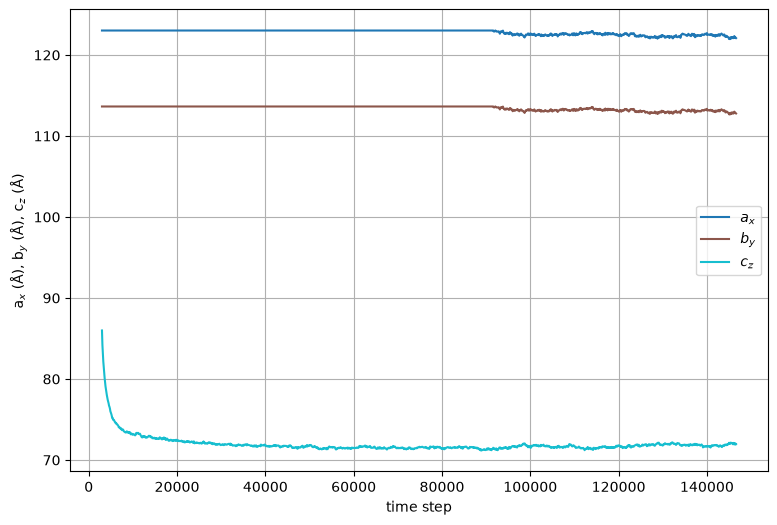
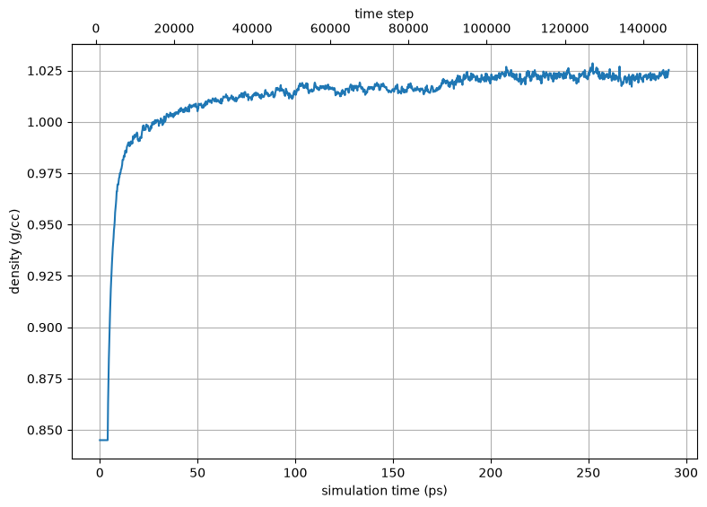
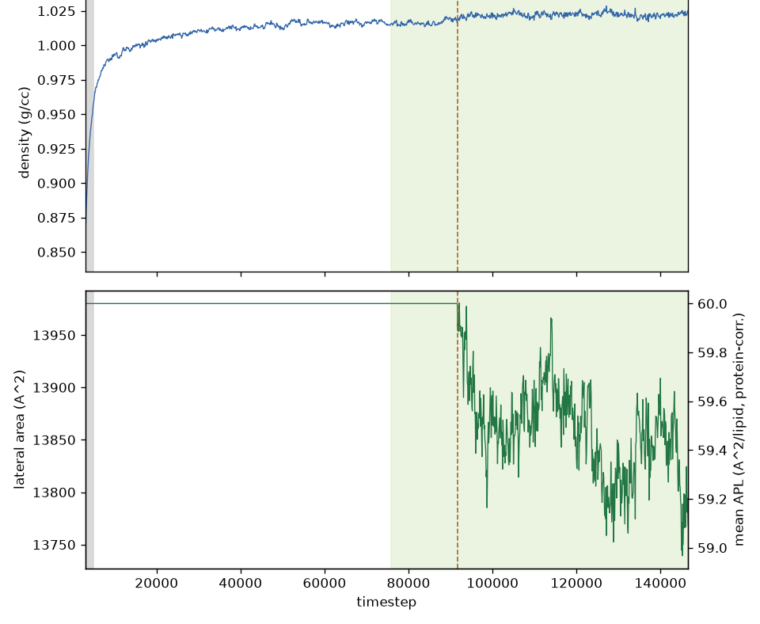
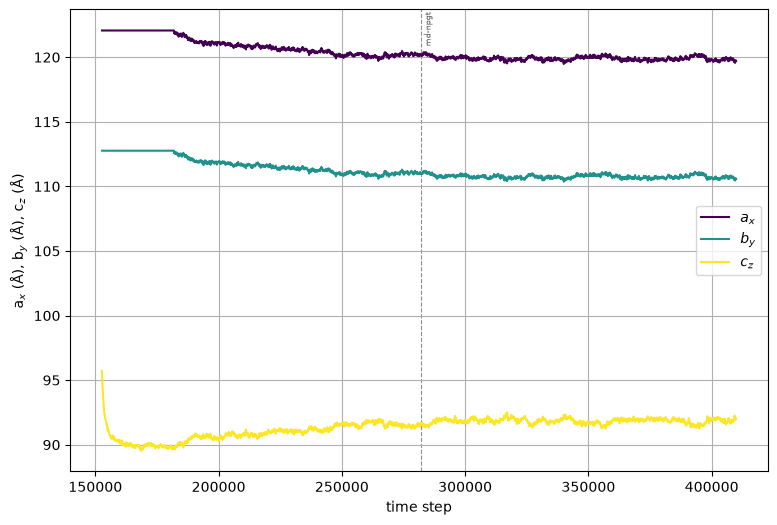
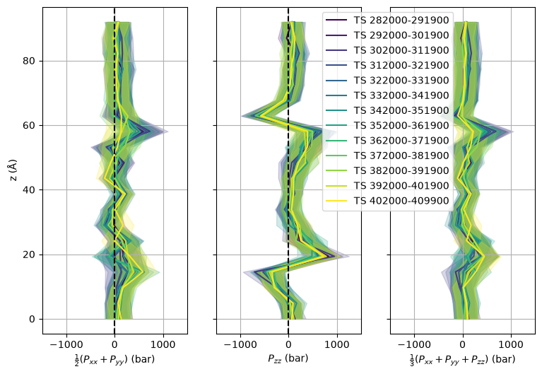
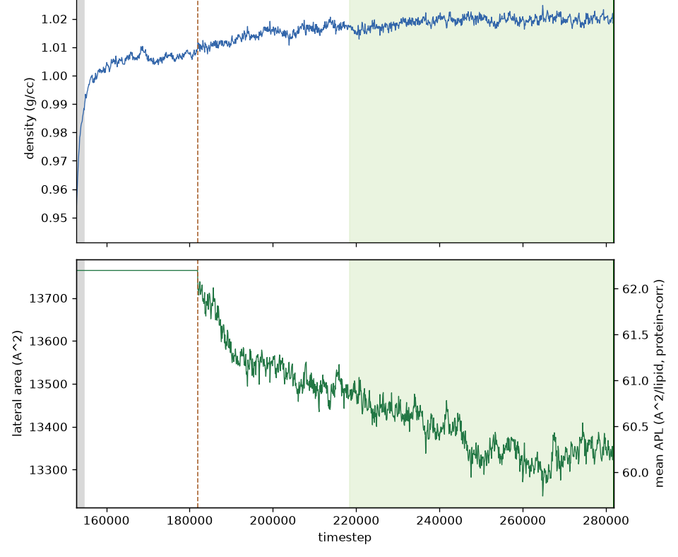
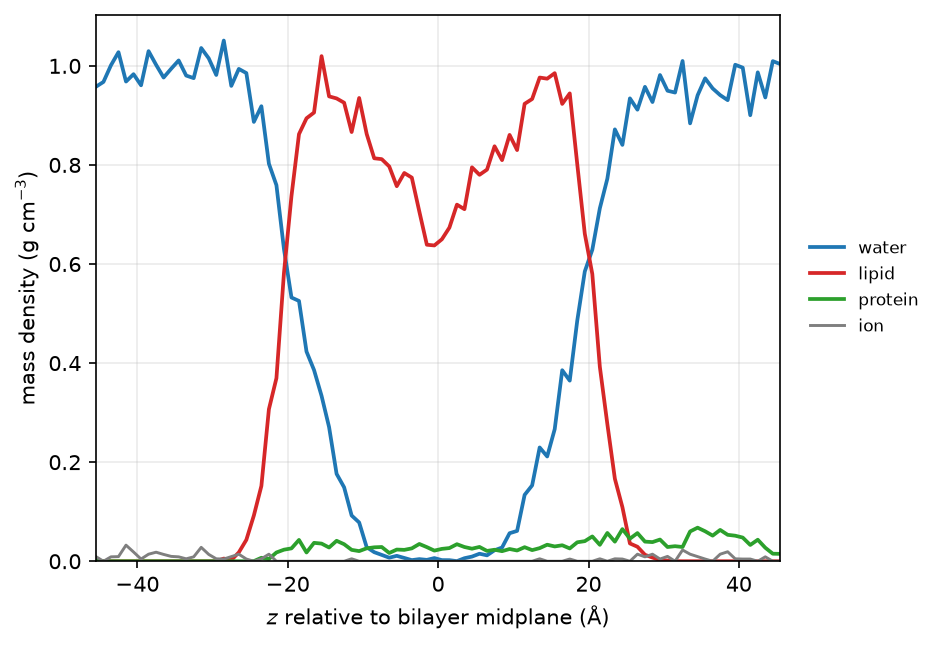

.. _example mper-tm symmetric bilayer:

Example 16: HIV-1 Env MPER-TM Trimer in a DMPC Symmetric Bilayer
--------------------------------------------------------------------------

           HIV-1 gp41 (MPER-TM) trimer embedded in a DMPC lipid bilayer. Each protein chain is colored uniquely, and a transparent isodensity surface is shown.  Waters and counterions are not shown.

`PDB ID 6e8w <https://www.rcsb.org/structure/6e8w>`_ is a trimeric HIV-1 Env gp41 construct embedded in a DMPC lipid bilayer (the authors also mention DHPC, but these are detergents that don't readily form bilayers). The structure was determined by NMR, and the structure file contains 15 models, and no lipids are included in the file.  This example shows how to use ``pestifer`` to generate a membrane-embedded protein system from this structure.

.. literalinclude:: ../../../../pestifer/resources/examples/16/inputs/hiv-mpertm3-membrane1.yaml
    :language: yaml

.. task-table:: ../../../../pestifer/resources/examples/16/inputs/hiv-mpertm3-membrane1.yaml

The bilayer is built by placing lipids on a lattice directly -- an *orthohexagonal* one, so each lipid has six equidistant neighbors rather than the closer diagonal contacts of a square lattice.  For a symmetric bilayer it grids the full membrane in one shot, sized to the embedded protein's footprint plus the ``embed.xydist`` margin -- there is no separate patch-packing step, and no calibration patches, because both leaflets share a composition.  The water chambers above and below the bilayer are filled by a ``solvate`` step at true liquid density rather than tiled on a lattice.

The key task in this example is the ``make_membrane_system`` task.  This task specifies a ``bilayer`` subtask and an ``embed`` subtask.  The ``bilayer`` subtask specifies the composition of the two leaflets and a ``quilt`` relaxation protocol that relaxes the gridded membrane prior to embedding the protein (the ``patch`` protocol is only used for asymmetric builds, which calibrate per-leaflet patches first -- see :ref:`example mper-tm viral bilayer`).  The ``embed`` subtask specifies how the protein is to be oriented and placed in the bilayer.  Immediately following the ``make_membrane_system`` task, a ``minimize`` and a short warm ``NVT`` pass fluidize the lipids around the freshly-embedded protein.  The barostatted equilibration that follows is a single self-terminating :ref:`membrane_equilibrate <subs_buildtasks_membrane_equilibrate>` task rather than the hand-tuned ladder of progressively longer NPT/NPgT runs this example used to carry: it runs NPgT in stability-bounded chunks and stops when the box density *and* the lateral area have both converged.

A detailed explanation of the two subtasks can be found at :ref:`subs_buildtasks_make_membrane_system`.

Results
+++++++

The plots below are generated by default during the membrane-building process.

           Cell dimensions vs time step during the ``quilt`` relaxation of the gridded DMPC membrane (before the protein is embedded).  The lateral cell contracts from the loose initial grid spacing to the membrane's equilibrium area per lipid.

           System density vs time step during the ``quilt`` relaxation of the gridded membrane, rising to the expected hydrated value of roughly 1.0 g/cc as the box condenses.

           Density and lateral area vs time step for the quilt's ``membrane_equilibrate`` stage.  Stage 1 settles the density with the lateral area held fixed, so the under-dense box loses its excess volume from :math:`z` alone; at the hand-off (dashed line) the barostat goes tensionless and the area relaxes to its preferred value, shown as area per lipid on the right-hand axis.  Pre-equilibrating the bilayer this way, rather than minimizing only, is what keeps the assembled system near density equilibrium instead of leaving a large post-embed condensation to the final stage.

The ``mdplot`` task generated the following plots for the membrane-embedded system.

           Cell dimensions vs time step for the protein-embedded membrane.

           Pressure profiles for selected time intervals during the protein-embedded membrane relaxation.

           Density and lateral area for the post-embed ``membrane_equilibrate``, which condenses out the voids left around the newly-embedded protein and stops when both observables are stationary rather than at a fixed step count.

The ``density-profile`` subcommand produces a species-resolved mass-density profile along the bilayer normal from the equilibrated final frame.  Water is cleanly excluded from the hydrophobic core, the lipid shows the characteristic headgroup peaks and a terminal-methyl trough at the midplane, and the membrane-spanning protein appears at low density across the bilayer.

           Water, lipid, and protein mass density vs distance from the bilayer midplane.  Generated with ``pestifer density-profile``.

.. raw:: html

    

        
Example author: Cameron F. Abrams &nbsp;&nbsp;&nbsp; Contact: <a href="mailto:cfa22@drexel.edu">cfa22@drexel.edu</a>

    
