.. _example mper-tm viral bilayer:

HIV-1 Env MPER-TM Trimer in an Asymmetric, Model Viral Bilayer
--------------------------------------------------------------

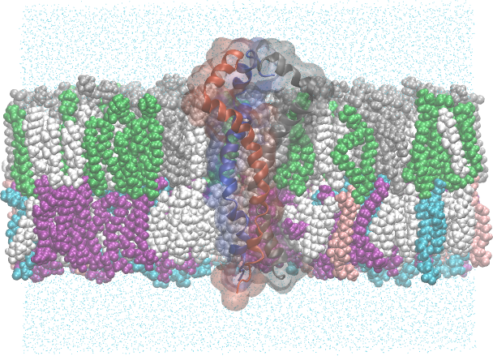

           HIV-1 gp41 (MPER-TM) trimer embedded in a model viral envelope lipid bilayer.  Bilayer is clipped to show the protein, and each protein chain is colored uniquely.  The outer leaflet (top) is composed of 36% Sphingomyelin d18:1/16:0 (CHARMM residue name PSM, colored grey), 17% 3-palmitoyl-2-oleoyl-D-glycero-1-Phosphatidylcholine (POPC, green), and 47% cholesterol (CHL1, white).  The inner leaflet (bottom) is composed of 30% 1-Stearoyl-2-Oleoyl-Phosphatidylethanolamine (SOPE, purple), 18% 1-Stearoyl-2-Oleoyl-Phosphatidylserine (SOPS, blue), 9% 3-palmitoyl-2-oleoyl-D-glycero-1-Phosphatidylethanolamine  (POPE, pink), and 43% cholesterol.

This example is the same as :ref:`example mper-tm symmetric bilayer`, but uses an asymmetric model viral bilayer instead of a symmetric DMPC bilayer.  The model viral bilayer is constructed from a mixture of lipids that are commonly found in the viral membrane.

Because the leaflets differ in composition, the grid packer takes the asymmetric path: it first relaxes two symmetric *calibration* patches -- one per leaflet composition -- to measure each leaflet's preferred area per lipid, then grids the full membrane (sized to the protein footprint) at stress-free per-leaflet counts.

**That approach has a name, and it is not new.**  Matching each leaflet to the equilibrium area of a *symmetric* bilayer of the same composition is the **SA** ("match surface areas") protocol -- one of the four in `Chaisson et al.'s <https://doi.org/10.3390/membranes13070629>`_ taxonomy (EqN, SA, 0-DS, EmBioAsym), in use since 2007 and the approach `Park, Im, and Pastor <https://doi.org/10.1016/j.bpj.2021.10.009>`_ recommend for generating initial conditions.  SA admits two realizations: stitch together leaflets lifted from the two equilibrated symmetric bilayers, or use their measured areas per lipid to compute leaflet counts and build the asymmetric bilayer from scratch.  **Pestifer does the latter.**  The calibration patches contribute their areas and nothing else -- no coordinates cross over -- which is the realization both sources prefer, because the product is then not locked to the size of the calibration cell.  That is exactly what lets the membrane here be sized to the protein's footprint while the patches stay at 100 lipids per leaflet.

**Why the calibration is simulated at all.**  Areas per lipid are *not* additive in lipid mixtures, so a leaflet's preferred area cannot be computed from its composition and a table of single-lipid values.  `MemGen <https://doi.org/10.1093/bioinformatics/btv292>`_ gives that non-additivity as its reason for not building asymmetric bilayers at all (p. 2898), referring the user instead to equilibrating two symmetric systems by hand.  Pestifer's two calibration runs are what buy the measurement: each leaflet's actual mixture is simulated and its own equilibrium area read off.  That is the cost this page is mostly about, and it is the reason an asymmetric build takes a detour a symmetric one does not.

**What SA does not promise.**  It sets the leaflet counts so that each leaflet sits at *its own symmetric* preferred area, which is zero differential stress only to first order: packing densities need not carry over from symmetric to asymmetric bilayers, and that is the premise the 0-DS protocol exists to avoid relying on.  Pestifer therefore treats the result as a claim to be checked -- ``diagnose_differential_stress`` measures the residual stress of the assembled membrane from its pressure profile and reports it, deliberately without rebuilding.  A build that wants a tensionless guarantee rather than a first-order construction should read that diagnostic, not the construction.

Three features of that path are what make a dense, asymmetric raft build tractable.

**The lattice is orthohexagonal.**  Every lipid gets six equidistant neighbors, which spreads a cholesterol-rich leaflet uniformly enough to grid near 50 :math:`Å^2` per lipid.  A square lattice puts close contacts along its diagonals at that density, which VMD mis-bonds and psfgen then "repairs" by guessing atoms onto the origin.

**Each leaflet's phase is an input, not an outcome.**  The upper leaflet is a saturated, cholesterol-rich raft (sphingomyelin plus 47% cholesterol), so it is declared ``Lo`` and packed from an ordered, trans-biased conformer ensemble.  A liquid-ordered leaflet cannot be reached by equilibrating a fluid one: that is a phase transition rather than relaxation, and MD will not cross it on build timescales.  The lower leaflet's oleoyl chains cannot be ordered by the same bias -- its ``Lo`` ensemble would be identical to its fluid one -- so it is declared ``Ld``, which also skips a redundant conformer generation.

**The calibration is what the grid is sized from.**  In the run shown below the two patches settled at **46.96** :math:`Å^2` per lipid for the upper leaflet and **53.07** :math:`Å^2` for the lower -- the asymmetry that the two-patch detour exists to quantify.  The water chambers above and below the bilayer are then filled by a ``solvate`` step at true liquid density, rather than tiled on a lattice.

.. literalinclude:: ../../../../pestifer/resources/examples/17/inputs/hiv-mpertm3-membrane2.yaml

.. task-table:: ../../../../pestifer/resources/examples/17/inputs/hiv-mpertm3-membrane2.yaml

Results
+++++++

The plots below are generated by default during the membrane-building process.  Every barostatted stage is run by the self-terminating :ref:`membrane_equilibrate <subs_buildtasks_membrane_equilibrate>` task, which chunks NPgT for patch-grid stability and stops when the box density *and* the lateral area have both converged -- so no stage length is hand-tuned here.

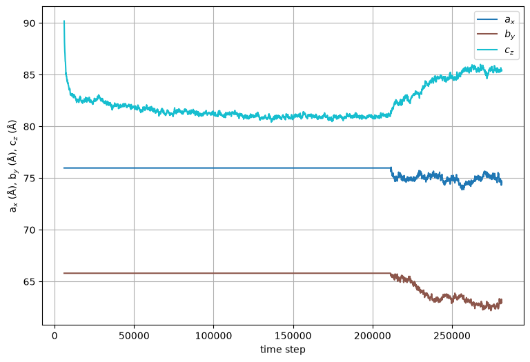

           Cell dimensions vs time step for the symmetric calibration patch used to measure the upper leaflet's preferred area per lipid.

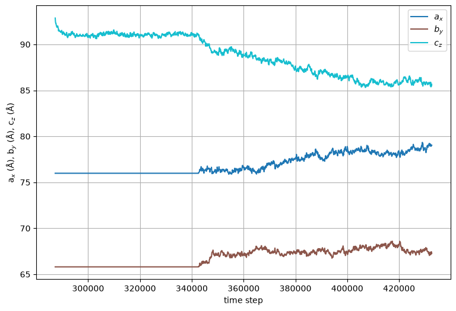

           Cell dimensions vs time step for the symmetric calibration patch used to measure the lower leaflet's preferred area per lipid.

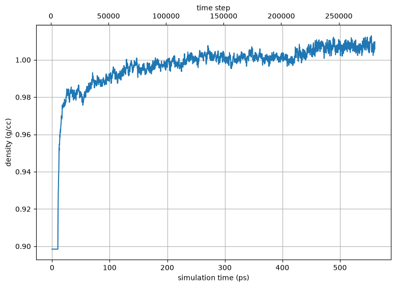

           System density vs time step for the upper-leaflet calibration patch.

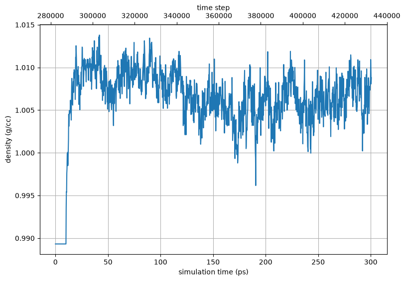

            System density vs time step for the lower-leaflet calibration patch.

The calibration itself is the ``membrane_equilibrate`` stage that ends each patch protocol, and its two-panel convergence plot is the clearest view of what the two-stage protocol does.  Stage 1 settles the density at *constant* lateral area -- the area trace is pinned flat -- so the under-dense box loses its excess volume from :math:`z` alone.  At the hand-off (dashed line) the barostat goes tensionless and the area relaxes to its preferred value, read off the right-hand axis as area per lipid.

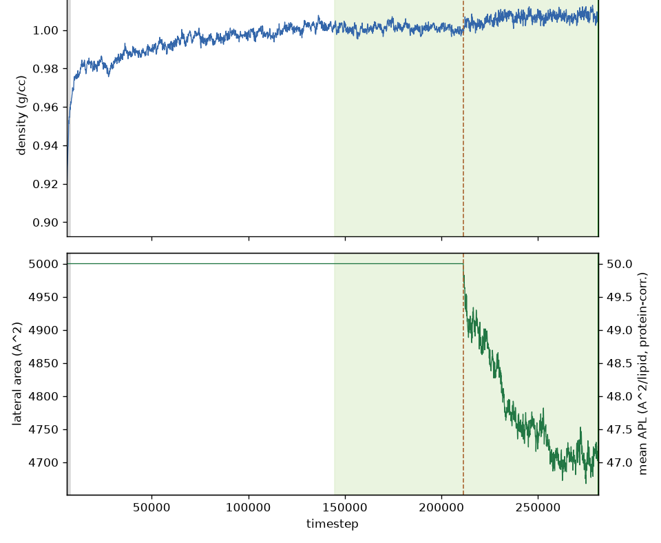

           Density and lateral area vs time step for the upper-leaflet (``Lo``) calibration patch.  The area is held at the build value through stage 1, then relaxes from 50 to about 47 :math:`Å^2` per lipid once the tensionless stage begins.  Convergence is gated on the cumulative area *plateau*, not merely a locally flat slope, so a slowly-condensing cholesterol-rich leaflet cannot stop early.

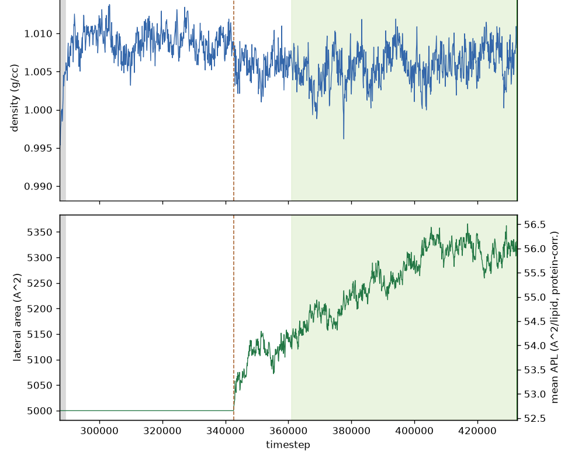

           The same for the lower-leaflet (``Ld``) calibration patch, which settles at a markedly larger area per lipid -- the quantitative asymmetry between the two leaflets.

Once the per-leaflet areas are calibrated, the full asymmetric membrane is gridded at the stress-free per-leaflet counts and relaxed with the ``quilt`` protocol before the protein is embedded.

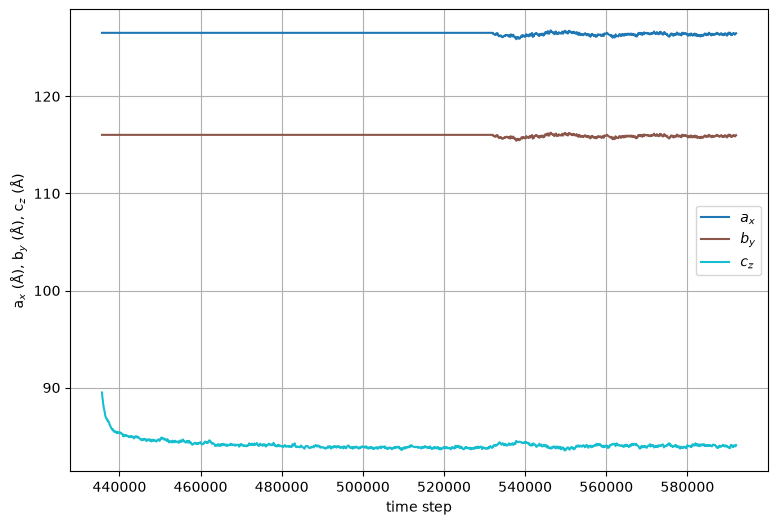

           Cell dimensions vs time step during the ``quilt`` relaxation of the full gridded asymmetric membrane.

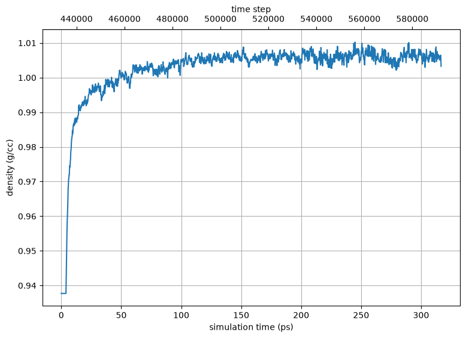

           System density vs time step during the ``quilt`` relaxation of the full gridded asymmetric membrane.

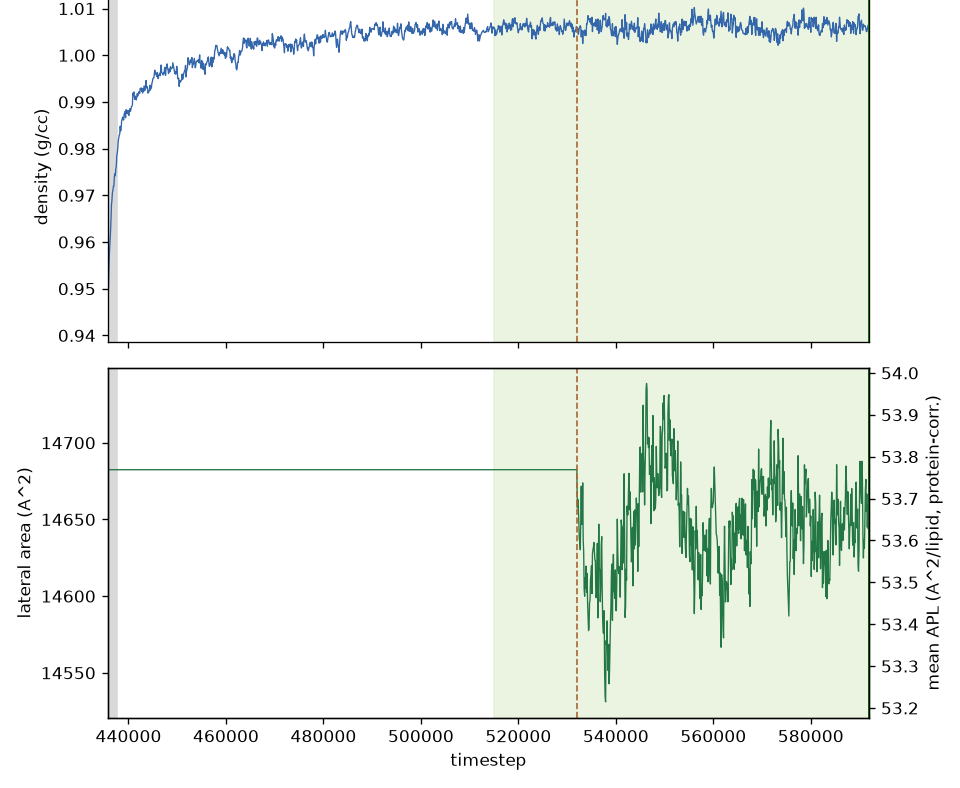

           Density and lateral area for the quilt's ``membrane_equilibrate`` stage.  The quilt is gridded deliberately loose to give the rigid, cholesterol-rich leaflets placement clearance, and this stage condenses that slack back out; unlike the calibration patches it keeps the cell's :math:`L_x{:}L_y` ratio locked, because the embedded membrane's lateral aspect has to stay stable.

The ``mdplot`` task generated the following plots for the membrane-embedded system.

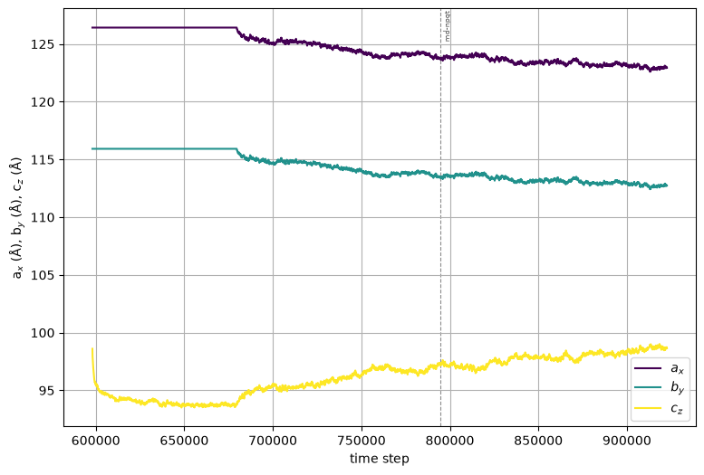

           Cell dimensions vs time step for the protein-embedded membrane.

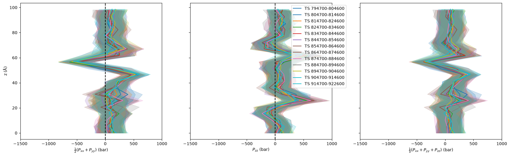

           Pressure profiles for selected time intervals during the protein-embedded membrane relaxation.

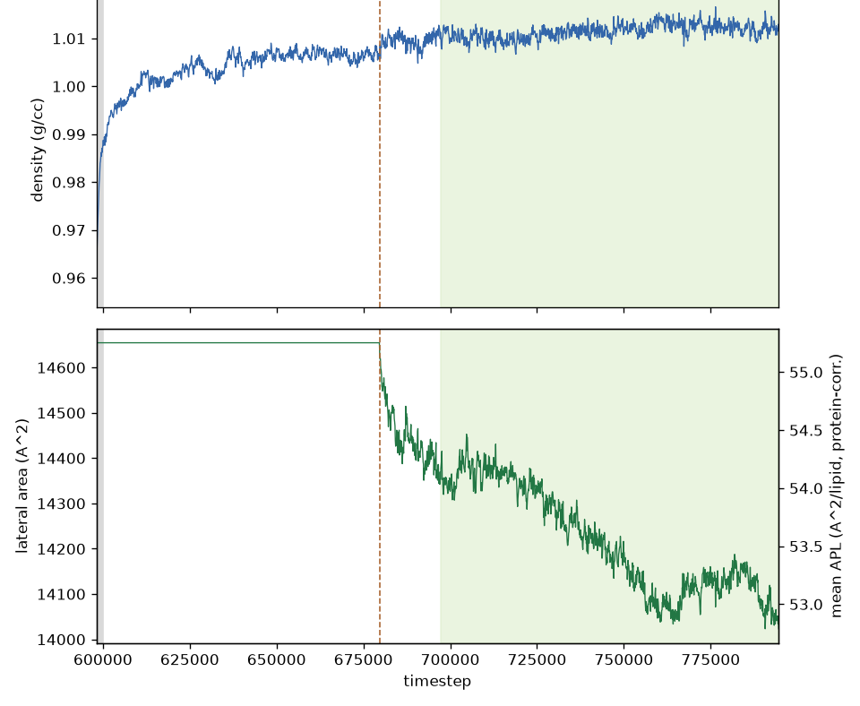

           Density and lateral area for the post-embed ``membrane_equilibrate``, which squeezes out the voids left around the freshly-embedded protein.  This is the slowest of the four stages, which is why its step ceiling is the highest: void removal is inherently gradual, and the task keeps running until both observables are stationary rather than stopping at a fixed step count.

The ``density-profile`` subcommand produces a species-resolved mass-density profile along the bilayer normal from the equilibrated final frame.  For a multicomponent bilayer the ``--lipid-components`` option decomposes the total lipid density into one curve per lipid species, which exposes the leaflet asymmetry: the outer-leaflet PSM and POPC peak on one side, the inner-leaflet SOPE, SOPS, and POPE on the other, while cholesterol (CHL1) populates both leaflets.

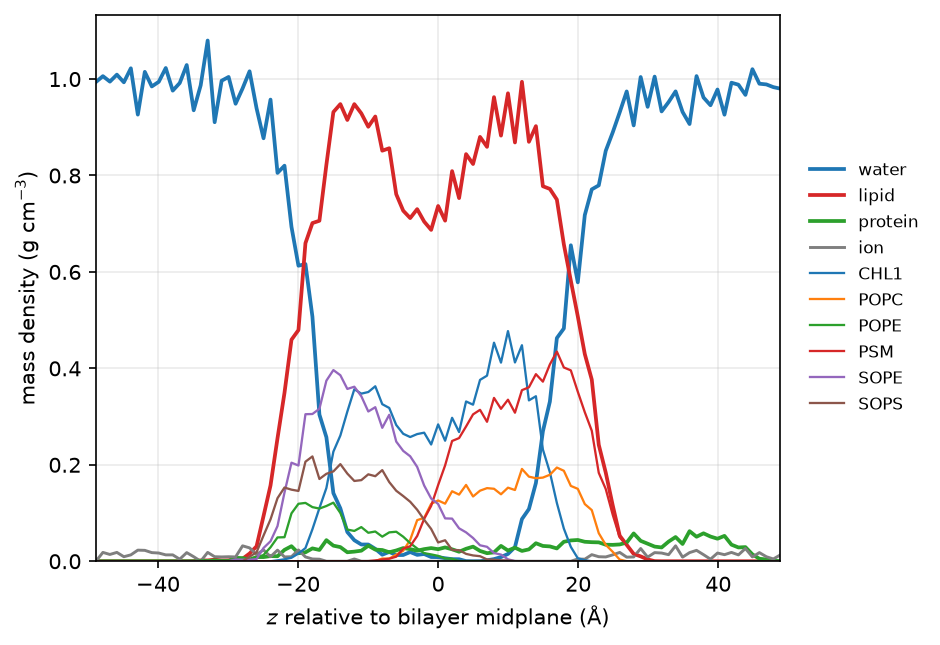

           Per-species mass density vs distance from the bilayer midplane, with the lipid total broken out into individual components.  Generated with ``pestifer density-profile --lipid-components``.

References
++++++++++

The method this example implements, and the sources for the paragraphs above:

* `Building Asymmetric Lipid Bilayers for Molecular Dynamics Simulations: What Methods Exist and How to Choose One?  Chaisson, E.H., Heberle, F.A., Doktorova, M. (2023) Membranes 13(7): 629 <https://doi.org/10.3390/membranes13070629>`_ -- the review that names and compares the four protocols; section 3.2 is SA and its two realizations.
* `Developing initial conditions for simulations of asymmetric membranes: a practical recommendation.  Park, S., Im, W., Pastor, R.W. (2021) Biophys. J. 120(22): 5041-5059 <https://doi.org/10.1016/j.bpj.2021.10.009>`_ -- recommends SA (p. 5056), and states the two realizations at p. 5047.
* `Membrane potential and electrostatics of phospholipid bilayers with asymmetric transmembrane distribution of anionic lipids.  Gurtovenko, A.A., Vattulainen, I. (2008) J. Phys. Chem. B 112(15): 4629-4634 <https://doi.org/10.1021/jp8001993>`_ -- an early application of the approach.
* `Behavior of Bilayer Leaflets in Asymmetric Model Membranes: Atomistic Simulation Studies.  Tian, J., Nickels, J., Katsaras, J., Cheng, X. (2016) J. Phys. Chem. B 120(33): 8438-8448 <https://doi.org/10.1021/acs.jpcb.6b02148>`_ -- builds asymmetric bilayers this way and tests the result by varying one leaflet's lipid count.
* `Accurate in silico modeling of asymmetric bilayers based on biophysical principles.  Doktorova, M., Weinstein, H. (2018) Biophys. J. 115(9): 1638-1643 <https://doi.org/10.1016/j.bpj.2018.09.008>`_ -- the 0-DS protocol, which targets zero differential stress directly.
* `MemGen: a general web server for the setup of lipid membrane simulation systems.  Knight, C.J., Hub, J.S. (2015) Bioinformatics 31(17): 2897-2899 <https://doi.org/10.1093/bioinformatics/btv292>`_ -- declines to automate asymmetric bilayers, and says why (p. 2898).

.. raw:: html

    

        
Example author: Cameron F. Abrams &nbsp;&nbsp;&nbsp; Contact: <a href="mailto:cfa22@drexel.edu">cfa22@drexel.edu</a>

    
