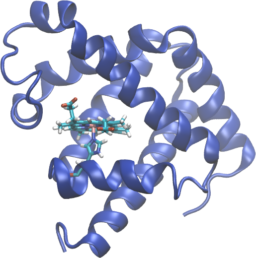

.. _example 1mob:

Example 19: Sperm whale myoglobin
---------------------------------

`PDB ID 1mob <https://www.rcsb.org/structure/1mob>`_ is one of 16 structures of sperm whale myoglobin mutants determined by the Phillips lab using X-ray crystallography.  This example demonstrates that pestifer can handle the heme group and the covalent bond between the heme and the His93 residue.  The heme group is a prosthetic group that is not part of the protein sequence, but it is included in the PDB file.  Pestifer can handle this by using the ``psfgen`` task to generate a PSF file that includes the heme group and the covalent bond.    

.. literalinclude:: ../../../pestifer/resources/examples/1mob.yaml
    :language: yaml

   Sperm whale myoglobin structure from PDB ID 1mob.  The heme group and His93 residue are shown in licorice representation, including the bond between the heme iron and the Nε of His93