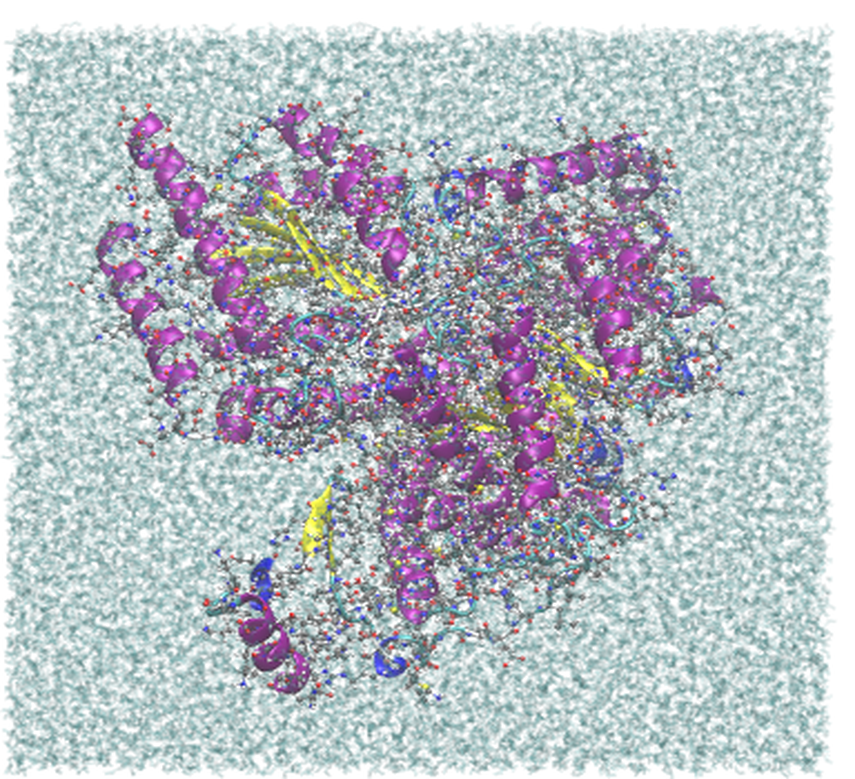

.. _example methylmalonyl-coa-mutase:

Example 20: Mitochondrial methylmalonyl-CoA mutase (Alphafold P22033)
---------------------------------------------------------------------

`Alphafold ID P22033 <https://alphafold.com/api/prediction/P22033>`_ is a predicted structure of the mitochondrial methylmalonyl-CoA mutase, a key enzyme in the metabolism of certain amino acids and fatty acids. This example demonstrates how to use Pestifer to set up a simulation environment for this protein.

.. literalinclude:: ../../../../pestifer/resources/examples/20/inputs/methylmalonyl-coa-mutase.yaml
    :language: yaml

.. task-table:: ../../../../pestifer/resources/examples/20/inputs/methylmalonyl-coa-mutase.yaml

    The largest of the globular examples in this style: 92,742 atoms, 26,951 waters, and 76 Na\ :sup:`+`
    / 80 Cl\ :sup:`-`.  Protein is drawn as a cartoon over all-atom detail and solvent as fine glassy
    lines, the same recipe as the :ref:`BPTI series <example bpti1>`.

.. raw:: html

        

            
Example author: Cameron F. Abrams&nbsp;&nbsp;&nbsp;Contact: <a href="mailto:cfa22@drexel.edu">cfa22@drexel.edu</a>

        
