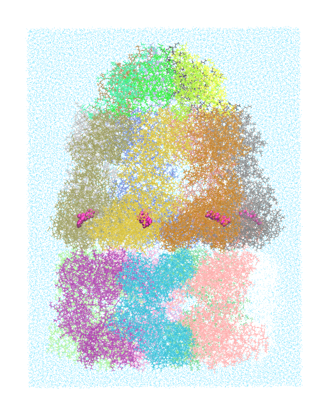

.. _example groel-groes-adp:

Example 21: Asymmetric GroEL/GroES Chaperonin Complex
-----------------------------------------------------

`PDB ID 1aon <https://www.rcsb.org/structure/1aon>`_ is the famous structure of the asymmetric GroEL/GroES chaperonin complex with ADP bound. This build represents Pestifer's ability to handle ligands like ADP.

.. literalinclude:: ../../../../pestifer/resources/examples/21/inputs/groel-groes-adp.yaml
    :language: yaml

.. task-table:: ../../../../pestifer/resources/examples/21/inputs/groel-groes-adp.yaml

        The GroEL/GroES chaperonin complex with ADP bound, in TIP3P water, as built by Pestifer.  This system has 550,023 atoms and its equilibrated box is roughly 158 x 160 x 211 Å.

Reference
+++++++++

* `The crystal structure of the asymmetric GroEL-GroES-(ADP)7 chaperonin complex. Xu, Z., Horwich, A.L., Sigler, P.B. (1997) Nature 388: 741-750 <https://doi.org/10.1038/41944>`_

.. raw:: html

    

        
Example author: Cameron F. Abrams &nbsp;&nbsp;&nbsp; Contact: <a href="mailto:cfa22@drexel.edu">cfa22@drexel.edu</a>

    

