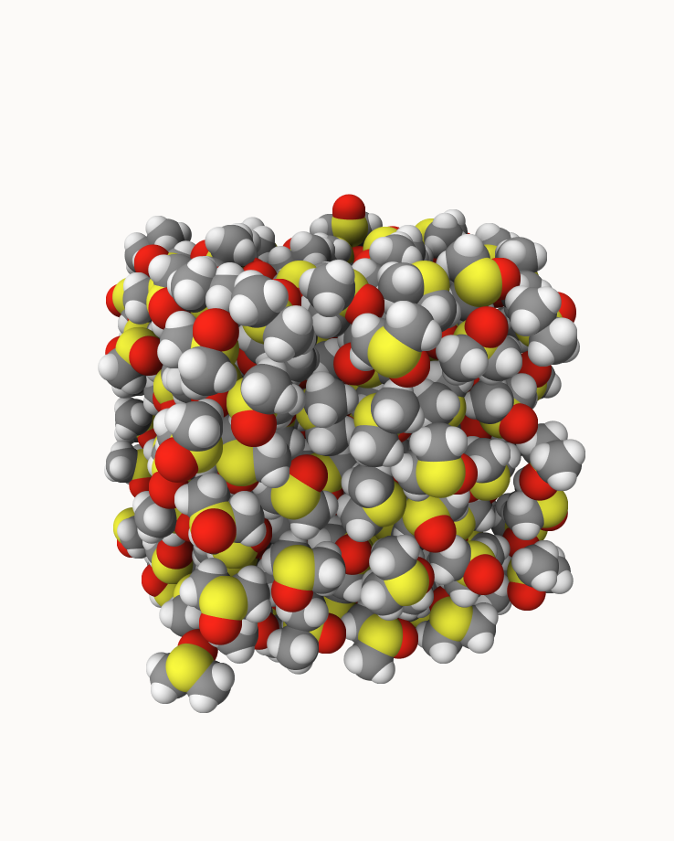
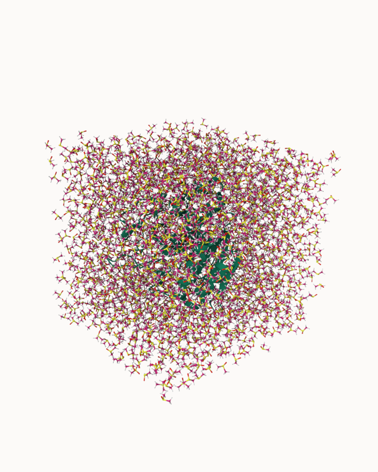
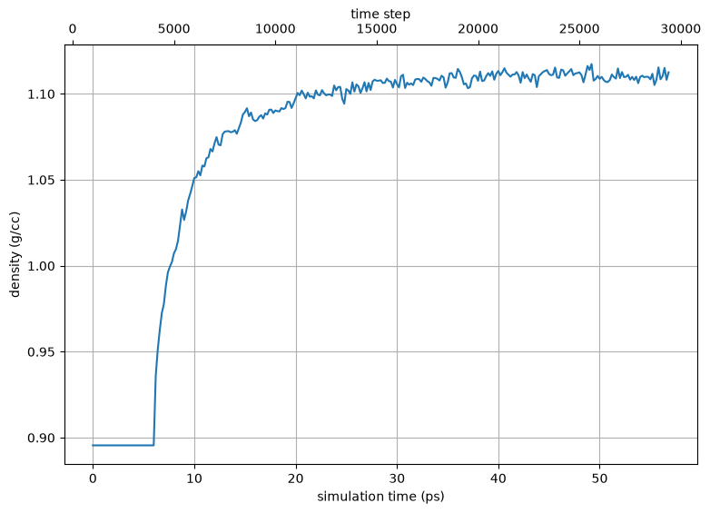

.. _example subtilisin-dmso:

Example 23: Subtilisin Carlsberg in DMSO
----------------------------------------

`PDB ID 1scd <https://www.rcsb.org/structure/1scd>`_ is the structure of the serine protease subtilisin Carlsberg.  This example demonstrates building a protein in a **non-aqueous solvent** -- here dimethyl sulfoxide (DMSO), a classic medium for studying enzyme catalysis in organic solvents.

Rather than water, the ``solvate`` task is given ``solvent: DMSO``.  Pestifer tiles a pre-equilibrated DMSO box (shipped in the built-in ``solvent`` collection) to fill the cell, then neutralizes the system's net charge by replacing a few DMSO molecules with counter-ions (VMD's ``autoionize`` only works for water, so pestifer does this by solvent replacement).  The build finishes with a staged, progressively longer NPT schedule so the box relaxes to its equilibrium density.

.. literalinclude:: ../../../../pestifer/resources/examples/23/inputs/subtilisin-dmso.yaml
    :language: yaml

.. task-table:: ../../../../pestifer/resources/examples/23/inputs/subtilisin-dmso.yaml

    The pre-equilibrated DMSO box (216 molecules) that pestifer ships in the built-in ``solvent`` collection and tiles to fill the cell.  Space-filling view: sulfur is yellow, oxygen red, carbon grey.  Rendered with `mdview <https://github.com/cameronabrams/mdview>`_.

    Subtilisin Carlsberg (green cartoon) solvated in DMSO, as built by Pestifer -- 22,488 atoms (1,834 DMSO molecules) in a box of roughly 62 x 61 x 68 Å.  Rendered with `mdview <https://github.com/cameronabrams/mdview>`_.

    Density over the progressive-NPT equilibration of the system, which settles near the bulk value for DMSO.

.. raw:: html

    

        
Example author: Cameron F Abrams &nbsp;&nbsp;&nbsp; Contact: <a href="mailto:cfa22@drexel.edu">cfa22@drexel.edu</a>

    

