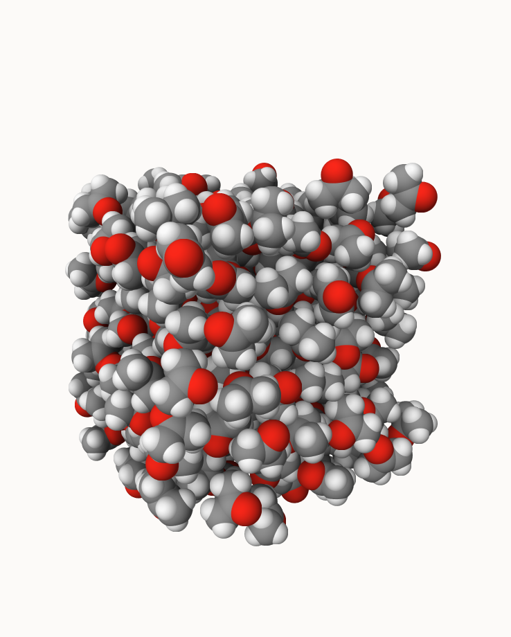
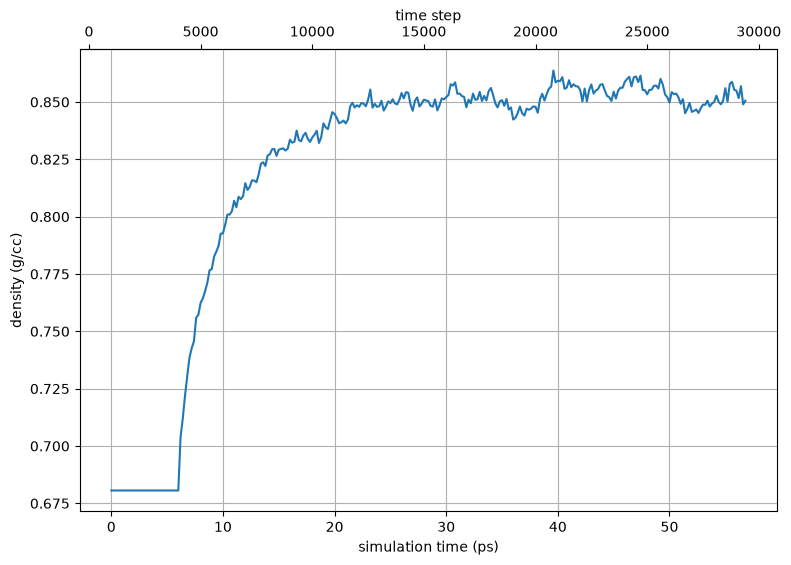

.. _example subtilisin-acetone:

Example 24: Subtilisin Carlsberg in acetone
-------------------------------------------

`PDB ID 1scd <https://www.rcsb.org/structure/1scd>`_ is the structure of the serine protease subtilisin Carlsberg.  Like :ref:`Example 23 <example subtilisin-dmso>`, this example builds the enzyme in a **non-aqueous solvent** -- here acetone, another classic medium for the study of enzyme catalysis in organic solvents.  The point of this example is what happens when the requested solvent has **no pre-equilibrated box shipped with pestifer**.

Pestifer ships boxes for a handful of common solvents (water, MEOH, ETOH, DMSO), but acetone is not among them.  Rather than erroring, the ``solvate`` task **builds the box on demand**: because ``ACO`` (acetone) is defined in the CGenFF force field, pestifer packs a periodic box of it, minimizes and NPT-equilibrates it, and **caches** the result under ``~/.pestifer/pdbrepository/<release>/solvent/ACO/`` so every subsequent build reuses it instantly.  The first build therefore pays a one-time cost (loudly logged) to generate the box; from then on it is as fast as a shipped solvent.  Set ``charmmff.generate_missing_coordinates: false`` to disable this and require an explicit box instead.

The rest of the build is identical to the DMSO example: the equilibrated acetone box is tiled to fill the cell, the system's net charge is neutralized by replacing a few acetone molecules with counter-ions (VMD's ``autoionize`` only works for water, so pestifer does this by solvent replacement), and a staged, progressively longer NPT schedule relaxes the box to its equilibrium density.

.. literalinclude:: ../../../../pestifer/resources/examples/24/inputs/subtilisin-acetone.yaml
    :language: yaml

.. task-table:: ../../../../pestifer/resources/examples/24/inputs/subtilisin-acetone.yaml

    The acetone box pestifer built **on the fly** (216 molecules; edge ~30 Å, ρ 0.77 g/cc) and cached for reuse, then tiled to fill the cell.  Space-filling view: oxygen is red, carbon grey -- and, unlike DMSO (:ref:`Example 23 <example subtilisin-dmso>`), there is no sulfur.  Rendered with `mdview <https://github.com/cameronabrams/mdview>`_.

    Density over the progressive-NPT equilibration of the system, which settles near the bulk value for acetone (~0.79 g/cc).  The auto-generated box was itself equilibrated to a density of 0.77 g/cc before tiling.

.. raw:: html

    

        
Example author: Cameron F Abrams &nbsp;&nbsp;&nbsp; Contact: <a href="mailto:cfa22@drexel.edu">cfa22@drexel.edu</a>

    

