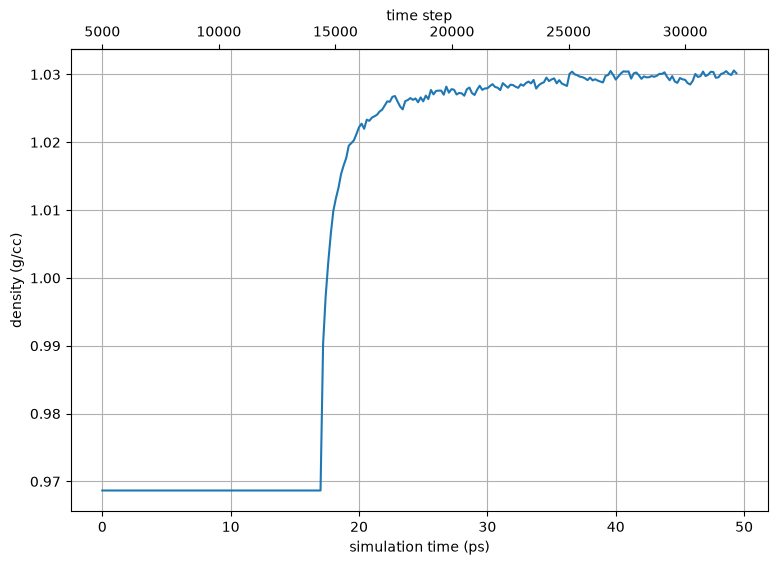

.. _example hiv-env-cd4-17b-liganded:

Example 25: Completing Partially-Resolved Ligands — the sCD4/17b-liganded 5vn3 Env Trimer
-----------------------------------------------------------------------------------------

`PDB ID 5vn3 <https://www.rcsb.org/structure/5vn3>`_ is an open, sCD4/17b-liganded HIV-1 B41 SOSIP Env ectodomain trimer.  :ref:`Example 12 <example env 5vn3>` builds just the Env from this structure, omitting the sCD4 and 17b chains.  This example instead builds the **full liganded complex** — the Env trimer, three soluble CD4 (sCD4), and three 17b Fabs — and in doing so demonstrates a general technique: **completing a ligand that is only partially resolved in your structure, using coordinates from a second structure, while preserving the original interface atom-for-atom.**

The problem
+++++++++++

In 5vn3 each 17b Fab is only about half-built.  The heavy chain (H/K/M) is resolved to residue 112 and the light chain (L/N/O) to 108 — that is, only the two **variable domains** (the Fv).  The **constant domains** (CH1, CL) are missing.  The Fv is exactly the part that forms the CD4-induced epitope contact with gp120, so we want to keep its 5vn3 coordinates *exactly*; we only need to add the missing constant domains.

A simple C-terminal fusion of each missing domain would not do: fusing CH1 onto the heavy chain and CL onto the light chain independently would not preserve the **CH1–CL constant-domain pairing**.  Instead we bring in a *complete* 17b Fab as a rigid scaffold, position it by its Fv, and then overwrite the Fv with 5vn3's exact coordinates.

`PDB ID 1gc1 <https://www.rcsb.org/structure/1gc1>`_ (the original gp120–CD4–17b complex) contains the **same** 17b antibody, fully resolved (heavy 1–229, light 1–213).  Its constant domains are what we graft on.

The strategy
++++++++++++

The build is done in stages, each a small pestifer script:

#. **Base** (``helper-01-base.yaml``) — build the Env trimer + sCD4, excluding the six partial Fab chains.  The Env preparation is the same as Example 12 (undo the SOSIP mutations, GGG-stub the V1/V2 loops, ligate the breaks).  5vn3's N-glycans are detected and modeled automatically.
#. **Fv donor** (``helper-02-fabdonor.yaml``) — rebuild 5vn3's six partial Fab chains through psfgen so every resolved residue has all its atoms.  These are the exact interface coordinates we will preserve.
#. **Position each Fab** (``helper-03-position-fab{1,2,3}.yaml``) — build a complete 1gc1 Fab, rigid-body ``align`` it onto one protomer's 5vn3 Fv, then ``transfer_coords`` to overwrite the Fv with 5vn3's exact coordinates.
#. **Assemble** (``hiv-env-cd4-17b-liganded.yaml``) — ``merge`` the three completed Fabs into the base, then solvate and equilibrate.

Positioning a Fab: ``align`` + ``transfer_coords``
++++++++++++++++++++++++++++++++++++++++++++++++++

This is the heart of the technique.  For each Fab:

.. literalinclude:: ../../../../pestifer/resources/examples/25/inputs/aux/helper-03-position-fab1.yaml
    :language: yaml

Three subtleties are worth understanding, because they generalize to any structure-completion task:

- **The two structures number the antibody differently.**  5vn3 uses Kabat numbering (with insertion codes in the CDR loops), 1gc1 uses sequential numbering.  The same physical residue therefore has different residue numbers in the two files.  Both ``align`` and ``transfer_coords`` match atoms by **selection order**, not by residue number — so the selections use different residue ranges on each side (1gc1 heavy ``1 to 127`` corresponds to 5vn3's 127-residue heavy Fv), and the correspondence is correct because the *sequences* are identical.

- **Fit by a single chain for a deterministic order.**  The alignment fits the 1gc1 heavy variable domain onto the donor's heavy chain only.  Using one chain guarantees the CA atoms are returned in residue order on both sides; a multi-chain fit would depend on the (unreliable) order in which chains appear in each PSF.  The subsequent transfer is done one chain at a time for the same reason.

- **Leave the chain termini to the scaffold.**  A standalone Fv chain is capped at its C-terminus (extra ``OT1``/``OT2`` atoms) where the corresponding 1gc1 residue is internal (a single carbonyl ``O``).  So the transfer covers heavy 1–126 and light 1–109 — one residue short of the Fv end — and the junction residue and the constant domains keep the 1gc1 scaffold coordinates.  Those residues are at the Fv/constant seam, away from the Env interface, and are relaxed by the subsequent minimization.

The result is a complete Fab whose Fv carries 5vn3's exact interface coordinates and whose constant domains come, correctly paired, from 1gc1.

Assembling and solvating
++++++++++++++++++++++++

The final script merges the three completed Fabs into the base and solvates.  Note that no chain-ID or segment-name bookkeeping is needed: the three Fabs all arrive as segments/chains H/L, and pestifer's ``merge`` automatically resolves the collisions.  It renames each colliding segment to a fresh **single-character segid** (e.g. the second Fab's heavy chain becomes segid ``E``, the third ``J``).  A single-character segid matters because a PSF has no chain column: every time the pipeline regenerates a PDB from the PSF — the ``solvate`` step, and every coordinate-to-PDB conversion — VMD re-derives each atom's chain ID from its segid's leading character.  Enumerated segids like ``H0``/``H1`` would both derive back to chain ``H`` and collapse the three Fabs onto one chain in any chain-based view (VMD cartoon tracing, ``chain H`` selections), making three Fabs look like one; a single-character segid keeps each Fab's chain ID unique **and** stable through the whole build, so the three Fabs stay distinct in the final structure.

A gentle staged warmup
++++++++++++++++++++++

Merging three freshly-completed Fabs into the trimer leaves each Fab's newly-built N-terminus packed tightly against its neighbors — a hard, interlocked contact that energy minimization alone cannot fully relieve (the clashing atoms sit on the wrong side of a small energy barrier).  Starting NVT dynamics at full temperature on such a structure blows up on the very first step: an atom is driven so far that its bond-length constraint cannot be satisfied and NAMD aborts with a ``RATTLE`` constraint failure.

The equilibration therefore begins **cold and slow**.  The first dynamics stage runs at 50 K with a 0.5 fs timestep and ``rigidbonds`` turned *off* — with no bond constraints there is nothing for ``RATTLE`` to fail, and the small timestep keeps the large initial forces from launching any atom across the box, so the strained contact simply unwinds.  The temperature is then ramped back up (150 K, then 300 K) before the usual series of progressively longer NPT runs equilibrates the density.  The two minimizations flanking the solvation are also lengthened (5000 steps each) to take the packing as far as minimization can before dynamics starts.  This cold-start recipe is a good default for **any** freshly-merged complex with tight new interfaces.

.. literalinclude:: ../../../../pestifer/resources/examples/25/inputs/hiv-env-cd4-17b-liganded.yaml
    :language: yaml

.. task-table:: ../../../../pestifer/resources/examples/25/inputs/hiv-env-cd4-17b-liganded.yaml

Running the build
+++++++++++++++++

Because it consumes pre-built structure files, this example is run as a sequence of scripts rather than a single ``pestifer run-example``.  Fetch the scripts with ``pestifer fetch-example 25`` and run them in order:

.. code-block:: bash

    pestifer build helper-01-base.yaml           # -> base.psf/pdb  (Env + sCD4)
    pestifer build helper-02-fabdonor.yaml        # -> fabdonor.psf/pdb  (5vn3 Fv donor)
    pestifer build helper-03-position-fab1.yaml   # -> fab_p1.psf/pdb
    pestifer build helper-03-position-fab2.yaml   # -> fab_p2.psf/pdb
    pestifer build helper-03-position-fab3.yaml   # -> fab_p3.psf/pdb
    pestifer build hiv-env-cd4-17b-liganded.yaml  # merge + solvate + equilibrate

The merged, unsolvated complex is a ~60,000-atom system: the Env trimer with its glycans, three sCD4, and three complete 17b Fabs, with the gp120–17b interfaces preserved exactly from 5vn3.

    System density through equilibration.  The flat opening segment is the cold, small-timestep warmup, which runs at constant volume; density then climbs and plateaus once the NPT schedule begins, confirming the solvated complex has equilibrated.

.. raw:: html

    

        
Example author: Cameron F Abrams &nbsp;&nbsp;&nbsp; Contact: <a href="mailto:cfa22@drexel.edu">cfa22@drexel.edu</a>

    

