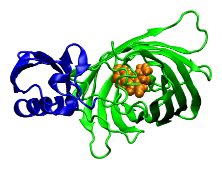
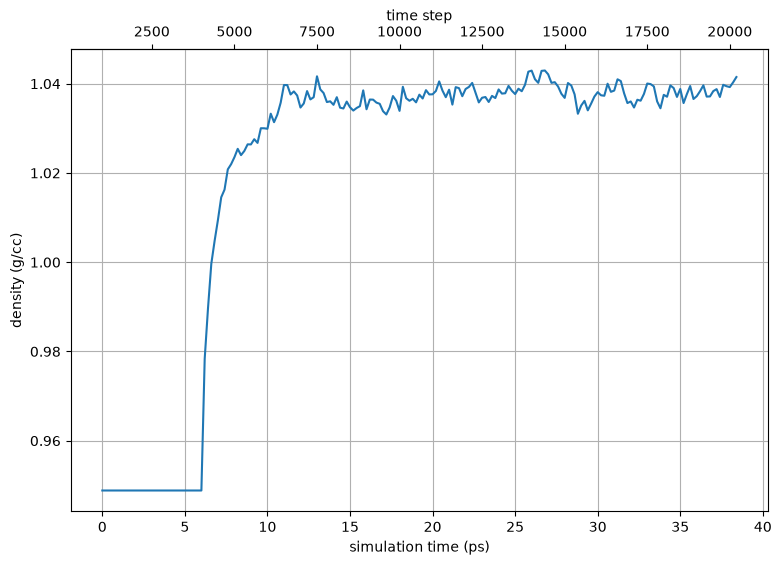

.. _example ubiquitin-gfp-fusion:

Example 27: Ubiquitin with a C-terminal GFP fusion
--------------------------------------------------

Fusion proteins -- one protein genetically appended to the terminus of another
-- are a workhorse of molecular biology, and green fluorescent protein (GFP) is
the archetypal fusion partner.  This example builds one: it fuses GFP onto the
C-terminus of ubiquitin to make a **single continuous polypeptide**, using
pestifer's ``Cfusions`` modification.

The entire fusion is requested with one shortcode::

    mods:
      Cfusions:
        - 1ema:A:2-229,A

which reads *"take residues 2-229 of chain A of PDB* `1ema
<https://www.rcsb.org/structure/1ema>`_ *(GFP) and fuse them onto chain A of the
base molecule"* -- here ubiquitin, `PDB 1ubq <https://www.rcsb.org/structure/1ubq>`_.
Pestifer fetches the donor structure automatically (just as a graft names its
source PDB), renumbers the donor residues so they continue past ubiquitin's
C-terminus instead of colliding with its numbering, and **orients the whole GFP
domain** so its N-terminus forms a real peptide bond with ubiquitin's C-terminus
rather than sitting tens of angstroms away at its own crystal coordinates.  The
two domains are joined by a single peptide bond and left pointing away from one
another -- a strain-free starting geometry that relaxes during equilibration.

.. literalinclude:: ../../../../pestifer/resources/examples/27/inputs/ubiquitin-gfp-fusion.yaml
    :language: yaml

.. task-table:: ../../../../pestifer/resources/examples/27/inputs/ubiquitin-gfp-fusion.yaml

Two features of the GFP structure make this a good stress test of pestifer's
handling of **non-standard residues in the middle of a chain**:

- **The chromophore.**  GFP's fluorophore ``CRO`` is not a ligand but a
  *modified residue* -- three residues (Thr65-Tyr66-Gly67) that cyclize
  post-translationally into a single unit embedded in the backbone.  It is
  parameterized in CHARMM's ``toppar_all36_prot_modify_res.str``, so pestifer
  builds it in-chain with proper peptide bonds on both sides.  Selecting the
  fusion domain therefore cannot use VMD's ``protein`` macro (which would drop
  ``CRO`` and hand psfgen a broken chain); pestifer takes the whole chain over
  the requested residue range instead.

- **Selenomethionine.**  1ema was phased with selenomethionine, so its
  methionines are recorded as ``MSE`` (with selenium ``SE`` in place of the
  sulfur ``SD``).  Selenomethionine has no CHARMM parameters, so pestifer
  aliases ``MSE`` to ``MET`` (and ``SE`` to ``SD``) automatically -- the
  standard crystallographic treatment -- and the built structure contains
  ordinary methionines.

A subtlety worth noting: several ``modify_res.str`` residues, ``CRO`` among
them, declare a redundant *backward* peptide bond in their topology.  When such
a residue is built in the middle of a chain, psfgen would otherwise emit a
duplicate junction bond that ``regenerate`` turns into a degenerate,
unparameterizable angle (NAMD reports ``UNABLE TO FIND ANGLE PARAMETERS``).
Pestifer cleans the finished PSF -- removing duplicate bonds and degenerate
angle/dihedral terms -- so these in-chain modified residues build and simulate
cleanly.

    The ubiquitin-GFP fusion construct.  Ubiquitin (blue) is joined by a single
    peptide bond to the GFP β-barrel (green), with the chromophore ``CRO`` shown
    in space-filling representation (orange) at the center of the barrel.

    Density over the progressive-NPT equilibration of the solvated fusion
    construct, settling near the bulk value for water.

.. raw:: html

    

        
Example author: Cameron F Abrams &nbsp;&nbsp;&nbsp; Contact: <a href="mailto:cfa22@drexel.edu">cfa22@drexel.edu</a>

    

