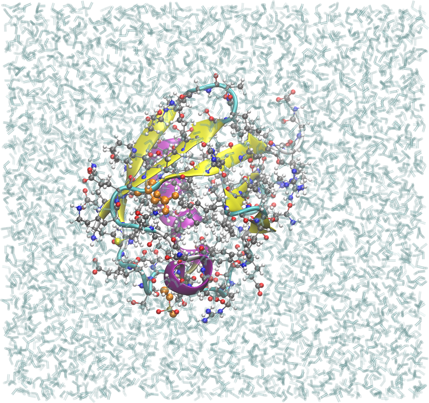

.. _example phosphoubiquitin:

Ubiquitin phosphorylated at Ser65 and Ser57
-------------------------------------------

`PDB ID 1ubq <https://www.rcsb.org/structure/1UBQ>`_ is ordinary human ubiquitin.  Nothing in it is phosphorylated.  This example installs a post-translational modification that is *not* in the input: Ser65 is converted to phosphoserine by mutating it to ``SEP``, the CHARMM residue for phosphoserine.

Ser65 is the PINK1 site.  Its phosphorylation activates parkin and is the committing step of mitophagy, so it is a modification one frequently wants to simulate on a structure that does not carry it.

.. code-block:: yaml

    mods:
      mutations:
        - A:SER,65,SEP

Ser57, also a reported ubiquitin phosphosite, is phosphorylated in the same build by the *other* route, and the difference between the two is the reason both are here:

.. code-block:: yaml

    mods:
      mutations:
        - A:SER,65,SEP     # a whole phosphoserine residue: the MONOanion
      patches:
        - SP2:A:57         # a phosphate added to the serine: the DIanion

.. code-block:: text

              route              residue name   net charge   phosphate
    Ser65     mutation to SEP    SEP            -1           one P-OH, two P-O
    Ser57     SP2 patch          SER            -2           three equivalent P-O

At pH 7 phosphoserine is mostly dianionic, so ``SP2`` is usually the physically right choice, and ``SP1`` gives the monoanion by the patch route.  This build uses one of each only to show them side by side; a real study picks one charge state and uses it throughout.

A modified residue is reached by ``mutations``, not by ``patches``: CHARMM ships several hundred modified amino acids -- ``SEP``, ``TPO``, ``PTR``, ``TYS``, ``MLZ`` and the rest -- as whole ``RESI`` residues rather than as patches, and a mutation is how a whole residue is swapped in.  (``patches`` is for true ``PRES`` entries; giving it a residue name is now reported rather than silently ignored.)

Two things about this build are worth reading before adapting it.

**The topology that defines the residue is pulled in automatically.**  ``SEP`` lives in ``toppar_all36_prot_na_combined.str``, which is not among the files pestifer loads by default; the topology defining a mutation target is added for you, so this config lists no force-field files at all.  (``TPO`` and ``PTR`` share that file and work the same way; see :ref:`Post-translational modifications <post_translational_modifications>`.)

**The minimize is not optional.**  The phosphate has no coordinates in the input; psfgen creates those atoms from the topology and ``guesscoord`` places them, initially at placeholder bond lengths of exactly 1.0 Å:

.. code-block:: text

                        straight out of psfgen    after the minimize    CHARMM b0
    Ser65 (SEP, -1)
      P-OG                    1.00 A                  1.58 A              1.60
      P-O1P, P-O2P            1.00 A                  1.48 A              1.48
      P-O3P (the P-OH)        1.00 A                  1.60 A              1.58
    Ser57 (SP2, -2)
      P-OG                    1.00 A                  1.58 A              1.60
      P-O1P, P-O2P, P-OT      1.00 A                  1.48 A              1.48

A build that skipped straight from the mutation to dynamics would start from a collapsed phosphate.  The ``validate`` task therefore runs *after* the minimize, and checks that each phosphorus exists rather than assuming the mutation or the patch implies it.  (Removing the ``SP2`` line makes the Ser57 test fail: it finds no phosphorus.)

.. note::

   The same two routes exist for phosphothreonine (``TPO`` by mutation; ``THP1``/``THPB`` by patch).  For phosphotyrosine use ``TP2`` for the dianion, and ``PTR`` by mutation for the monoanion: the ``TP1`` patch spells one atom type ``ON2b`` where the force field declares ``ON2B``, and psfgen as pestifer runs it rejects the mismatch.  The mutation route matches the residue a depositor would have annotated; the patch route gives control of protonation.

A modification that is *already* in the input needs none of this.  A deposit carrying ``SEP`` -- declared by a ``MODRES`` record -- builds with no configuration at all, because the residue is already classified as protein and nothing aliases it away.  Selenomethionine is the deliberate exception: ``MSE`` **is** aliased to ``MET``, since it is a phasing substitution rather than chemistry to preserve.

Most other modifications need no extra stream either: sulfotyrosine, the lysine acyl and methyl
ladders, hydroxyproline and the cysteine oxidation series are all reachable with a single
``mutations`` line and nothing else.  :ref:`Post-translational modifications
<post_translational_modifications>` lists what is available and why phosphoserine is one of the
few that needs the configuration above.

.. literalinclude:: ../../../../pestifer/resources/examples/28/inputs/phosphoubiquitin.yaml
    :language: yaml

.. task-table:: ../../../../pestifer/resources/examples/28/inputs/phosphoubiquitin.yaml

    Phosphoubiquitin as built, in the :ref:`BPTI series <example bpti1>` style: 13,493 atoms in
    4,076 waters, equilibrated box roughly 48 x 51 x 54 Å.  The two phosphoserines are orange:
    ``SEP`` 65, installed by mutation, and Ser57 carrying the ``SP2`` patch.  They differ by one
    proton (monoanion and dianion), which a picture cannot show.

.. raw:: html

    

        
Example author: Cameron F. Abrams &nbsp;&nbsp;&nbsp; Contact: <a href="mailto:cfa22@drexel.edu">cfa22@drexel.edu</a>

    

