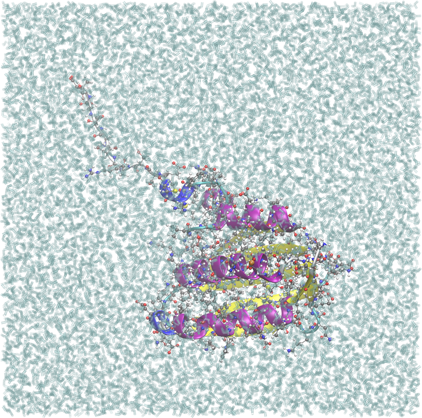

.. _example vansc-catalytic-domain:

VanSC histidine kinase catalytic domain, biological assembly 1
--------------------------------------------------------------

`PDB ID 8dx0 <https://www.rcsb.org/structure/8DX0>`_ is the catalytic (ATP-binding) domain of VanSC, a histidine kinase from a vancomycin-resistance two-component system, at 1.45 Å.  Its asymmetric unit holds **two** copies of the domain, chains A and B, and the authors define each as a separate monomeric biological unit: assembly 1 is chain A, assembly 2 is chain B.

A crystal's asymmetric unit is how the structure was solved, not necessarily the molecule to simulate.  This example builds exactly one copy:

.. code-block:: yaml

    psfgen:
      source:
        biological_assembly: 1

**What "one copy" includes.**  An assembly takes along everything that belongs to its chains: here chain A's 139 resolved residues, its 123 crystal waters and its one magnesium ion.  pestifer also rebuilds a 10-residue loop that chain A is missing, so the protein comes out at 149 residues.  Chain B's copy, waters and two magnesiums are left out.

**The validate task checks the copy, not the letters.**  It counts protein residues, magnesiums and crystal waters, the three numbers that distinguish one copy from two:

.. code-block:: text

                              assembly 1    whole asymmetric unit
    protein residues (CA)        149              298
    magnesium                      1                3
    crystal waters               123              228

Both columns are measured.  The same config with ``biological_assembly`` removed builds the whole asymmetric unit, fails all three tests, and stops.  The tests select by residue type (``protein``, ``resname MG``) and not by chain or segment letter, because the letters in a built system are assigned by pestifer; see :ref:`validate <subs_buildtasks_validate>`.

.. note::

   Before version 3.19.2, an assembly that selected a *subset* of the asymmetric unit built the whole asymmetric unit anyway, silently.  This structure is the one that exposed it, and this example is the guard against it coming back.

.. literalinclude:: ../../../../pestifer/resources/examples/30/inputs/vansc-catalytic-domain.yaml
    :language: yaml

.. task-table:: ../../../../pestifer/resources/examples/30/inputs/vansc-catalytic-domain.yaml

    The single VanSC catalytic domain as built, in the :ref:`BPTI series <example bpti1>` style:
    40,539 atoms in 12,692 waters, equilibrated box roughly 60 x 81 x 82 Å.  One protein copy and its
    magnesium ion (hidden from this side); chain B and its two magnesiums are left out.

.. raw:: html

    

        
Example author: Cameron F. Abrams &nbsp;&nbsp;&nbsp; Contact: <a href="mailto:cfa22@drexel.edu">cfa22@drexel.edu</a>

    

