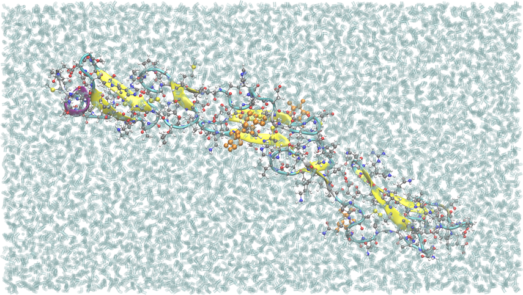

.. _example notch2-egf-o-glycans:

Human Notch-2 EGF11-13 with O-fucose and O-glucose
--------------------------------------------------

`PDB ID 5mwb <https://www.rcsb.org/structure/5MWB>`_ is human Notch-2 EGF repeats 11-13, at 1.86 Å, with three **O-linked** glycans: sugars attached to the hydroxyl of a serine or threonine rather than to an asparagine.  O-fucosylation of Notch EGF repeats is what Fringe glycosyltransferases extend to tune Notch-ligand binding, and O-glucosylation is needed for Notch activity.

.. code-block:: text

    Thr470  --  alpha-L-fucose                        (O-fucose)
    Ser500  --  beta-D-glucose                        (O-glucose)
    Ser462  --  beta-D-glucose  --  xylose (1->3)     (O-glucose, extended)

Every other glycan example in this set is N-linked (for instance the :ref:`BG505 SOSIP trimer <example env 4zmj>` and the :ref:`BA.2 spike <example sars cov2 spike ba2>`).  Nothing extra is needed in the config for the glycans: they are read from the deposit along with their ``LINK`` records.

**Each link gets the patch for what its sugar is.**  CHARMM joins a sugar to serine with ``SGPA`` or ``SGPB`` and to threonine with ``TGPA`` or ``TGPB``, where A is an axial (alpha) link at the sugar's C1 and B an equatorial (beta) one.  The two differ in atoms and types -- threonine's CB is a CH, serine's a CH2 -- so the serine patch cannot be used on a threonine.  This build gets:

.. code-block:: text

    patch SGPB   Ser462 -- beta-glucose
    patch TGPA   Thr470 -- alpha-L-fucose
    patch SGPB   Ser500 -- beta-glucose
    patch 13bb   glucose O3 -- xylose C1

pestifer chooses each from the sugar's identity: beta-glucose is equatorial at C1, and alpha-L-fucose axial.  The deposited coordinates agree -- the fucose bond lies along the ring normal, and both glucose bonds are near the ring plane.

The validate task checks that three serine or threonine atoms are bonded to a sugar, and that the fucose, both glucoses, the xylose and the three calcium ions are all present.

**The xylose is built as the deposit declares it.**  5mwb codes it as ``XYP``, beta-D-xylopyranose, and pestifer builds a beta xylose.  The xylose on Notch O-glucose is usually described as alpha-1,3, and in this deposit the geometry at its C1 is not clearly either.  A study that wants the alpha anomer can say so in the config:

.. code-block:: yaml

    psfgen:
      aliases:
        residue: ["XYP AXYL"]

**Calcium needs an alias.**  The three calcium ions bound between the EGF repeats are named ``CA`` in the PDB, but CHARMM's calcium residue is ``CAL``; without the ``CA CAL`` residue alias psfgen builds the wrong, same-named residue and cannot place the ion.  pestifer stops before psfgen and asks for the alias if it is missing.

.. literalinclude:: ../../../../pestifer/resources/examples/31/inputs/notch2-egf-o-glycans.yaml
    :language: yaml

.. task-table:: ../../../../pestifer/resources/examples/31/inputs/notch2-egf-o-glycans.yaml

    Notch-2 EGF11-13 as built, in the :ref:`BPTI series <example bpti1>` style: 27,640 atoms in
    8,617 waters, equilibrated box roughly 59 x 44 x 105 Å, viewed through its short side so the
    three repeats lie across the frame.  The O-linked sugars are orange: the fucose on Thr470,
    and the glucoses on Ser462 and Ser500, the first extended by a xylose.

.. raw:: html

    

        
Example author: Cameron F. Abrams &nbsp;&nbsp;&nbsp; Contact: <a href="mailto:cfa22@drexel.edu">cfa22@drexel.edu</a>

    

