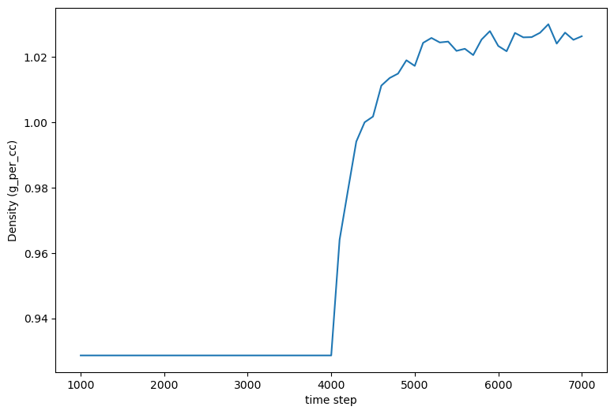

.. _example bpti1:

Example 1: Bovine Pancreatic Trypsin Inhibitor (BPTI)
-----------------------------------------------------

The Input Configuration
=======================

The ``psfgen`` `user manual <https://www.ks.uiuc.edu/Research/vmd/plugins/psfgen/ug.pdf>`_ is a necessary resource for learning how to use ``psfgen`` to generate PDB and PSF input files for NAMD.  A simple example in that manual is a solvation of bovine pancreatic trypsin inhibitor (BPTI) starting from its PDB coordinates (`PDB ID 6pti <https://www.rcsb.org/structure/6PTI>`_).  ``pestifer`` can reproduce this solvation via the input YAML-format configuration shown below:

.. literalinclude:: ../../../../pestifer/resources/examples/ex01/inputs/bpti1.yaml
    :language: yaml

You can check the :ref:`config_ref` for a complete reference to Pestifer config files.

This build can be performed (preferably in a clean directory) using this command:

.. code-block:: bash

   $ pestifer run-example 1

The first thing ``pestifer`` does with ``run-example`` is to copy the YAML config file for that example into the local directory.  In this case, the file copied is named ``bpti1.yaml``, and contains what you see above.  Or, alternatively, pasting that content into a local file ``myconfig.yaml``:

.. code-block:: bash

   $ pestifer run myconfig.yaml

You could also use ``fetch-example`` to get the config file and then run it:

.. code-block:: bash

  $ ls
  $ pestifer fetch-example 1
  $ ls
  bpti.yaml
  $ pestifer run bpti1

(If there is no extension on the argument of run, pestifer assumes one of ``.yaml``, ``.yml``, or ``.ym``.)

``bpti1.yaml`` is a YAML-format text file, and the keywords (of course) have particular meanings.  This is also an example of a "minimal" configuration file; ``pestifer`` has many more controls that can be set in a configuration file than are shown here.  Here, this configuration file contains two topmost directives: ``title`` and :ref:`config_ref tasks`.  The value of ``title`` is the string ``Bovine Pancreatic Trypsin Inhibitor (BPTI)`` and the value of ``tasks`` is a *list*.  Each element in the list of tasks is itself a directive describing a task, and ``pestifer`` in general executes tasks in the order they appear in the ``tasks`` list.

Digression: Interactive Help 
============================

``pestifer`` uses the general-purpose package ``ycleptic`` (`pypi <https://pypi.org/project/ycleptic/>`_) to manage its input configurations.  A package developer using ``ycleptic`` specifies a "pattern" file describing the configuration file syntax they would like their package to have.  ``ycleptic`` provides two useful features:

1. Automatic generaton of a hierarchical arrangement of RST files for documentation of all configuration parameters; in these pages, this is rooted at :ref:`config_ref`.
2. Automatic acquisition of a command-line interactive help feature that allows package users to explore the configuration file format specified by the package developers.  

Let's use this second feature to explore the ``fetch`` task.  (You can visit the :ref:`config_ref tasks` page to view the same info in the online documentation.) 

.. code-block:: bash

  $ pestifer --no-banner config-help tasks

    tasks:
        Specifies the tasks to be performed serially in a pestifer run

    base|tasks
        fetch ->
        continuation ->
        psfgen ->
        ligate ->
        pdb2pqr ->
        mdplot ->
        cleave ->
        domainswap ->
        solvate ->
        desolvate ->
        ring_check ->
        make_membrane_system ->
        md ->
        manipulate ->
        terminate ->
        validate ->
        .. up
        ! quit
    pestifer-help:  fetch

    fetch:
        Fetch task; its only job is to fetch any external data file (e.g.,
        PDB).

    base|tasks->fetch
        source
        sourceID
        source_format
        .. up
        ! quit
    pestifer-help: source

    source:
        Source for the initial coordinate file; one of 'pdb' (for the RCSB
        PDB), 'alphafold' (for the AlphaFold DB), or 'local' (for a
        local file)
        default: pdb

    All subattributes at the same level as 'source':

    base|tasks->fetch
        source
        sourceID
        source_format
        .. up
        ! quit
    pestifer-help: sourceID

    sourceID:
        ID of the source file; if source is 'local', a file 'sourceID.pdb' or
        'sourceID.cif' must exist in the working directory

    All subattributes at the same level as 'sourceID':

    base|tasks->fetch
        source
        sourceID
        source_format
        .. up
        ! quit
    pestifer-help: source_format

    source_format:
        Format of the source file; this should be 'pdb' or 'cif'
        default: pdb
        allowed values: pdb, cif

    All subattributes at the same level as 'source_format':

    base|tasks->fetch
        source
        sourceID
        source_format
        .. up
        ! quit
    pestifer-help: !
  $

In the config file for this example, we specify on the the ``sourceID`` as 6pti; the other source attributes take their default values.  This causes ``pestifer`` to fetch the file ``6pti.pdb`` from the RCSB PDB (if ``6pti.pdb`` does not already exist in the current working directory).

We can return to ``config-help`` to explore the ``psfgen`` task, which is the next task in the list.  We can do this by:

.. code-block::bash

  $ pestifer config-help tasks psfgen

    psfgen:
        Parameters controlling a specific psfgen run on an input molecule

    base|tasks->psfgen
        source ->
        mods ->
        .. up
        ! quit 
    pesifer-help: source

    source:
        Specifies the processing and interpretation of the initial source
        coordinate file

    base|tasks->psfgen->source
        biological_assembly
        transform_reserves
        remap_chainIDs
        reserialize
        model
        cif_residue_map_file
        include
        exclude
        sequence ->
        .. up
        ! quit
    pestifer-help: biological_assembly

    biological_assembly:
        integer index of the biological assembly to construct; default is 0,
        signifying that the asymmetric unit is to be used
        default: 0

    All subattributes at the same level as 'biological_assembly':

    base|tasks->psfgen->source
        biological_assembly
        transform_reserves
        remap_chainIDs
        reserialize
        model
        cif_residue_map_file
        include
        exclude
        sequence ->
        .. up
        ! quit

And so on.  Let's return to the example.  Immediately after the ``psfgen`` task we declare an ``md`` task, and the subdirective ``ensemble`` is set to ``minimize``.  There are no other subdirectives explicitly listed.  This task will use ``namd3`` to run an energy minimization.  Let's have a look at the possible subdirectives for an ``md`` task.  We can do this by:

.. code-block:: bash

  $ pestifer console-help tasks md

    md:
        Parameters controlling a NAMD run

    base|tasks->md
        cpu-override
        vacuum
        ensemble
        minimize
        nsteps
        dcdfreq
        xstfreq
        temperature
        pressure
        addl_paramfiles
        other_parameters
        constraints ->
        .. up
        ! quit
    pestifer-help:

The Input Configuration (Continued)
===================================

So let's return to the example.  After the first ``md`` task is the ``solvate`` task.  Notice that it has no subdirectives; in this case default values are used for any subdirectives. After this task has finished, we have a run-ready *nonequilibrated* system.  We equilibrate here using first another minimization via an ``md`` task, then an NVT equilibration in another ``md`` task, and then a series of progressively longer NPT equilibrations in yet more ``md`` tasks.  These "chained-together" NPT runs avoid the common issue that, after solvation, the density of the initial water box is a bit too low, so under pressure control the volume shrinks.  It can shrink so quickly that NAMD's internal data structures for distributing the computational load among processing units becomes invalid, which causes NAMD to die.  The easiest way to reset those internal data structures is just to restart NAMD from the result of the previous run.

The ``mdplot`` task generates a plot of system density (in g/cc) vs time step for the series of MD simulations that occur after solvation.  If you are monitoring a run in real time, this file will be called ``solvated-density.png``.  This is a quick way to check that enough NPT equilibration has been performed.  For this example, the plot looks like this:

    Density vs. timestep for the BPTI system post-solvation.

Since the density has plateaued, we can reasonably assume that the system density is equilibrated.

Finally, we see a ``terminate`` task, whose main role is to generate some informative output and to provide a set of NAMD input files (PSF, PDB, xsc, coor, and vel) that all have a common base file name.  The ``package`` subdirective creates a tarball ``<basename>.tar.gz`` containing all input files necessary to execute a NAMD run, ready for transfer to the HPC resource of your choice.  The ``md`` attribute of pestifer allows you to specify any NAMD configuration options you'd like in the production NAMD config file; here, we merely state that we want the default NAMD parameters for an NPT run.  The ``state_dir`` attribute is the name of a directory you would like to prepend to all files in this tarball; here the default value ``my_state`` is used.

By default, the ``terminate`` task also archives all other working files from the build in another tarball called ``artifacts.tar.gz``.  The ``archive_dir`` is a prepended directory name for the files in that tarball. (The PNG images of any plots generated by an ``mdplot`` task can be found in this tarball.)

Listing the contents of the state tarball:

.. code-block:: bash

   $ tar ztf my_6pti.tar.gz
    my_state/my_6pti.psf
    my_state/my_6pti.pdb
    my_state/my_6pti.coor
    my_state/my_6pti.xsc
    my_state/my_6pti.vel
    my_state/prod_6pti.namd
    my_state/par_all36m_prot.prm
    my_state/par_all36_lipid.prm
    my_state/par_all36_carb.prm
    my_state/par_all36_na.prm
    my_state/par_all36_cgenff.prm
    my_state/par_all36m_prot.prm
    my_state/par_all36_lipid.prm
    my_state/par_all36_carb.prm
    my_state/par_all36_na.prm
    my_state/par_all36_cgenff.prm
    my_state/toppar_water_ions.str
    my_state/toppar_all36_carb_glycopeptide.str
    my_state/toppar_all36_prot_modify_res.str
    my_state/toppar_water_ions.str
    my_state/toppar_all36_carb_glycopeptide.str
    my_state/toppar_all36_prot_modify_res.str
    my_state/toppar_all36_moreions.str
    
You should note the presence of CHARMM force-field files in the current directory.  These are generated by ``pestifer`` during the build, and are essentially copies of the parent files with certain lines commented out to permit use by VMD and NAMD.  The parent files are not altered.

The archive tarball contains all intermediate files used in the build but which are not necessary for production MD runs.  These files can be useful for debugging or for understanding the build process.

.. _file name conventions:

Digression: On File Name Conventions
====================================

Intermediate files generated by pestifer during a build typically conform to a common naming convention:

.. code-block:: bash

   CC-MT-ST-TASKNAME.ext

Here ``CC`` is the 2-digit identification of the run *controller* (e.g., ``00`` for the first controller), ``MT`` is the 2-digit identification of the *main task* of that controller (e.g., ``02`` is the *third* task), and ``ST`` is the 2-digit identification of the *subtask*  of that task(e.g., ``00`` for the first subtasks). ``TASKNAME`` is the name of the task as it appears in the yaml file. ``ext`` is the file extension.  For example, ``00-02-00_solvate.psf`` is the PSF file generated by the ``solvate`` task (the *third* task) in this example.

Some tasks may spawn *subcontrollers*, which typically acquire a controller ID derived from that of the parent controller.  In the current version of pestifer, this occurs when building a membrane bilayer, in which a series of MD simulations are launched by a subcontroller the the ``make_membrane_system`` task.

.. raw:: html

        

            
Example author: Cameron F. Abrams&nbsp;&nbsp;&nbsp;Contact: <a href="mailto:cfa22@drexel.edu">cfa22@drexel.edu</a>

        
