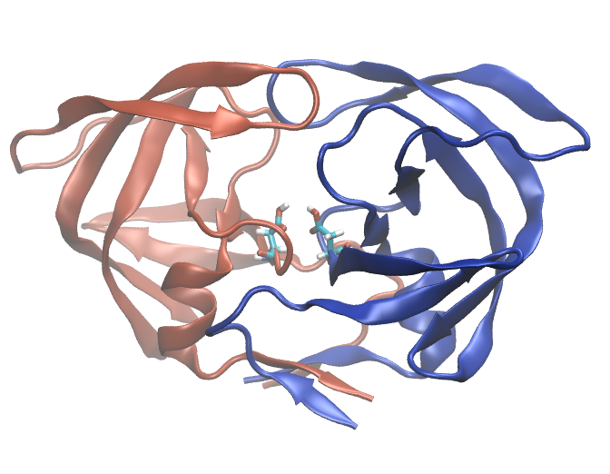

.. _example hivprotease:

Example 5: HIV Protease with Patches to Protonate Aspartates
------------------------------------------------------------

`PDB ID 1f7a <https://www.rcsb.org/structure/1f7a>`_ is a structure of the HIV-1 protease in complex with an inhibitor mimic.  This example demonstrates how to use the ``mods`` subdirective to apply CHARMM36 residue patches, including protonation/deprotonation patches.

Here, we removed the ligand, and protonate the active-site aspartates (Asp29).  We also undo the two engineered mutations on each chain, at resids 7 and 25.  We also add segment type and psfgen alias information so that Pestifer can handle the acetate molecules present in the PDB file.

.. literalinclude:: ../../../../pestifer/resources/examples/ex05/inputs/hiv-protease.yaml
    :language: yaml

Note that this required first mutating the residues at positions 25 from asparagine to asparate. This PDB entry was a catalytically inactive construct with an inhibitor mimic bound, so the catalytic aspartates were mutated to asparagines.

           HIV-1 protease with aspartates protonated.  The two chains are colored differently and Asp29 on each chain is shown in licorice.

The ACT residues are acetates, and CHARMM36 refers to these as ACET residues.  The atom names in the PDB ligand ACT are not the same as those in the CHARMM36 ACET residue, so we need to provide a mapping for the atom names in the ``psfgen`` top-level directive.

If instead you would simply like to remove the acetates, you can do so by specifying them in the ``exclude`` list of the ``source`` directive:

.. code-block:: yaml

   tasks:
     psfgen:
       source:
         exclude:
           - resname == 'ACT'
           - chainID == 'P'

.. raw:: html

        

            
Example author: Cameron F. Abrams&nbsp;&nbsp;&nbsp;Contact: <a href="mailto:cfa22@drexel.edu">cfa22@drexel.edu</a>

        
