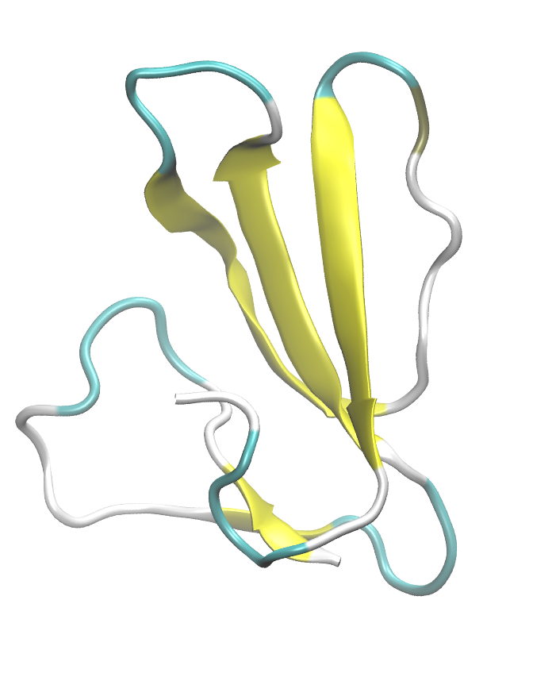

.. _example toxin:

Example 6: Fasciculin 1 at pH 7.0
----------------------------------

`PDB ID 1fas <https://www.rcsb.org/structure/1fas>`_ is the 1.9-Å resolution structure of fasciculin 1, an anti-acetylcholinesterase toxin from green mamba snake venom.  This example demonstrates how to use the ``pdb2pqr`` task to assign protonation states to ionizable residues at a specified pH.  The ``pdb2pqr`` task is used to prepare the structure for simulation by assigning appropriate protonation states based on the pH value specified in the YAML configuration file.  Here we set the pH to 7.0.  We also exclude all atoms with altLocs values of 'B'.

.. literalinclude:: ../../../../pestifer/resources/examples/ex06/inputs/green-mamba-toxin.yaml
    :language: yaml

Note that the ``pdb2pqr`` task is invoked immediately after the ``psfgen`` task but *before* the ``solvate`` task. The ``pdb2pqr`` task is documented at :ref:`subs_runtasks_pdb2pqr`.

        Fasciculin 1 (PDB ID 1fas).

Reference
+++++++++

* 1.9-Å resolution structure of fasciculin 1, an anti-acetylcholinesterase toxin from green mamba snake venom. le Du, M.H., Marchot, P., Bougis, P.E., Fontecilla-Camps, J.C. (1992) J Biological Chem 267: 22122-22130. `PDF <https://www.jbc.org/article/S0021-9258(18)41644-4/pdf>`_

.. raw:: html

        

            
Example author: Cameron F. Abrams&nbsp;&nbsp;&nbsp;Contact: <a href="mailto:cfa22@drexel.edu">cfa22@drexel.edu</a>

        
