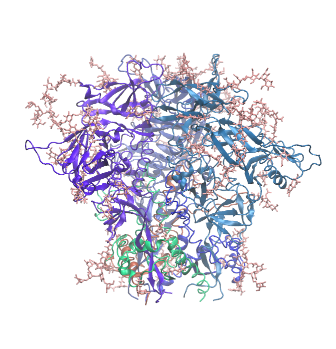

.. _example env 4tvp:

Example 8: Closed, PGT122/35O22-Liganded HIV-1 BG505 Env SOSIP.664 Trimer (ligands removed)
-------------------------------------------------------------------------------------------

`PDB ID: 4tvp <https://www.rcsb.org/structure/4tvp>`_ is a structure of the HIV-1 Env ectodomain trimer in a closed conformation, with the PGT122 and 35O22 antibody Fabs bound.  This structure has fairly well-resolved glycans, likely because of the stabilization provided by the Fab ligands.  Here we prepare a system with just the ectodomain and glycans, omitting the ligands.

Many structures in the RCSB are only available in mmCIF format, rather than the older, outdated PDB format; `4tvp <https://www.rcsb.org/structure/4TVP>`_ is one example.  Pestifer uses the native residue indices in the mmCIF file to build the system, not the "auth" indices.

.. literalinclude:: ../../../../pestifer/resources/examples/ex08/inputs/hiv-sosip-env-ectodomain2.yaml
    :language: yaml

    Structure of HIV-1 BG505 SOSIP.664 trimer (PDB ID 4tvp) with Fab ligands deleted from a complete Pestifer build.  Glycans are shown in pink stick representation.  The run-ready system has approx. 290,000 atoms and is approx. 149 x 197 x 129 Angstroms in size.

.. raw:: html

    

        
Example author: Cameron F. Abrams &nbsp;&nbsp;&nbsp; Contact: <a href="mailto:cfa22@drexel.edu">cfa22@drexel.edu</a>

    
