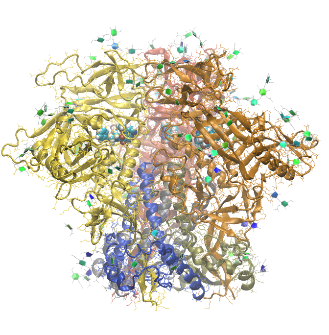

.. _example env ad8:

Example 9: Cleaved, Asymmetric HIV-1 AD8 Env Ectodomain Trimer
--------------------------------------------------------------

`PDB ID 8fad <https://www.rcsb.org/structure/8fad>`_ is a structure of the cleaved, asymmetric HIV-1 AD8 Env ectodomain trimer.

The molecules with the resname 83G are bound instances of the entry inhibitor model BMS-806, which is a small molecule related to the drug Temsavir. 83G was parameterized using the CGenFF server, so it was done prior to the build.

.. literalinclude:: ../../../../pestifer/resources/examples/ex09/inputs/hiv-ad8-env-ectodomain.yaml
    :language: yaml

   The cleaved, asymmetric HIV-1 AD8 Env ectodomain trimer (PDB ID 8fad) with the entry inhibitor BMS-806 (83G) bound. Glycan rings are shown as solid shapes, and the 83G ligands are shown in VdW representation.

Parameterization of 83G
+++++++++++++++++++++++

The following procedure was used to parameterize 83G.

1. Use VMD to generate a PDB file of a single copy of the 83G ligand from the 8fad structure.  The PDB file has no H atoms.

    .. console::tcl

        mol new 8fad
        set lig [atomselect top "chain C and resname 83G"]
        $lig writepdb 83G_8fad_C.pdb

2. Use Open Babel to add hydrogens first, and then to create the mol2 file needed for cgenff.

    .. console::bash

        $ obabel -ipdb 83G_8fad_C.pdb -h --minimize -opdb -O tmp.pdb
        $ obabel -ipdb tmp.pdb -h -omol2 -O 83G-1.mol2
        $ cat 83G-1.mol2 | sed s/"tmp.pdb"/"83G"/g > 83G.mol2

3. Upload ``83G.mol2`` to the `CGenFF server <https://cgenff.com>`_, and follow the instructions to generate a parameter file.  The server will generate a ``83G-cgenff.str`` file that contains the parameters for 83G.  (A future release of Pestifer will interface with the cgenff executable, which is free for educational users.)

4. Copy the contents of ``83G-cgenff.str`` into a new file called ``83G-cgenff.str`` in the ``pestifer/resources/charmmff/custom/`` directory.  This makes pestifer aware of the new residue.

5. Ensure that ``83G`` is listed in one of the segtypes in :mod:`pestifer/core/labels`.  For example, it can be added to the ``ligand`` segtype:

    .. code-block:: python

        'ligand': {
            'macro': True,
            'resnames' : [
                'EIC', 'VCG', 'HEM', 'ADP', 'ATP', '83G']},

   It does not matter which segtype it is added, so long as it is not one associated with polymeric molecules like proteins or nucleic acids.

Reference
+++++++++

* Asymmetric conformations of cleaved HIV-1 envelope glycoprotein trimers in styrene-maleic acid lipid nanoparticles.  Wang, K., Zhang, S., Go, E.P., Ding, H., Wang, W.L., Nguyen, H.T., Kappes, J.C., Desaire, H., Sodroski, J., Mao, Y. Commun Biol 6: 535 `DOI 10.1038/s42003-023-04916-w <https://doi.org/10.1038/s42003-023-04916-w>`_ (2023)

.. raw:: html

    

        
Example author: Cameron F. Abrams&nbsp;&nbsp;&nbsp;Contact: <a href="mailto:cfa22@drexel.edu">cfa22@drexel.edu</a>

    
