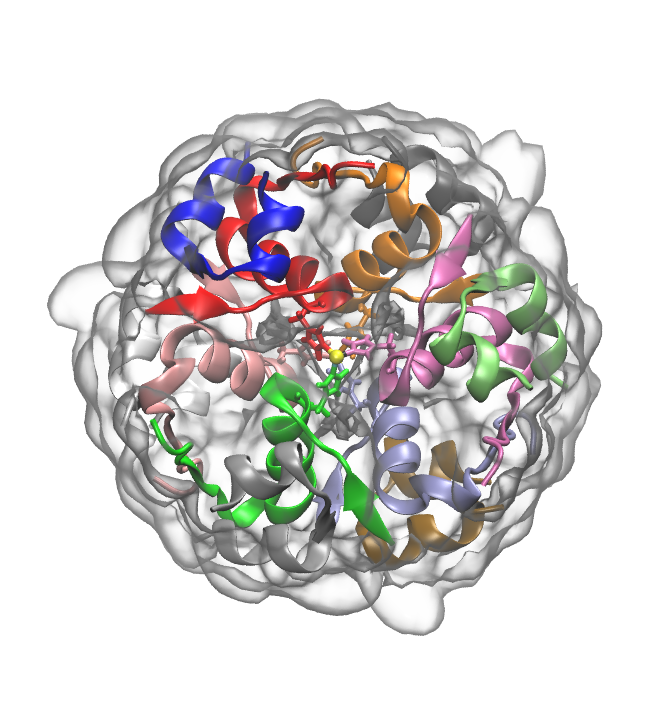

.. _example insulin6:

Example 13: DES-PHE B1 Bovine Insulin Hexamer
---------------------------------------------

`PDB ID: 2ins <https://www.rcsb.org/structure/2ins>`_ is a structure of the bovine insulin hexamer with the DES-PHE B1 mutation.  This example demonstrates how to build a system with a hexameric assembly, and it also illustrates how Pestifer automatically handles rare bonds, like the HIS-N&epsilon;-Zn bonds in this structure.

.. literalinclude:: ../../../../pestifer/resources/examples/ex13/inputs/insulin-hexamer.yaml
    :language: yaml

    Insulin hexamer (PDB ID 2ins) with zinc ions shown as yellow spheres and the six histidines that coordinate them shown in stick representation.

Incidentally, the CHARMMFF patches for creating bonds between histidines and zinc ions are defined in the stream file ``toppar_all36_prot_modify_res.str``, but they are misnamed.  In the original file, they appear as:

.. verbatim::

    PRES ZNHD         0.00 ! patch to covalently link HSD to Zn
                           ! Patch is 1-HSD and 2-Zn
    BOND 1NE2 2ZN

    PRES ZNHE         0.00 ! patch to covalently link HSE to Zn
                           ! Patch is 1-Hse and 2-Zn
    BOND 1ND1 2ZN

Clearly, these definitions are backwards.  The patch ``ZNHE`` should link HSE to Zn, and the patch ``ZNHD`` should link HSD to Zn.  Pestifer automatically corrects this error on-the-fly when it processes the stream file, so no user intervention is needed.

.. raw:: html

    

        
Example author: Cameron F. Abrams &nbsp;&nbsp;&nbsp; Contact: <a href="mailto:cfa22@drexel.edu">cfa22@drexel.edu</a>

    
