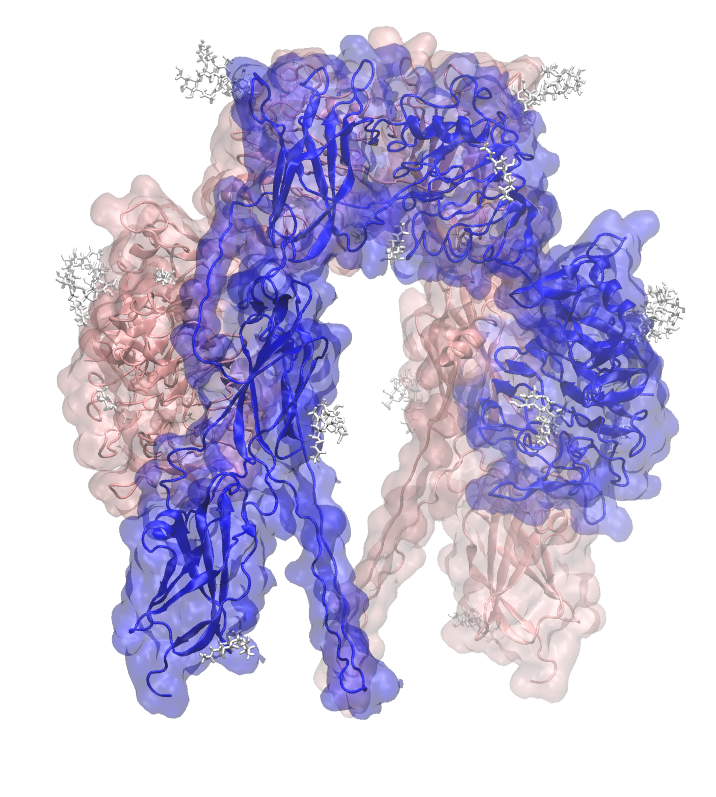

.. _example insulin receptor:

Example 14:  Human Insulin Receptor Ectodomain IRαβ
---------------------------------------------------

`PDB entry 4zxb <https://www.rcsb.org/structure/4ZXB>`_ is a 3.3-Å resolution structure of the human insulin receptor ectodomain (IRαβ) monomer (chain E) in complex two Fabs (chains A, B, C, and D).  The receptor is dimeric, and the asymmetric structure is a monomer, so Pestifer replicates the monomer to make a dimer model according to the BIOMT records in the PDB file.  The Fabs are excluded.  The structure has several missing loops, which Pestifer builds in.  The structure also has several glycans, which Pestifer retains.

.. literalinclude:: ../../../../pestifer/resources/examples/ex14/inputs/insulin-receptor-ectodomain.yaml
    :language: yaml

        Human insulin receptor ectodomain (PDB ID 4zxb) with glycans shown in white licorice.  Protein chains are colored uniquely.

.. raw:: html

    

        
Example author: Cameron F. Abrams &nbsp;&nbsp;&nbsp; Contact: <a href="mailto:cfa22@drexel.edu">cfa22@drexel.edu</a>

    
