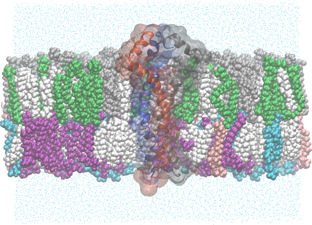
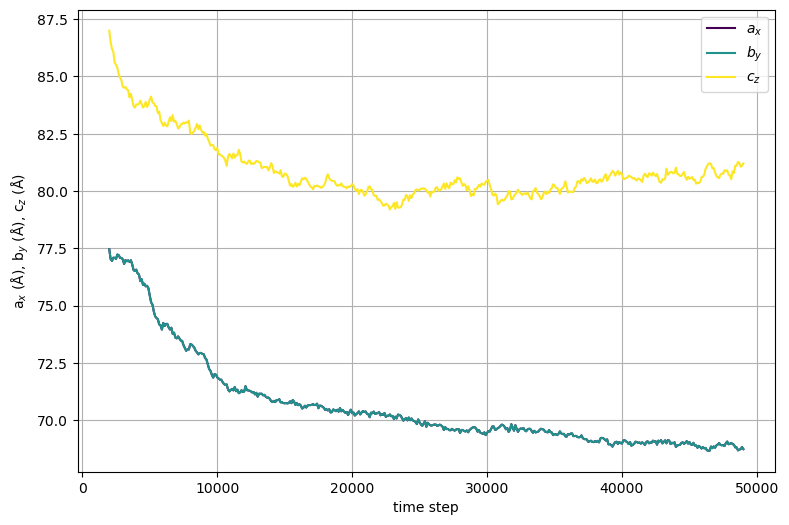
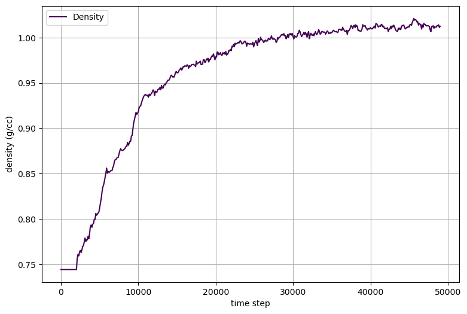
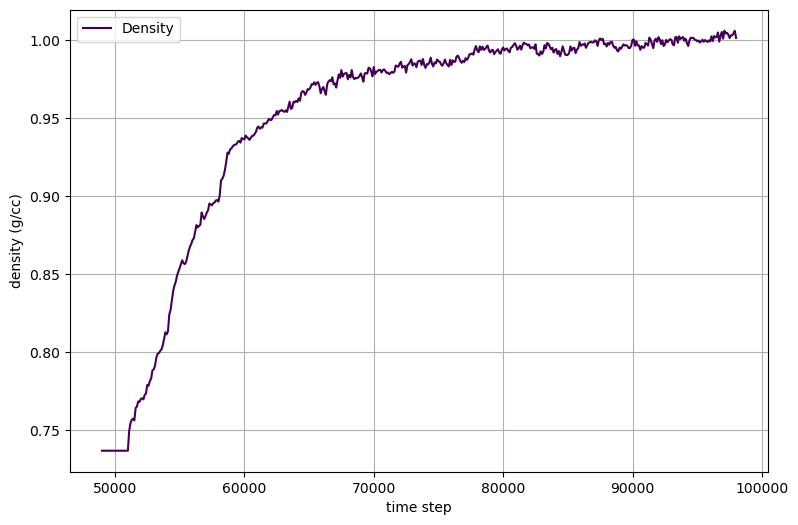
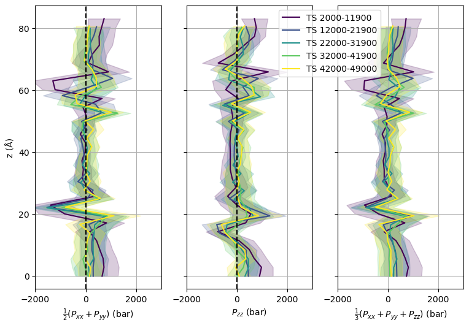
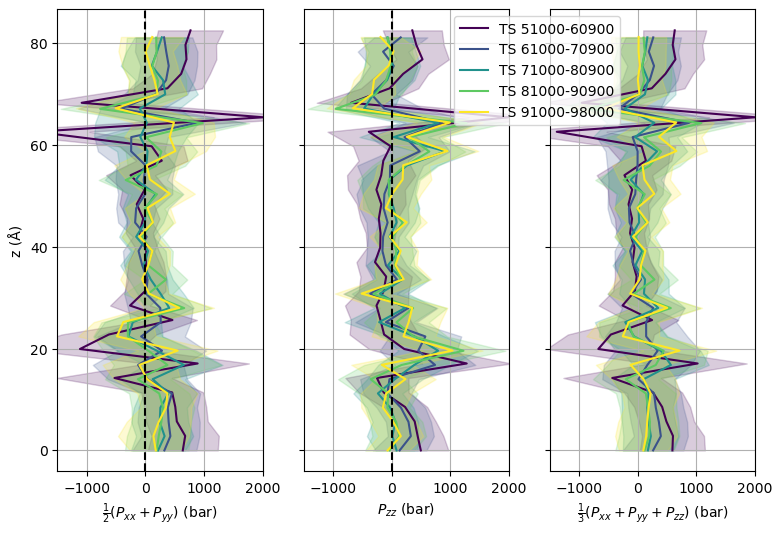
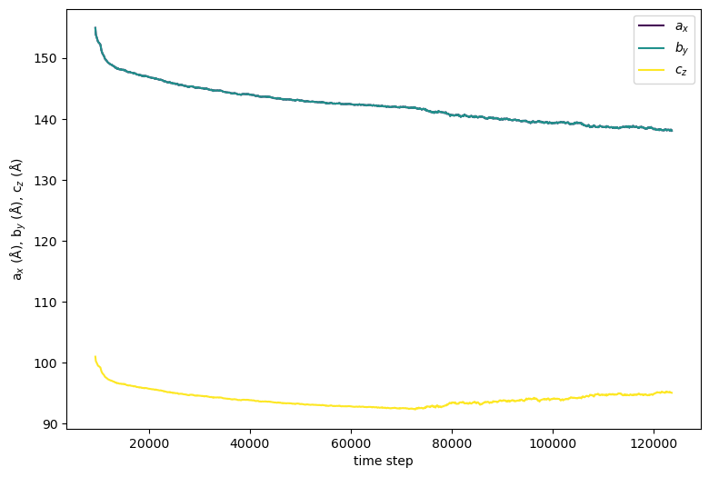
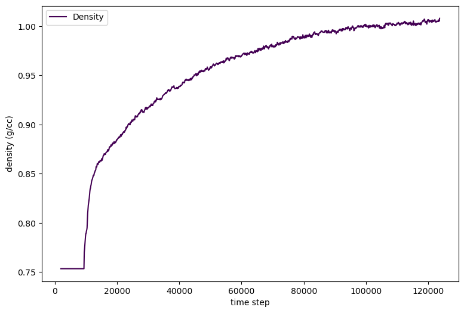
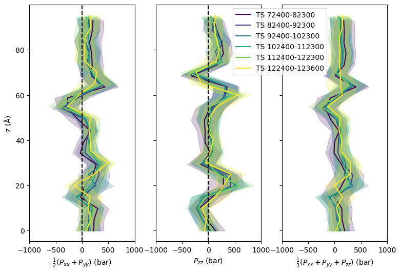

.. _example mper-tm viral bilayer:

Example 17: HIV-1 Env MPER-TM Trimer in an Asymmetric, Model Viral Bilayer
--------------------------------------------------------------------------

           HIV-1 gp41 (MPER-TM) trimer embedded in a model viral envelope lipid bilayer.  Bilayer is clipped to show the protein, and each protein chain is colored uniquely.  The outer leaflet (top) is composed of 36% Sphingomyelin d18:1/16:0 (CHARMM residue name PSM, colored grey), 17% 3-palmitoyl-2-oleoyl-D-glycero-1-Phosphatidylcholine (POPC, green), and 43% cholesterol (CHL1, white).  The inner leaflet (bottom) is composed of 30% 1-Stearoyl-2-Oleoyl-Phosphatidylethanolamine (SOPE, purple), 18% 1-Stearoyl-2-Oleoyl-Phosphatidylserine (SOPS, blue), 9% 3-palmitoyl-2-oleoyl-D-glycero-1-Phosphatidylethanolamine  (POPE, pink), and 47% cholesterol.

This example is the same as :ref:`example mper-tm symmetric bilayer`, but uses a model viral bilayer instead of a DMPC bilayer.  The model viral bilayer is constructed from a mixture of lipids that are commonly found in the viral membrane.

.. literalinclude:: ../../../../pestifer/resources/examples/ex17/inputs/hiv-mpertm3-membrane2.yaml

Results
+++++++

The plots below are generated by default during the membrane-building process.

           Cell dimensions vs time step for the initial symmetric 200-lipid bilayer patch from which the upper leaflet is extracted.

.. figure:: 17-patchB-a_x-b_y-c_z.png

           Cell dimensions vs time step for the initial asymmetric 200-lipid bilayer patch from which the lower leaflet is extracted.

           System density vs time step for the initial 200-lipid bilayer patch from which the upper leaflet is extracted.

            System density vs time step for the initial 200-lipid bilayer patch from which the lower leaflet is extracted.

           Pressure profiles for selected time intervals during relaxation of the upper leaflet bilayer patch.

              Pressure profiles for selected time intervals during relaxation of the lower leaflet bilayer patch.

The ``mdplot`` task generated the following plots for the membrane-embedded system.

           Cell dimensions vs time step for the protein-embedded membrane.

           System density vs time step for the protein-embedded membrane.

           Pressure profiles for selected time intervals during the protein-embedded membrane relaxation.
.. raw:: html

    

        
Example author: Cameron F. Abrams &nbsp;&nbsp;&nbsp; Contact: <a href="mailto:cfa22@drexel.edu">cfa22@drexel.edu</a>

    
