.. _example mper-tm viral bilayer:

Example 17: HIV-1 Env MPER-TM Trimer in an Asymmetric, Model Viral Bilayer
--------------------------------------------------------------------------

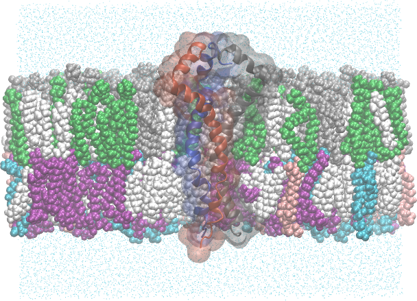

           HIV-1 gp41 (MPER-TM) trimer embedded in a model viral envelope lipid bilayer.  Bilayer is clipped to show the protein, and each protein chain is colored uniquely.  The outer leaflet (top) is composed of 36% Sphingomyelin d18:1/16:0 (CHARMM residue name PSM, colored grey), 17% 3-palmitoyl-2-oleoyl-D-glycero-1-Phosphatidylcholine (POPC, green), and 47% cholesterol (CHL1, white).  The inner leaflet (bottom) is composed of 30% 1-Stearoyl-2-Oleoyl-Phosphatidylethanolamine (SOPE, purple), 18% 1-Stearoyl-2-Oleoyl-Phosphatidylserine (SOPS, blue), 9% 3-palmitoyl-2-oleoyl-D-glycero-1-Phosphatidylethanolamine  (POPE, pink), and 43% cholesterol.

This example is the same as :ref:`example mper-tm symmetric bilayer`, but uses an asymmetric model viral bilayer instead of a symmetric DMPC bilayer.  The model viral bilayer is constructed from a mixture of lipids that are commonly found in the viral membrane.

Because the leaflets differ in composition, the grid packer takes the asymmetric path: it first relaxes two symmetric *calibration* patches -- one per leaflet composition -- to measure each leaflet's preferred area per lipid, then grids the full membrane (sized to the protein footprint) at stress-free per-leaflet counts.

.. literalinclude:: ../../../../pestifer/resources/examples/ex17/inputs/hiv-mpertm3-membrane2.yaml

.. task-table:: ../../../../pestifer/resources/examples/ex17/inputs/hiv-mpertm3-membrane2.yaml

Results
+++++++

The plots below are generated by default during the membrane-building process.

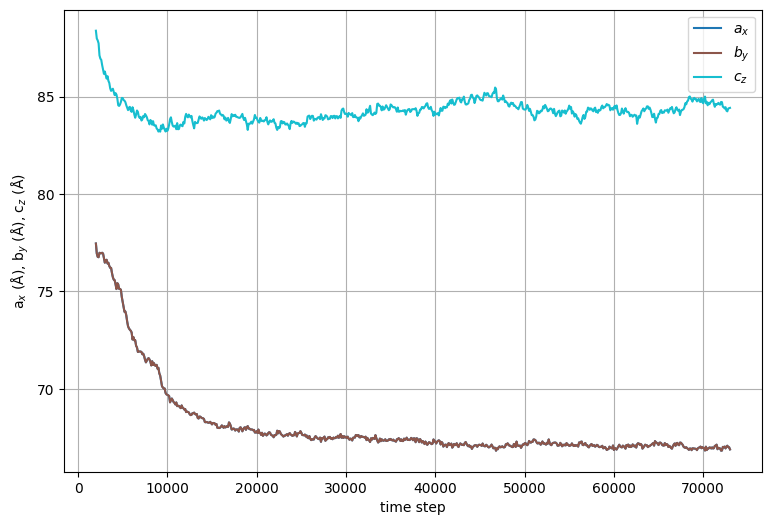

           Cell dimensions vs time step for the symmetric calibration patch used to measure the upper leaflet's preferred area per lipid.

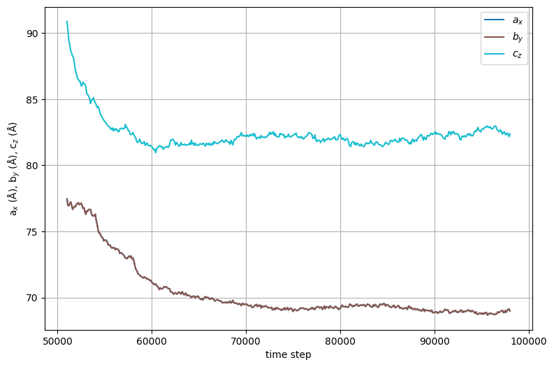

           Cell dimensions vs time step for the symmetric calibration patch used to measure the lower leaflet's preferred area per lipid.

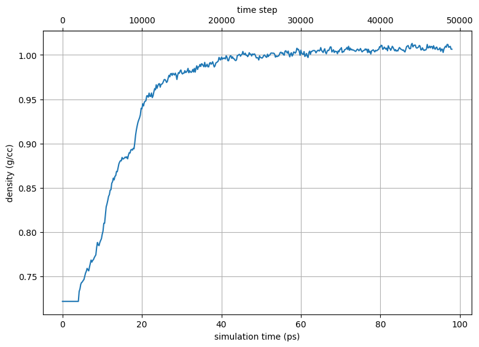

           System density vs time step for the upper-leaflet calibration patch.

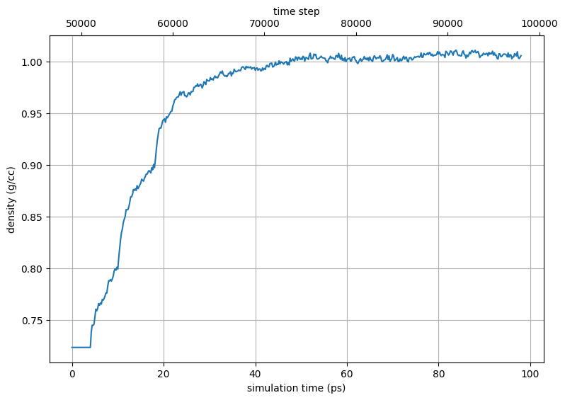

            System density vs time step for the lower-leaflet calibration patch.

Once the per-leaflet areas are calibrated, the full asymmetric membrane is gridded at the stress-free per-leaflet counts and relaxed with the ``quilt`` protocol before the protein is embedded.

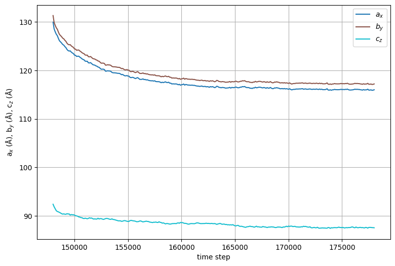

           Cell dimensions vs time step during the ``quilt`` relaxation of the full gridded asymmetric membrane.

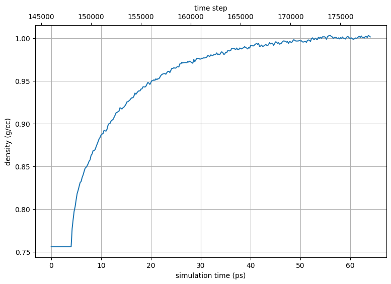

           System density vs time step during the ``quilt`` relaxation of the full gridded asymmetric membrane.

The ``mdplot`` task generated the following plots for the membrane-embedded system.

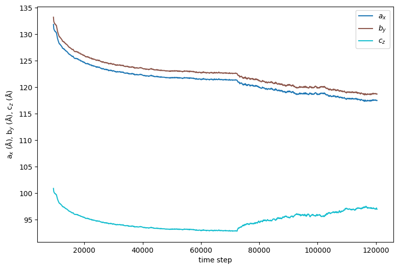

           Cell dimensions vs time step for the protein-embedded membrane.

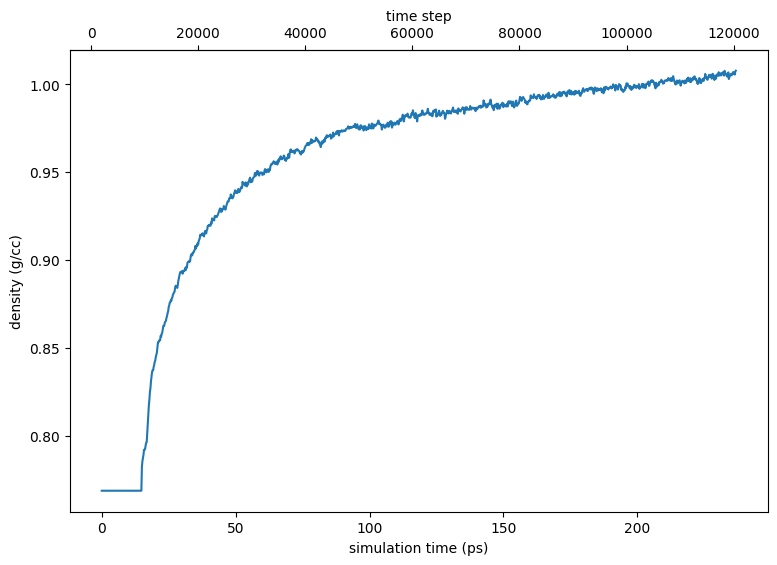

           System density vs time step for the protein-embedded membrane.

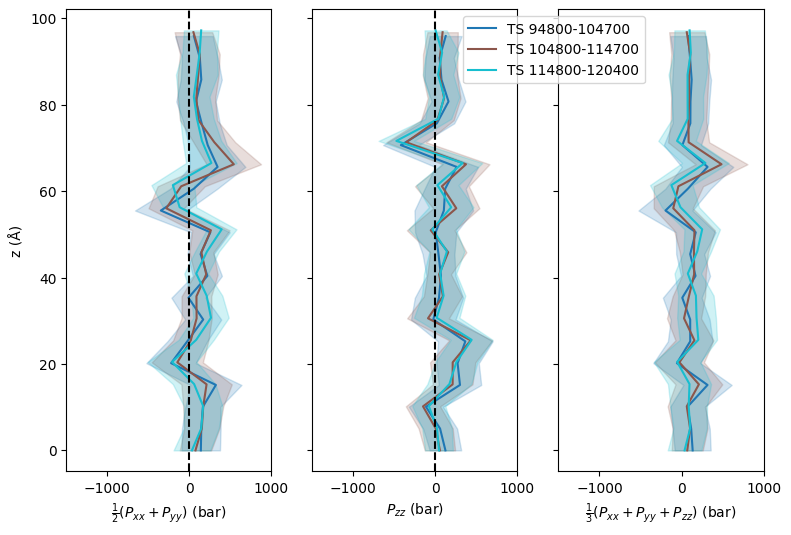

           Pressure profiles for selected time intervals during the protein-embedded membrane relaxation.

The ``density-profile`` subcommand produces a species-resolved mass-density profile along the bilayer normal from the equilibrated final frame.  For a multicomponent bilayer the ``--lipid-components`` option decomposes the total lipid density into one curve per lipid species, which exposes the leaflet asymmetry: the outer-leaflet PSM and POPC peak on one side, the inner-leaflet SOPE, SOPS, and POPE on the other, while cholesterol (CHL1) populates both leaflets.

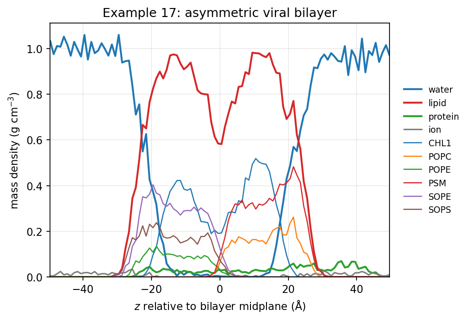

           Per-species mass density vs distance from the bilayer midplane, with the lipid total broken out into individual components.  Generated with ``pestifer density-profile --lipid-components``.

.. raw:: html

    

        
Example author: Cameron F. Abrams &nbsp;&nbsp;&nbsp; Contact: <a href="mailto:cfa22@drexel.edu">cfa22@drexel.edu</a>

    
