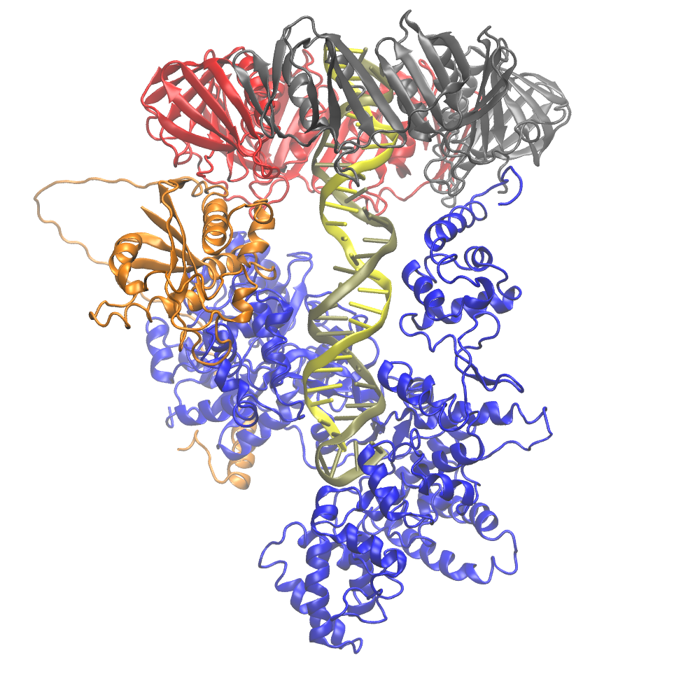

.. _example ecoli-polymerase:

Example 18: E. coli Replicative DNA Polymerase Complex Bound to DNA
-------------------------------------------------------------------

`PDB ID 5fkw <https://www.rcsb.org/structure/5fkw>`_ is a structure of E. coli polymerase bound to a 12-mer DNA duplex. This example demonstrates that pestifer can handle simple nucleic acids.  It also shows how Pestifer can build in missing nucleic acid residues; in this case, there are 3 unresolved nucleotides at the 5'-end of chain T.

.. literalinclude:: ../../../../pestifer/resources/examples/ex18/inputs/ecoli-polymerase.yaml
    :language: yaml

        E coli polymerase complex (PDB ID 5fkw) with DNA shown in yellow and brown cartoon.  The orange chain (chainID D) has a 20-residue loop that pestifer built.

Reference
+++++++++

* `cryo-EM structures of the E. coli replicative DNA polymerase reveal its dynamic interactions with the DNA sliding clamp, exonuclease and tau. Fernandez-Leiro, R., Conrad, J., Scheres, S.H., Lamers, M.H. (2015) Elife 4: e07335. <https://doi.org/10.7554/eLife.11134>`_
