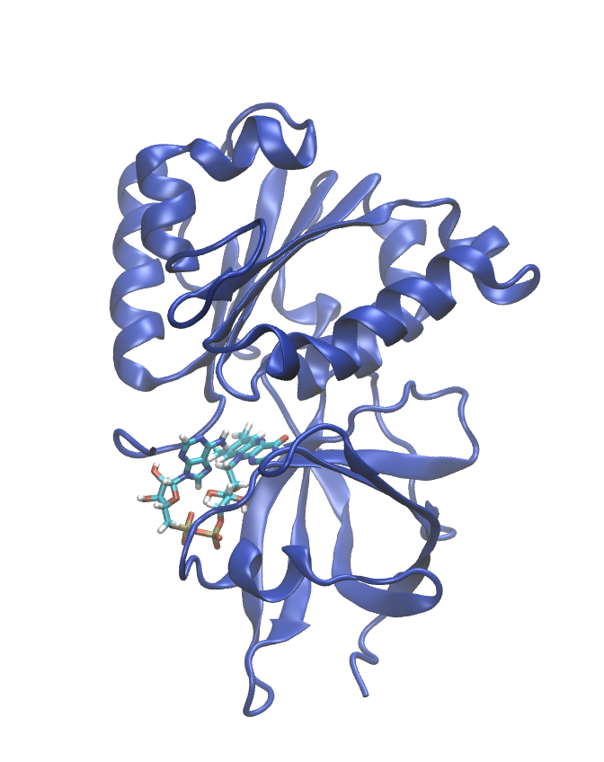

.. _example ferredoxin-fad:

Example 22: Ferredoxin-NADP(H) Reductase from Rhodobacter capsulatus
--------------------------------------------------------------------

`PDB ID 2bgj <https://www.rcsb.org/structure/2bgj>`_ is the structure of ferredoxin-NADP(H) reductase from *Rhodobacter capsulatus*. This example demonstrates how to build a system with a flavin cofactor (FAD).  Because FAD is already handled by the CHARMM36 force field, this is actually pretty easy.  This structure also contains four distinct but identical proteins, so we delete all but one of them.

.. literalinclude:: ../../../../pestifer/resources/examples/ex22/inputs/ferredoxin-fad.yaml
    :language: yaml

    The ferredoxin-NADP(H) reductase from *Rhodobacter capsulatus*, as built by Pestifer.  This system has 32,240 atoms and its box dimensions are  72.2 x 71.2 x 61.3 Å.

Reference
+++++++++

* `The ferredoxin-NADP(H) reductase from Rhodobacter capsulatus: molecular structure and catalytic mechanism. Nogues, I., Perez-Dorado, I., Frago, S., Bittel, C., Mayhew, S.G., Gomez-Moreno, C., Hermoso, J.A., Medina, M., Cortez, N., Carrillo, N. (2005) Biochemistry 44: 11730-11740 <https://doi.org/10.1021/bi0508183>`_

.. raw:: html

    

        
Example author: Cameron F. Abrams &nbsp;&nbsp;&nbsp; Contact: <a href="mailto:cfa22@drexel.edu">cfa22@drexel.edu</a>

    
