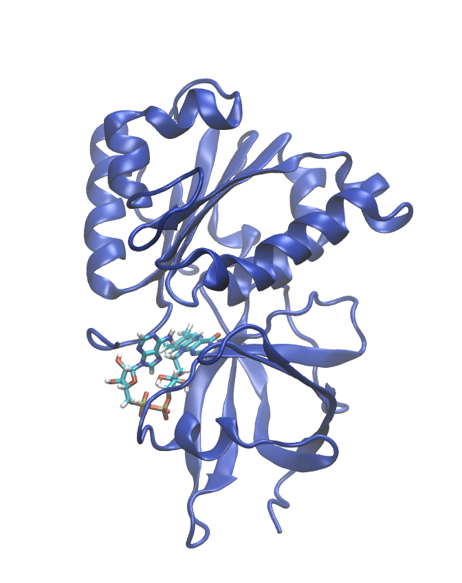

.. _example ferredoxin-fad:

Example 22: Ferredoxin-NADP(H) Reductase from Rhodobacter capsulatus
--------------------------------------------------------------------

`PDB ID 2bgj <https://www.rcsb.org/structure/2bgj>`_ is the structure of ferredoxin-NADP(H) reductase from *Rhodobacter capsulatus*. This example demonstrates how to build a system with a flavin cofactor (FAD).

.. literalinclude:: ../../../pestifer/resources/examples/ferredoxin-fad/ferredoxin-fad.yaml
    :language: yaml

    The ferredoxin-NADP(H) reductase from *Rhodobacter capsulatus*, as built by Pestifer.  This system has 32,240 atoms and its box dimensions are  72.2 x 71.2 x 61.3 Å.

.. raw:: html

    

        
Example author: Cameron F. Abrams &nbsp;&nbsp;&nbsp; Contact: <a href="mailto:cfa22@drexel.edu">cfa22@drexel.edu</a>

    
