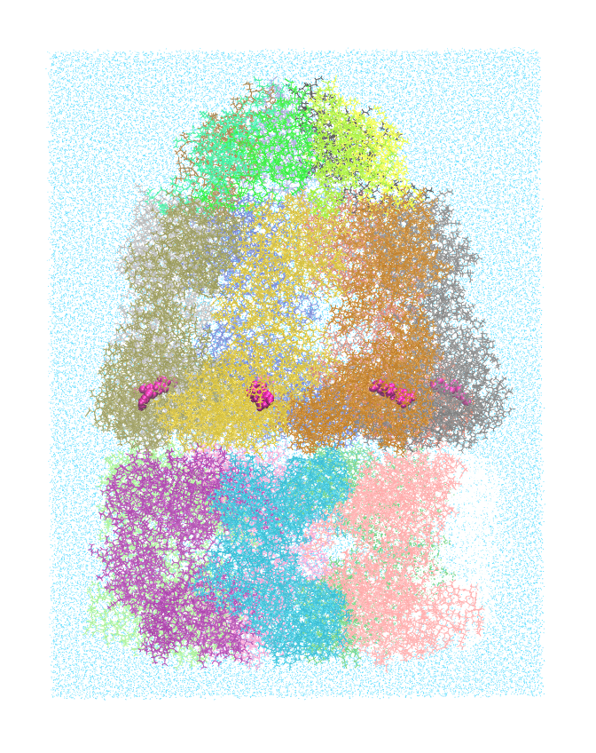

.. _example groel-groes-adp:

Example 21: Asymmetric GroEL/GroES Chaperonin Complex
-----------------------------------------------------

`PDB ID 1aon <https://www.rcsb.org/structure/1aon>`_ is the famous structure of the asymmetric GroEL/GroES chaperonin complex with ADP bound. This build represents Pestifer's ability to handle ligands like ADP.

.. literalinclude:: ../../../pestifer/resources/examples/groel-groes-adp/groel-groes-adp.yaml
    :language: yaml

        The GroEL/GroES chaperonin complex with ADP bound, in TIP3P water, as built by Pestifer.  This system has 550,812 atoms and its box dimensions are 158.5 x 160.3 x 210.9 Å.
        
.. raw:: html

    

        
Example author: Cameron F. Abrams &nbsp;&nbsp;&nbsp; Contact: <a href="mailto:cfa22@drexel.edu">cfa22@drexel.edu</a>

    

