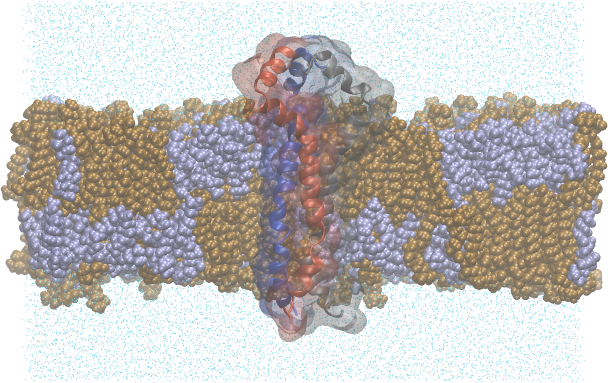
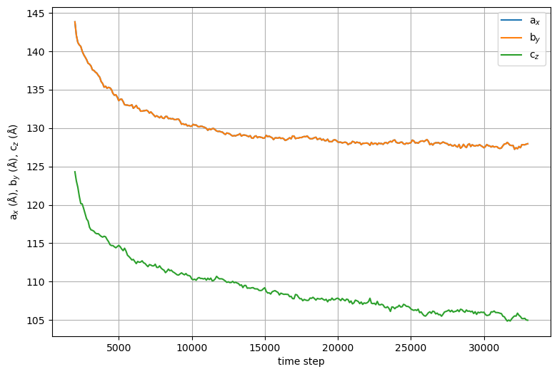
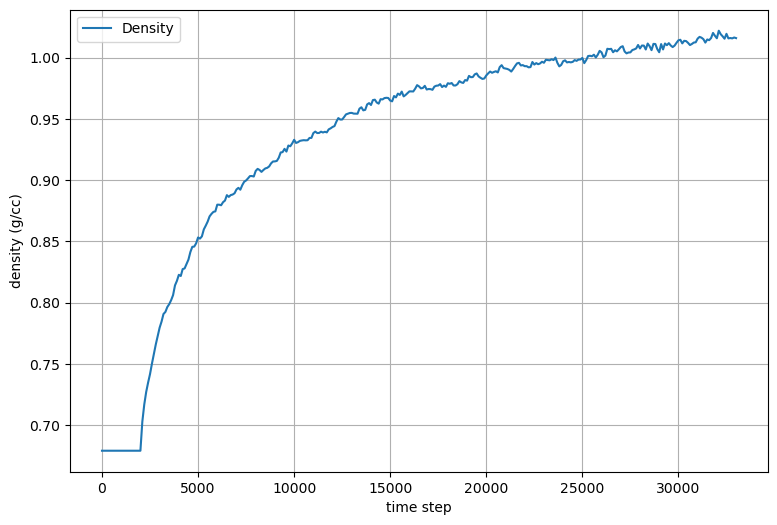
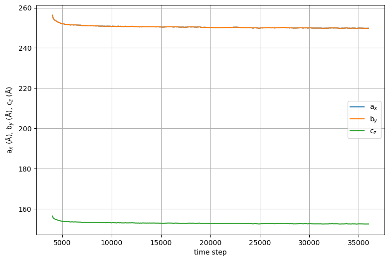
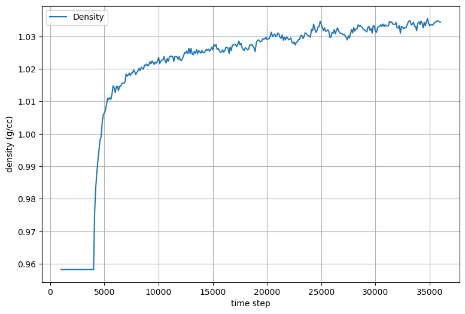
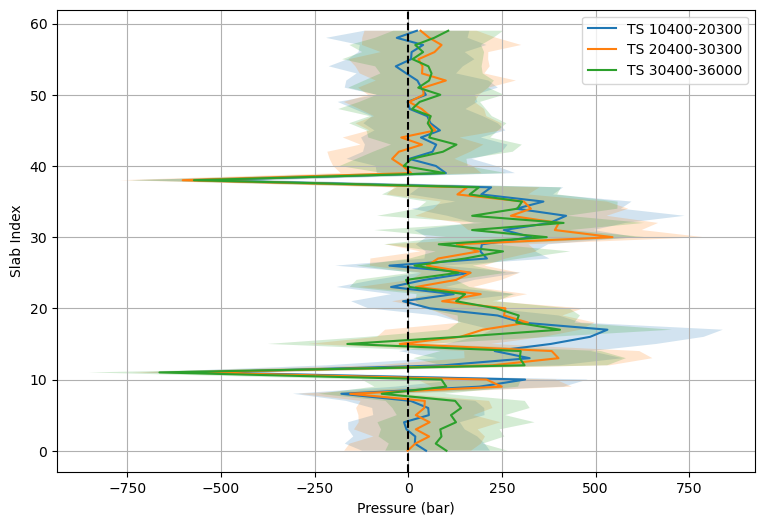

.. _example mper-tm symmetric bilayer:

Example 16: HIV-1 Env MPER-TM Trimer in a DMPC/DHPC Symmetric Bilayer
--------------------------------------------------------------------------

           HIV-1 gp41 (MPER-TM) trimer embedded in a DHPC/DMPC lipid bilayer.  Bilayer is clipped to show the protein, and each protein chain is colored uniquely.  DMPC lipids are brown and DHPC (C6) are purple.

`PDB ID 6e8w <https://www.rcsb.org/structure/6e8w>`_ is a trimeric HIV-1 Env gp41 construct embedded in a DHPC/DMPC lipid bilayer. The structure was determined by NMR, and the structure file contains 15 models, and no lipids are included in the file.  This example shows how to use ``pestifer`` to generate a membrane-embedded protein system from this structure.

.. literalinclude:: ../../../pestifer/resources/examples/hiv-mpertm3-membrane1.yaml
    :language: yaml

The key task in this example is the ``make_membrane_system`` task.  This task specifies a ``bilayer`` subtask and an ``embed`` subtask.  The ``bilayer`` subtask specifies the composition of the two leaflets, directives for using ``packmol`` to assemble the initial *minimal* bilayer patch, and relaxation protocols for relaxing the patch and the full-sized bilayer, prior to embedding the protein.  The ``embed`` subtask specifies how the protein is to be oriented and placed in the bilayer.  Immediately following the ``make_membrane_system`` task, the ``minimize`` task is used to relax the system after embedding the protein.  This is then followed by a series of ``md`` tasks to progressively equilibrate the system density and the bilayer area.

A detailed explanation of the two subtasks can be found at :ref:`subs_runtasks_make_membrane_system`.

Results
+++++++

The plots below are generated by default during the membrane-building process.

           Cell dimensions vs time step for the initial 200-lipid bilayer patch.

           System density vs time step for the initial 200-lipid bilayer patch.

.. figure:: pics/15-patch-pressureprofile.png

           Pressure profiles for selected time intervals during the patch relaxation.

The ``mdplot`` task generated the following plots for the membrane-embedded system.

           Cell dimensions vs time step for the protein-embedded membrane.

           System density vs time step for the protein-embedded membrane.

           Pressure profiles for selected time intervals during the protein-embedded membrane relaxation.
