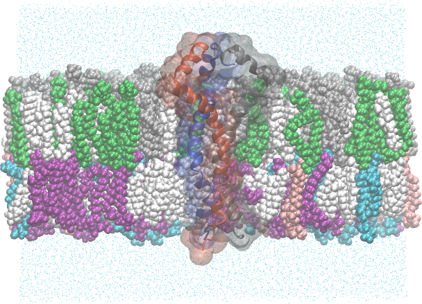

.. _example mper-tm viral bilayer:

Example 17: HIV-1 Env MPER-TM Trimer in an Asymmetric, Model Viral Bilayer
--------------------------------------------------------------------------

           HIV-1 gp41 (MPER-TM) trimer embedded in a model viral envelope lipid bilayer.  Bilayer is clipped to show the protein, and each protein chain is colored uniquely.  The outer leaflet (top) is composed of 36% Sphingomyelin d18:1/16:0 (CHARMM residue name PSM, colored grey), 17% 3-palmitoyl-2-oleoyl-D-glycero-1-Phosphatidylcholine (POPC, green), and 43% cholesterol (CHL1, white).  The inner leaflet (bottom) is composed of 30% 1-Stearoyl-2-Oleoyl-Phosphatidylethanolamine (SOPE, purple), 18% 1-Stearoyl-2-Oleoyl-Phosphatidylserine (SOPS, blue), 9% 3-palmitoyl-2-oleoyl-D-glycero-1-Phosphatidylethanolamine  (POPE, pink), and 47% cholesterol.

This example is the same as :ref:`example mper-tm symmetric bilayer`, but uses a model viral bilayer instead of a DMPC/DHPC bilayer.  The model viral bilayer is constructed from a mixture of lipids that are commonly found in the viral membrane.

.. literalinclude:: ../../../pestifer/resources/examples/hiv-mpertm3-membrane2/hiv-mpertm3-membrane2.yaml

In this example, we demonstrate the ``composition`` keyword in the ``bilayer`` section of the  ``make_membrane_system`` task.  This is a more flexible representation of the bilayer composition than the packmol-memgen format used in example 15.

