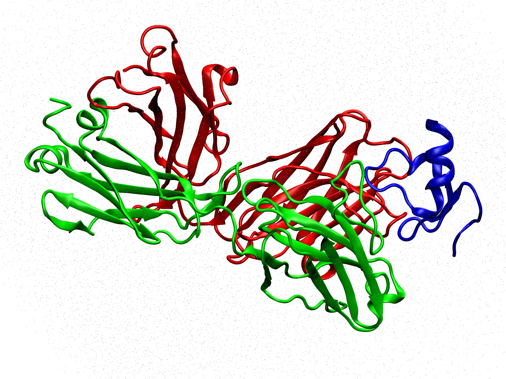

.. _quickstart:

Quick start
===========

This page takes you from a database ID to a NAMD-ready simulation box in one sitting,
without writing a line of YAML.  Pestifer's ``new-system --interactive`` subcommand fetches
the structure, tells you what it found in it, asks you what to do about each finding, and
writes the configuration file for you.

You need a working install first -- see :ref:`installation`, and make sure ``vmd``,
``namd3``, ``charmrun``, and ``catdcd`` are on your path.

Step 1: Pick a structure
------------------------

Any RCSB PDB ID or AlphaFold ID will do.  This walkthrough uses `12ER
<https://www.rcsb.org/structure/12ER>`_, a 2.99 Å cryo-EM structure released in March
2026: the BCMA-targeting Fab arm of the bispecific antibody **teclistamab** bound to the
BCMA ectodomain.  It is a realistic target -- five chains, disordered termini, an
expression tag -- and every one of those features turns into a question you get to answer.

Work in a clean, empty directory; a build writes a lot of files.

.. code-block:: console

   $ mkdir teclistamab && cd teclistamab

Step 2: Answer the questions
----------------------------

.. code-block:: console

   $ pestifer new-system 12er --interactive

Pestifer downloads the structure, reads its header, and starts asking.  Everything below
is a real session; pressing :kbd:`Enter` accepts the capitalized default in each
``[y/N]`` / ``[Y/n]`` prompt, so most of this is just tapping through.

.. code-block:: text

   Biological assemblies:
     1: 1 copy of chain(s) [A, B, C, D, E]

   Chains present:
     Include chain A [protein (216 residues) - HEAVY CHAIN OF THE FAB FRAGMENT OF AN ANTI-LAMBDA LIGHT]? [Y/n] n
     Include chain B [protein (214 residues) - LIGHT CHAIN OF THE FAB FRAGMENT OF AN ANTI-LAMBDA LIGHT]? [Y/n] n
     Include chain C [protein (41 residues) - TUMOR NECROSIS FACTOR RECEPTOR SUPERFAMILY MEMBER 17]? [Y/n]
     Include chain D [protein (221 residues) - HEAVY CHAIN OF THE BCMA-TARGETED FAB ARM OF TECLISTAMAB]? [Y/n]
     Include chain E [protein (214 residues) - LIGHT CHAIN OF THE BCMA-TARGETED FAB ARM OF TECLISTAMAB]? [Y/n]

   Missing terminal residues (unresolved; dropped unless you build them):
     Build a modeled tail for chain C N-terminus (1-5, 5 res)? [y/N]
     Build a modeled tail for chain C C-terminus (47-82, 36 res)? [y/N]

   Cloning artifacts / expression tags (extra residues not in the native protein):
     Excise expression tag in chain C (55-82)? [y/N]

   Post-psfgen build pipeline (each stage optional; edit nsteps in the YAML as needed):
     Vacuum minimization? [Y/n]
     Vacuum MD (NVT) equilibration? [y/N]
     Solvate (water box + neutralizing ions)? [Y/n]
       Solvated minimization? [Y/n]
       NVT warm-up before density equilibration? [Y/n]
       NPT density equilibration (self-terminating)? [Y/n]
       Longer NPT production run? [y/N]
     Terminate task (package the built system)? [Y/n]

   Launch this build now? [y/N] n

Only two answers were typed; everything else was :kbd:`Enter`.  Three things happened.

**Chain selection.** Chains A and B are the Fab of an anti-lambda-light-chain antibody
(REGN15499), included as a cryo-EM fiducial to add mass and break the symmetry of an
otherwise small, featureless complex.  It is an artifact of how the structure was
determined, not part of the biology you want to simulate, so declining it drops roughly
half the system and leaves BCMA (C) plus the teclistamab Fab arm (D, E).  Notice that
Pestifer showed you the molecule name from the header for each chain, which is what makes
that call possible without opening the structure in a viewer.

**Disordered termini.** Chain C is only resolved for residues 6-46 out of 82.  Unresolved
residues are dropped unless you ask for them to be modeled, and modeling a 36-residue
disordered tail onto a 41-residue domain would be inventing structure, so the default
(``N``) is the right answer here.

**The expression tag.** Residues 55-82 of chain C are a tag, not native BCMA.  They fall
inside the C-terminal stretch that was never resolved, so declining the tail already
removed them and there is nothing left to excise.

The last prompt offers to run the build immediately.  Answer ``n`` the first time so you
can read what it wrote.

Step 3: Read the config it wrote
--------------------------------

You now have ``12er.yaml``:

.. code-block:: yaml

   title: New template pestifer config for id 12er (PDB)
   tasks:
   - fetch:
       sourceID: 12er
       source_format: pdb
   - psfgen:
       source:
         biological_assembly: 1
         exclude:
         - chainID in ['A', 'B']
   - md:
       ensemble: minimize
   - solvate: null
   - md:
       ensemble: minimize
   - md:
       ensemble: NVT
       nsteps: 1000
   - density_equilibrate: null
   - terminate:
       basename: my_12er
       package:
         basename: prod_12er
         namd:
           ensemble: NPT

This is an ordinary Pestifer config -- nothing about it is special because it was
generated.  The two chains you declined became one ``exclude`` expression; everything you
accepted by pressing :kbd:`Enter` is just the default behavior and needs no directive at
all.  Tasks run top to bottom:

- :ref:`fetch <subs_buildtasks_fetch>` downloads 12ER.
- :ref:`psfgen <subs_buildtasks_psfgen>` builds the PSF and PDB.
- The first :ref:`md <subs_buildtasks_mdtask>` task relaxes the structure in vacuum.
- :ref:`solvate <subs_buildtasks_solvate>` puts it in a water box with neutralizing ions.
- Another minimization, then a short NVT run brings the box to temperature.
- :ref:`density_equilibrate <subs_buildtasks_density_equilibrate>` settles the box density
  under NPT, restarting itself as needed and stopping when the density converges.
- :ref:`terminate <subs_buildtasks_terminate>` names the outputs and packages them.

A task with ``null`` (or nothing) after it runs with all defaults.  Every directive each
task accepts is in the :ref:`config_ref`, or from the command line via
``pestifer config-help``.  The ``nsteps`` values are deliberately conservative -- edit them.

Step 4: Build it
----------------

First, confirm the config is sound.  This takes about a second, fetches nothing, and writes
nothing:

.. code-block:: console

   $ pestifer build 12er.yaml --check

It validates the YAML against the schema, confirms ``vmd``, ``namd3``, ``charmrun``, and
``catdcd`` resolve on your PATH, checks that the tasks hand off to one another correctly, and
prints the plan it would execute.  Make it a habit -- it costs a second and catches mistakes
that would otherwise surface several minutes into a run.  Then build:

.. code-block:: console

   $ pestifer build 12er.yaml

(``pestifer run`` is an alias for ``build``, and the ``.yaml`` extension is optional.)
Fetching, building the PSF, and solvating take seconds; the solvated minimization and the
density equilibration are the long poles.  Progress goes to the console and to a log file
named after the config.

Step 5: What you get
--------------------

    The system this pipeline produces, drawn from the built PSF and the final coordinates.
    The teclistamab Fab arm is its heavy chain (red) and light chain (green); BCMA (blue)
    is bound at the tip of the Fab, which is the interaction the structure was determined
    to show.  The faint stipple is the water box, drawn as context -- the framing follows
    the solute, so the solvent runs off the edges rather than shrinking the complex to a
    speck.  The anti-lambda Fab you declined in Step 2 would have roughly doubled what is
    in this picture.

The whole run takes about **eleven minutes** on a workstation GPU.  Almost all of it is
one task:

.. code-block:: text

    -               fetch: 00:00:00.129 ( 0.0%)
    -              psfgen: 00:00:02.142 ( 0.3%)
    -                  md: 00:00:04.418 ( 0.7%)   vacuum minimization
    -             solvate: 00:00:02.644 ( 0.4%)
    -                  md: 00:00:48.058 ( 7.2%)   solvated minimization
    -                  md: 00:00:18.855 ( 2.8%)   NVT warm-up
    - density_equilibrate: 00:09:22.174 (83.8%)
    -           terminate: 00:00:32.653 ( 4.9%)

Getting to a run-ready topology is the fast part; equilibrating it is the expensive part,
which is the usual shape of a preparation pipeline.  The built system is 60,485 atoms --
6,992 of protein and 17,831 waters -- in a 73.4 x 88.2 x 91.5 Å box, with a net charge of
zero, so ``solvate`` did not need to add any counterions.

The ``terminate`` task then packs everything up, and this is what is left in your
directory:

.. code-block:: text

   prod_12er.tar.gz             4.3 MB    the run-ready package
   my_12er-artifacts.tar.gz     246 MB    every intermediate file, archived
   12er-diagnostics.log                   the full build log
   mdplots/                               density-vs-time plot from the equilibration
   12er.yaml                              the config you generated

Note that the system files are *inside* the package rather than loose in the directory --
the default ``cleanup`` sweeps the working directory once the package is written.  Unpack
``prod_12er.tar.gz`` and you get:

.. code-block:: text

   prod_12er/my_12er.psf         the topology
   prod_12er/my_12er.pdb         final coordinates, text
   prod_12er/my_12er.coor        final coordinates, NAMD binary
   prod_12er/my_12er.vel         final velocities
   prod_12er/my_12er.xsc         the periodic cell
   prod_12er/my_12er_minimal.prm the CHARMM parameters this system actually needs
   prod_12er/prod_12er.namd      a sample NAMD config to review and edit

That directory is self-contained: copy it to whatever machine you run production on and
nothing else has to come with it.  If a build goes wrong, the answers are in the artifacts
tarball -- every psfgen script, NAMD log, and intermediate structure the run produced.

When the structure is more interesting still
--------------------------------------------

12ER had no glycans, no interior chain breaks, and no engineered mutations to reverse.
When a structure does, ``--interactive`` asks about those too -- which biological assembly
to build when there is more than one, whether to build each interior missing loop in full
or replace it with a short stub, and whether to revert engineered mutations to the database
sequence.  Declining a protein chain also drops any glycan chain glycosidically attached to
it, so you are never asked about those separately:

.. code-block:: text

   $ pestifer new-system 4zmj --interactive
     Build biological assembly 1 (3 copies)? (No = asymmetric unit only) [Y/n] y
     Include chain G [protein (462 residues) - Envelope glycoprotein gp160] (+ attached glycan chain(s) A, C, D)? [Y/n] y
     Build interior loop B 548-568 (21 res) in full? [Y/n] n
       Replace it with a short built stub sequence instead? (No = keep full) [Y/n] y
         Stub sequence (one-letter codes)? [GGG] GSGSG
     Revert B:PRO559 -> db ILE [engineered mutation]? [y/N] y
     ...

If you would rather see what is in a structure without answering anything, use
``--inspect`` instead: it writes the same findings into the config as *commented* stubs
that you uncomment by hand.  Both flags are documented in full on the
:ref:`new-system <subs new-system>` page.

Where to go next
----------------

- :ref:`examples` -- 27 worked builds, from a single small protein up through glycosylated
  membrane-embedded trimers.
- :ref:`usage` -- the rest of the subcommands.
- :ref:`config_ref` -- every configuration directive.
- :ref:`guides` -- longer walkthroughs that cut across tasks.
