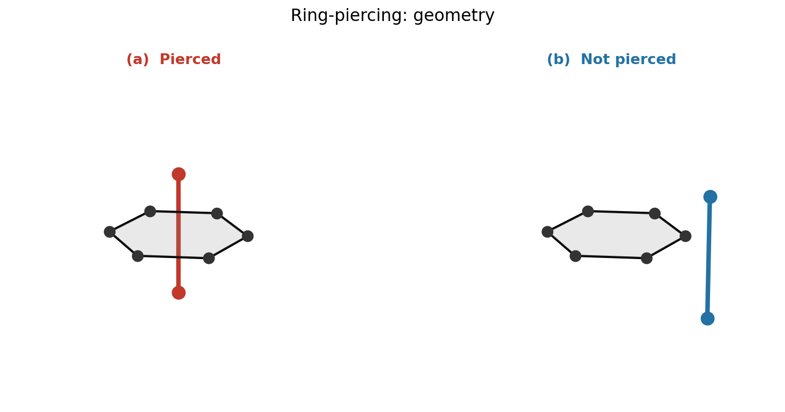
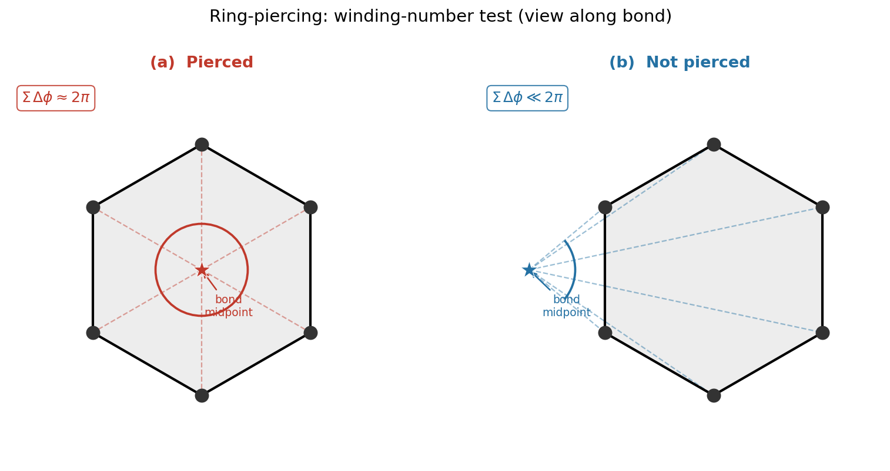

.. _subs_buildtasks_ring_check:

ring_check
----------

The ``ring_check`` task detects and removes **pierced-ring** configurations — cases where a bond from one molecule passes through the geometric center of a ring in another molecule.  This most commonly arises in membrane systems containing cholesterol or other sterols, where a lipid acyl chain can thread through a sterol ring during initial packing.  It can also happen with glycans, which often contain multiple rings and can be threaded by side chains or other glycans.  Because these configurations are non-physical and can cause problems for downstream MD simulations, pestifer provides this task to identify and resolve them.

Prerequisites
~~~~~~~~~~~~~

``ring_check`` requires PSF, PDB, and XSC state files, so it must follow at least one MD step (typically a short minimization).  The canonical placement is immediately after the first minimization following a ``psfgen`` or ``make_membrane_system`` task:

.. code-block:: yaml

   tasks:
     - make_membrane_system:
         ...
     - md:
         ensemble: minimize
         minimize: 1000
     - ring_check:

If no piercings are detected the task is a no-op, so it is safe to include unconditionally whenever sterols or glycans are present.

Parameters
~~~~~~~~~~

All parameters are optional:

.. code-block:: yaml

   - ring_check:
       segtypes: [lipid, glycan]   # segment types whose rings are checked (default: both)
       cutoff: 10.0                # bond-ring COM pre-screen distance in Å (default: 10.0)
       delete: piercee             # which molecule to remove (default: piercee)

**segtypes**
  List of segment types whose rings are examined.  Bonds from *any* segment type can be the piercer; only rings belonging to segments of these types are checked.  Default is ``[lipid, glycan]``.

**cutoff**
  Distance in Å between a bond midpoint and a ring center-of-mass used to pre-screen candidate pairs before the full geometric test.  Increasing it finds more candidates at the cost of more computation; the default of 10.0 Å is appropriate for typical ring sizes.

**delete**
  Controls which molecule is removed when a non-glycan piercing is found:

  - ``piercee`` *(default)* — removes the ring-containing residue (e.g. the cholesterol whose ring was threaded).  Use this for sterol rings pierced by lipid acyl chains.
  - ``piercer`` — removes the residue whose bond did the piercing.
  - ``none`` — logs all piercings and terminates the build.

.. note::

   **Glycan ring piercings always terminate the build.**  Because glycan residues are covalently bonded to the protein, they cannot be deleted to resolve a piercing.  If a glycan ring is found to be pierced, pestifer logs an error identifying each problematic segment and residue and raises an exception.  The recommended remedy is to rebuild the system with a different random seed or to add more minimization steps before the ``ring_check`` task.

How the detection works
~~~~~~~~~~~~~~~~~~~~~~~

For each ring in the target segments, pestifer uses a link-cell grid to find all bonds whose midpoint lies within ``cutoff`` Å of the ring's center of mass.  For each candidate bond, it projects the ring atoms onto a plane perpendicular to the bond at the bond midpoint and sums the subtended angles.  A sum near 2π indicates the bond passes through the ring interior (the winding-number test).

   **Side view.**  Left: a bond (red) passes through the center of a hexagonal ring — a pierced configuration.  Right: the bond (blue) clears the ring.

   **Winding-number test** (view along the bond axis).  Ring atoms are projected onto the plane perpendicular to the bond at the bond midpoint (star).  Left: the midpoint lies inside the ring; the angles subtended by consecutive atom pairs sum to ≈ 2π — pierced.  Right: the midpoint is outside the ring; the total subtended angle is much less than 2π — not pierced.

How pierced-ring resolution works
~~~~~~~~~~~~~~~~~~~~~~~~~~~~~~~~~~

When piercings are found, pestifer resolves them by **deleting** the offending residue — either the piercee (the molecule whose ring was threaded) or the piercer (the molecule whose bond did the threading), depending on the ``delete`` parameter.  Deletion is the only automatic resolution strategy available, for two reasons.

First, untangling a pierced ring by coordinate manipulation is a hard geometry problem: any continuous path that moves the bond out of the ring interior must pass through the ring plane, which requires atoms to overlap in a physically meaningless way during the move.  In practice, short energy minimization steps (which is what precedes ``ring_check``) reliably worsen rather than resolve piercings because the force field has no term that penalizes topological entanglement.

Second, deletion is only safe when the residue to be removed is a **standalone molecule** — one that is not covalently bonded to any other residue in the system.  Lipid and sterol residues satisfy this condition: each lipid molecule is an independent PSF segment, so removing it leaves the rest of the topology intact.  Glycan residues do *not* satisfy it: glycan sugar rings are covalently linked to the protein via glycosidic bonds recorded in the PSF.  Deleting a glycan residue would break those bonds and corrupt the topology, so glycan piercings always terminate the build instead (see the note in the Parameters section above).

The resolution procedure writes a new psfgen script that issues ``delatom`` commands for each offending residue, then rebuilds the PSF and PDB, and updates the pipeline state.

Example: sterol ring check in a viral membrane
~~~~~~~~~~~~~~~~~~~~~~~~~~~~~~~~~~~~~~~~~~~~~~~

This is taken from :ref:`example mper-tm viral bilayer` (Example 17):

.. code-block:: yaml

   tasks:
     - make_membrane_system:
         bilayer:
           composition:
             upper: {POPC: 0.5, POPE: 0.3, CHL1: 0.2}
             lower: {POPC: 0.5, POPE: 0.3, CHL1: 0.2}
     - md:
         ensemble: minimize
         minimize: 1000
         constraints:
           k: 10
           atoms: protein and name CA
     - ring_check:
